# Protocol Sensitivity Dominates Aggregation-Rule Differences in Flow-Based Network Intrusion Detection: A Leakage-Controlled Study of Conditional Ensemble Weighting

## Abstract

Reported differences between intrusion-detection models are sensitive to duplicate flows, conflicting labels, feature leakage and class priors. We test a widely adopted but rarely validated assumption: that fusing random-forest experts with sample-specific reliability weights (RCCF) beats equal voting. Under one leakage-controlled protocol we build a 53,237-flow natural-prior population and a 3,365-flow balanced control from CIC-IDS2017, add NSL-KDD, UNSW-NB15 and an IoT corpus, and compare four feature views over ten seeds. The two models differ by -0.000456 Macro-F1 (five up, five down); the seed-level 90% and test-row paired bootstrap intervals both lie inside equivalence margins of 0.005 and 0.01. The four experts disagree on no test row, weight entropy is 0.99998, and class prior and deduplication order move Macro-F1 by +0.0725 and +0.0060. Three identifiability conditions are derived, one a row-wise bound: 99.91% of the 23,958 test rows are provably invariant, with a median decision margin 3,469-5,038 times it. All 108 gate configurations yield six distinct validation scores; the gain is governed by expert diversity (slope 0.0646, r = 0.749). The equivalence reproduces on a population 7.8 times larger but not on the uncapped 2,429,503-flow corpus, where it becomes a small, consistent deficit (-0.005533, all ten seeds) at a 175-fold training cost; the IoT corpus saturates for every model. The mechanism is 4.1 times larger and 4.6 times slower than one forest, without cost-sensitive advantage. We contribute a reusable leakage-controlled protocol, an identifiability boundary and a map separating protocol from aggregation-rule effects; the evidence supports neither superiority nor production readiness.

**Keywords:** network intrusion detection; ensemble learning; conditional weighting; data leakage; identifiability; reproducibility; CIC-IDS2017

---

## 1. Introduction

### 1.1 Background and motivation

Flow-based machine learning remains the most common form of published intrusion-detection research. Each network flow is summarised by roughly one hundred statistical features from a tool such as CICFlowMeter, and a classifier separates benign from malicious traffic. CIC-IDS2017, NSL-KDD and UNSW-NB15 dominate this literature [14-16], and thousands of papers report that one model outperforms another on them. The corresponding research area is surveyed in [24,25].

The comparability of those claims is nevertheless doubtful. Public traffic datasets exhibit three recurring hazards. First, **duplicate and near-duplicate flows**: the same attack is recorded many times, and if duplicates are discovered only after splitting, the training and test partitions overlap substantially. Second, **conflicting labels**: identical feature vectors carry different labels, forcing the model to fit contradictory supervision. Third, **transform leakage**: if standardisation, feature selection or resampling is executed before the split, information from the test partition enters training through the fitted transform parameters.

When these factors are uncontrolled, a comparison between models stops being a comparison of algorithms and becomes a comparison of splitting accidents. Several recent studies show that leakage and preprocessing order alone can reverse conclusions in intrusion detection [20-22]. The natural scientific question is therefore: **once these factors are controlled, how much of the widely reported improvement survives?**

### 1.2 Three untested assumptions

We focus this question on one concrete object. A common recipe in the literature is to train several ensemble models over different feature views or hyper-parameters and fuse them with sample-specific weights. The recipe carries three assumptions, denoted H1-H3.

**H1 (feature redundancy).** Raw flow features contain substantial redundancy and noise, so a filter selector (chi-square, mutual information, ANOVA) can reduce dimensionality to a small subset without materially losing discriminative power.

**H2 (weighting gain).** Experts differ in reliability across samples; therefore, weighting them by a sample-specific reliability estimate should be reliably better than equal voting. Even if the experts are individually comparable, the gate should help whenever their errors occur on different samples.

**H3 (protocol independence).** These conclusions are insensitive to deduplication order, class priors, split construction and population size, so results can be compared across papers.

H3 is the most consequential because, in the literature, it is never stated explicitly, yet it underpins every cross-paper comparison of the form "model X reaches 99% on CIC-IDS2017".

### 1.3 Research questions

Four research questions structure the paper. Each maps to exactly one results subsection.

**RQ1 (feature selection).** Does training-side filter selection reduce dimensionality without a material Macro-F1 loss?

**RQ2 (weighting gain).** Does sample-conditional fusion outperform equal voting under the same feature view? If the two produce identical predictions, why is the mechanism inert?

**RQ3 (protocol robustness).** Are the conclusions robust to deduplication order, class priors, repeated splits, tuning budgets and population size?

**RQ4 (external validity).** Do the conclusions survive beyond CIC-IDS2017, on NSL-KDD, UNSW-NB15 and file-level stress tests?

### 1.4 Contributions

The contributions are ordered by evidential strength.

1. **A reusable leakage-controlled protocol and audit record.** Starting from 2,830,743 raw records, every stage is logged - label mapping, non-finite removal, physical-range screening, global deduplication, cross-label conflict resolution and class capping - down to a 53,237-flow natural-prior population whose construction rules are fully specified. Scripts, intermediate counts and per-row predictions are released.
2. **An identifiability analysis of conditional weighting.** Three conditions are derived under which sample-conditional weighting cannot change a hard label regardless of the weights, together with observable criteria (normalised weight entropy, expert disagreement rate, and a margin-versus-perturbation bound). This converts "the gate does not help" from an observation into a testable mechanism.
3. **A quantitative map separating protocol effects from aggregation-rule effects.** On one experiment set we measure five sources of variation: aggregation (0.0005), feature view (+0.0021), deduplication order (up to +0.0060), tuning budget (+0.0078) and class prior (+0.0725). File-level extrapolation spans 0.33-1.00. Protocol effects are an order of magnitude larger than the aggregation effect the literature usually reports, and the equivalence survives a 7.8-fold larger population but **breaks on the fully uncapped corpus**, where the difference becomes a small, consistent deficit.
4. **An honest cost account.** Training and inference overhead, probability quality, open-set behaviour and latency percentiles are reported for the conditional mechanism, showing that in the absence of a discriminative gain these costs are not exchangeable.

The contribution is deliberately not incremental. Adding another classifier to an existing benchmark would answer no open question, because the literature already contains many such comparisons and they disagree. What the field lacks is a way to decide whether a reported difference is attributable to the method or to the protocol. This paper supplies that decision procedure in three parts: an auditable protocol that fixes the information boundary, a set of identifiability conditions that predict when an aggregation mechanism cannot act at all, and a measured magnitude for each source of variation so that a reader can see which choices actually move the number. The result is falsifiable - Condition 1 predicts zero gain for the expert sets used here, and the reverse experiment confirms that prediction - and it is usable by other authors regardless of which classifier they prefer.

We explicitly do **not** claim that RCCF is a better classifier, that the results extend to the full CIC-IDS2017 corpus or to production traffic, or that the NSL-KDD and UNSW-NB15 results constitute evidence of cross-dataset transfer.

### 1.5 Organisation

Section 2 reviews related work and states the gap. Section 3 describes data sources, the audit, the two population definitions and the leakage-controlled protocol. Section 4 presents the feature views, the conditional weighting mechanism, the identifiability conditions and the complexity analysis. Section 5 reports results in the order RQ1-RQ4, followed by secondary metrics. Section 6 explains the failure conditions, derives practical guidance and lists validity threats. Section 7 concludes.

---

## 2. Related Work and Positioning

### 2.1 Public datasets and their evaluation hazards

CIC-IDS2017 was released by Sharafaldin et al. in 2018 [14] and contains five days of benign and malicious traffic summarised into 78 flow features by CICFlowMeter. NSL-KDD is a refined version of KDD CUP 99 with five native labels (Normal, DoS, Probe, R2L, U2R) [15]. UNSW-NB15, released by Moustafa and Slay in 2015, provides official training and testing files with nine attack categories [16].

Several structural defects are documented [19]. Class distributions are extremely skewed - in CIC-IDS2017 the Web Attack and Infiltration families are three to five orders of magnitude smaller than BENIGN. Feature tables contain constant columns and collection artefacts. Some attack families were generated by a single tool in a single time window and are therefore highly homogeneous. Training and test partitions may share duplicates. Engelen and Timmerman, and Liu et al., show that preprocessing order and splitting choices alone can materially change reported performance [20,21]. These findings motivate H3: if protocol choices change conclusions, the protocol itself must become a reported and tested object. This position is part of a wider methodological critique of machine learning in security [22,23,26].

### 2.2 Feature selection and leakage

Filter selection is popular in this domain because it is cheap and interpretable. The chi-square statistic measures dependence between a discretised feature and the label [12], mutual information (MI) captures non-linear dependence, and analysis of variance (ANOVA) compares between-class with within-class variance [13]. All three are used here as controls.

The difficulty is that these statistics depend on the label distribution. Fitting a selector before splitting leaks test-label information through the feature ranking. Such leakage is common and hard to detect from a methods paragraph [22]. Our protocol fits every selector inside the training partition and refits it inside each cross-fitting fold, so the selector is subject to the same information boundary as the model.

### 2.3 Ensemble aggregation and adaptive weighting

Breiman's random forest combines bootstrapped trees through equal voting or probability averaging [1,2], justified by variance reduction when tree errors are imperfectly correlated. A natural generalisation replaces equal weights with unequal ones: if the reliability of each tree or expert can be estimated for a given sample, weight accordingly.

Implementations in the literature include validation-accuracy tree weighting, out-of-bag error weighting, meta-learners that predict sample-dependent weights, confidence-based weighting after probability calibration, and uncertainty-driven weighting in deep ensembles [8-11,31]. Such methods typically report gains on specific datasets, but rarely satisfy three conditions simultaneously: (i) all information used for weighting comes from the training and validation partitions; (ii) the equal-weight control uses the same feature view and tuning budget; and (iii) paired significance tests and repeated-split stability are reported. Without these, "weighting helps" cannot be separated from "this particular split helped".

Recent open-set work adds extreme-value theory, prototype learning or autoencoder reconstruction error to construct rejection mechanisms [27,28,42,43]. Such methods optimise two objectives jointly - known-class discrimination and unknown-class rejection - and have a correspondingly different cost structure. We therefore report open-set behaviour as a diagnostic rather than folding it into the main conclusion.

### 2.4 Probability quality, open-set rejection and deployment cost

Hard-label metrics such as accuracy and Macro-F1 say nothing about probability quality. For alert ranking, risk scoring and human-in-the-loop triage, Log Loss, the Brier score and expected calibration error (ECE) matter more [29]. Two models with identical hard labels can differ substantially in calibration, so discriminative and probabilistic metrics must be reported separately [30,31].

Deployment constraints form an independent axis. A gateway may allow only a few milliseconds per flow, and the classifier-stage latency must be predictable. A design that matches an equal-weight forest on offline Macro-F1 but multiplies inference latency has no exchange value in deployment. We report P50, P95 and P99 single-row latency and distinguish single-thread from library-default threading.

### 2.5 Gap and positioning

The literature therefore contains a specific gap: **conditional ensemble weighting is widely assumed to help, but has not been tested simultaneously for its gain, its identifiability boundary and its cost under strict leakage control.** Existing work either reports a gain without controlling leakage, controls leakage but compares a single model, or reports a negative result without explaining the mechanism.

This paper is therefore positioned as a **protocol and boundary study**. It does not propose a better classifier. It treats conditional weighting as an object of study and delivers (i) its measured gain under control, (ii) the conditions under which it provably cannot act, (iii) the relative magnitude of protocol and aggregation-rule effects, and (iv) a reusable evaluation protocol. Table 1 positions this study against four related families.

**Table 1. Related research families and the positioning of this study**

| Family | Typical task | Fitting boundary of weighting information | Main claim type | Difference from this study |
|---|---|---|---|---|
| Classical IDS classifier comparisons | Closed-set multiclass | No weighting | Accuracy on one dataset | Duplicates and prior effects uncontrolled |
| Filter selection plus forest | Dimensionality reduction plus classification | Selector fitting position often unstated | Lower dimension at equal performance | Selector leakage rarely controlled |
| Meta-learned or uncertainty-driven weighting | Conditional aggregation | Weight model fitted jointly with predictor | Reported weighting gain | No equal-weight, equal-budget control or paired tests |
| Open-set and extreme-value rejection | Known plus unknown | Threshold depends on validation data | Unknown-class rejection metrics | Different objective and cost structure |
| This study | Controlled test of conditional weighting | Cross-fitted risk models, validation calibration, test used for diagnostics only | Gain magnitude, identifiability boundary, protocol sensitivity | Protocol is the primary variable; algorithmic superiority is not claimed |

---

## 3. Data, Provenance and Protocol

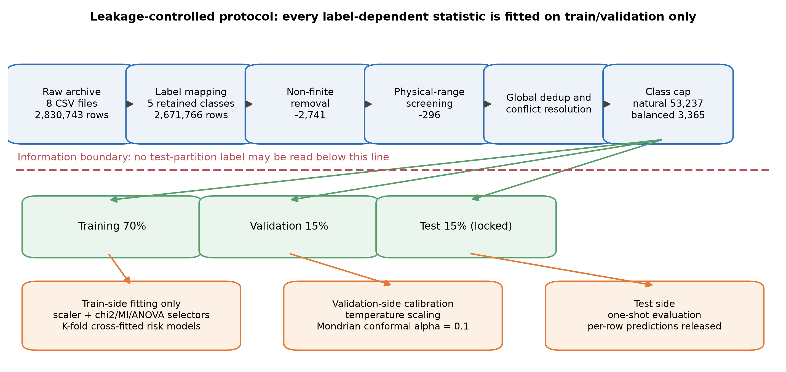

### 3.1 Datasets, sources and licensing

Four public datasets are used, all obtained from official or public sources [14-18]. No scanning, probing or live attack traffic was generated at any point. Table 2 records sources, versions, retrieval dates, licence status and file hashes. The datasets are not redistributed; only processing scripts and the code that produces the derived statistics are released.

Licence status deserves an explicit note. The CIC-IDS2017 and UNSW-NB15 release pages do not display a standard SPDX licence identifier, so the datasets are used under the terms of those pages and the original papers are cited. For NSL-KDD a public mirror snapshot was used and no standard licence identifier could be verified. We therefore do not infer any licence and only record provenance and hashes. This is deliberately conservative: where permission cannot be confirmed, the study reports origin rather than asserting redistribution rights.

**Table 2. Dataset sources, versions and integrity records**

| Dataset | Source | Version or snapshot | Retrieval date | Licence status | Integrity |
|---|---|---|---|---|---|
| CIC-IDS2017 | Canadian Institute for Cybersecurity, official page | MachineLearningCSV archive (8 CSV files) | 2026-09-02 | No SPDX identifier shown; used under page terms with citation | SHA-256 and MD5 recorded (Table S1) |
| NSL-KDD | Public GitHub mirror, KDDTrain+ / KDDTest+ | Mirror snapshot, commit not recorded | 2026-09-03 | No standard licence identifier verified; none inferred | SHA-256 recorded for both files |
| UNSW-NB15 | UNSW Canberra Cyber, official project page | Official training and testing CSV | 2026-09-04 | Page requires citation of the original paper; no SPDX identifier | SHA-256 recorded for both files |
| N-BaIoT | UCI Machine Learning Repository, dataset 442 | Mirai and Gafgyt captures from nine consumer IoT devices; 115 flow features | 2026-09-19 | CC BY 4.0, stated on the dataset page | SHA-256 of the 1.77 GB archive recorded (Table S1) |

### 3.2 Audit of CIC-IDS2017 and the two populations

The local CIC-IDS2017 archive contains eight CSV files, 2,830,743 raw records and 78 flow features. The audit proceeds in six stages, each of which is counted (Figure 2, Table 3).

**Stage 1, label mapping.** The raw data contains fifteen labels. BENIGN maps to Normal; DDoS and the four DoS families map to DoS/DDoS; FTP-Patator, SSH-Patator and Web Attack Brute Force map to Brute Force; Web Attack XSS and Web Attack Sql Injection map to Web Attack; Bot remains Bot. PortScan, Infiltration and Heartbleed are excluded from the closed-set task and retained as unknown families for open-set diagnostics. Mapping retains 2,671,766 records and excludes 158,977.

**Stage 2, non-finite removal.** Records containing NaN or infinity are dropped. All 2,741 removals are infinite values; there are no NaNs. This leaves 2,669,025 records.

**Stage 3, physical-range screening.** Flow duration, rates, header lengths and segment sizes cannot be negative. Of 2,668,729 records that satisfy this constraint, 296 are removed as physically impossible. The CICFlowMeter sentinel value of -1, documented as "unavailable" for initial-window and undefined inter-arrival fields, is retained because it encodes missingness rather than corruption.

**Stage 4, global deduplication and conflict resolution.** Exact feature vectors are deduplicated across the whole corpus before any split. This finds 239,093 duplicate occurrences; 4,524 of them lie in cross-label conflict groups covering 133 unique feature vectors. Conflicting vectors cannot be retained, because a single input would carry multiple labels, so they are removed before capping.

**Stage 5, class capping.** To keep computation and reproduction auditable, each retained class is capped at 20,000 records, giving 53,237 candidates. Observed class proportions are preserved rather than equalised: Normal 37.57%, DoS/DDoS 37.56%, Brute Force 19.95%, Bot 3.66% and Web Attack 1.26%. We call this the **natural-prior population** P_nat. It is split 70/15/15 into 37,265 / 7,986 / 7,986 records.

**Stage 6, balanced control.** To separate the difficulty caused by class imbalance from the behaviour of the aggregation rule, a second population P_bal is drawn with 673 records per class, giving 3,365 records split 2,355 / 505 / 505.

**Boundary statement.** P_nat and P_bal are audited, deduplicated, capped research populations. Neither equals the full CIC-IDS2017 corpus, and neither represents production traffic priors. Every conclusion below is restricted to these two populations.

**Table 3. CIC-IDS2017 audit stage counts**

| Stage | Records remaining | Removed at this stage | Note |
|---|---:|---:|---|
| Raw archive | 2,830,743 | - | 8 CSV files, 78 flow features |
| After label mapping | 2,671,766 | 158,977 | Five retained classes; PortScan, Infiltration and Heartbleed reserved for diagnostics |
| After non-finite removal | 2,669,025 | 2,741 | All infinite; no NaNs |
| After physical-range screening | 2,668,729 | 296 | Negative duration, rate, length or segment size |
| After deduplication and conflict resolution | - | 239,093 duplicate occurrences / 133 conflicting vectors | Completed before splitting |
| After class capping (natural-prior population) | 53,237 | - | 20,000 per class, observed proportions retained |
| Train / validation / test | 37,265 / 7,986 / 7,986 | - | Stratified 70/15/15 |
| Balanced control population | 3,365 (673 per class) | - | 2,355 / 505 / 505 |

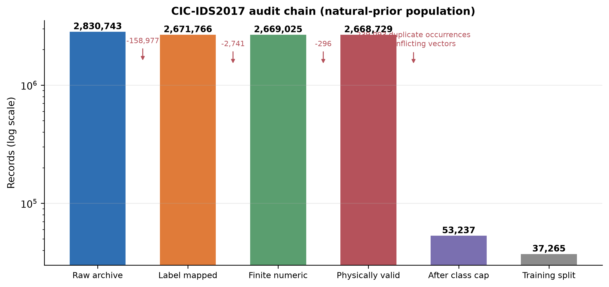

### 3.3 NSL-KDD and UNSW-NB15

NSL-KDD uses the official KDDTrain+ and KDDTest+ files with native labels Normal, DoS, Probe, R2L and U2R, and no label remapping. It is therefore an **independent native-label benchmark**, not a transfer experiment. UNSW-NB15 uses the official training and testing CSV files with the ten-class `attack_cat` label; the binary label and identifier columns are dropped, and categorical variables are encoded from the training side only.

The four datasets are deliberately complementary rather than interchangeable. They span four capture settings (a 1998 line of descent for NSL-KDD, a 2015 synthetic testbed for UNSW-NB15, a 2017 enterprise-like testbed for CIC-IDS2017 and a 2018 consumer-IoT testbed for N-BaIoT), four feature extractors (41 connection-record features, 49 Argus/Bro-derived features, 78 CICFlowMeter features and 115 IoT flow features), and four label spaces (5, 10, 5 retained and 3 native classes). Their known defects also differ: NSL-KDD carries the redundancy of its KDD lineage, UNSW-NB15 contains largely synthetically generated attacks and cross-split feature overlap, CIC-IDS2017 contains duplicate flows, cross-label conflicts and constant columns, and N-BaIoT repeats 67.8% of its rows exactly. Together they cover the environment the earlier draft identified as missing, a consumer-IoT deployment, while none is a temporally separated capture from a common testbed. The coverage matrix is reported in the supplementary material.

Because these label spaces are incompatible, the three sets of scores are never pooled or averaged here, and they are never interpreted as evidence of transfer. Their role is to act as pressure tests: a conclusion that holds only on CIC-IDS2017 should not be written as a general law.

### 3.4 Leakage-controlled protocol

The protocol is organised around one information boundary: **any statistic that depends on labels or on the data distribution may be estimated only from the training or validation partition; test labels are read once, for final evaluation.**

The concrete constraints are as follows.

1. **Corpus-level audit precedes the split.** Global deduplication and cross-label conflict resolution are part of population definition and are completed before splitting, with all counts reported. Their influence is quantified separately in Section 5.4 through a reversed control in which deduplication happens after the split and only on the training side.
2. **Transforms are fitted on the training side only.** Scalers and chi-square / mutual-information / ANOVA selectors are fitted inside the training partition and stored as part of the pipeline; validation and test partitions are transformed, never fitted.
3. **Cross-fitted risk models.** The risk models that drive conditional weighting consume out-of-fold probabilities produced by K-fold cross-fitting, with selectors refitted inside each fold. This prevents using the same rows to train an expert and to estimate its reliability.
4. **Validation is used for calibration only.** Temperature-scaling parameters and Mondrian conformal thresholds are estimated on the validation partition and never see test labels.
5. **The test partition is locked.** Test labels are read only after models, weights and thresholds are final, and only to compute the reported metrics.

Figure 1 shows the full sequence and the information boundary.

### 3.5 Estimands and statistical procedure

Two estimands are distinguished. The **primary estimand** is test Macro-F1 on the natural-prior population P_nat, averaged over a pre-specified set of ten random seeds (42, 2024, 3407, 7, 13, 101, 202, 303, 404, 505). **Secondary estimands** are the same metric on the balanced control population P_bal, together with probability quality, selective risk, open-set rejection, perturbation degradation and latency.

The statistical procedure has five components, all applied to paired comparisons on identical test rows: (i) exact McNemar tests for hard-label disagreement [36]; (ii) a seed-level sign-flip test for directional stability [37,38]; (iii) stratified paired bootstrap for interval estimation of Macro-F1 differences [40]; (iv) Holm correction across the family of three comparisons against RCCF [39], reported as adjusted sign-flip p-values in Table 5; and (v) equivalence testing (TOST), which compares the paired bootstrap 90% interval [41] with a pre-specified **smallest effect size of interest** (SESOI). Component (v) is what allows a statement that a difference is smaller than a given margin, rather than merely failing to reject a null hypothesis of no difference. Every p-value is reported with an effect size, and a small but unstable point estimate is never interpreted as an algorithmic advantage. The equivalence margins were fixed before the primary results were inspected: 0.01 Macro-F1 as the primary margin and 0.005 as a stricter margin. The primary margin corresponds to about 1.1% of the natural-prior Macro-F1 and is taken as the smallest difference that would justify the mechanism's cost in practice.

Macro-F1 is the primary metric because Web Attack accounts for only 1.26% of the natural-prior population, so accuracy is dominated by the majority classes. Class-level reports, balanced accuracy and normalised confusion matrices are reported alongside it.

### 3.6 Validity threats excluded by design

The protocol excludes three threats by construction: **transform leakage** (all transforms are fitted on the training side only), **split leakage** (deduplication precedes splitting and a reversed control is reported), and **unequal tuning budgets** (all baselines share one feature budget and one hyper-parameter search procedure, and Section 5.3 subjects the gate itself to an equivalent search). Threats that the protocol **cannot** exclude are listed in Section 6.5, including the gap between the research populations and production traffic, the absence of a category-complete temporal holdout, and latency measurements that exclude packet capture and feature extraction.

---

## 4. Method

### 4.1 Feature views and base learners

The objects being aggregated are four random-forest experts trained on four **feature views**: all 78 features, and the top k = 60 features selected by chi-square, mutual information and ANOVA respectively. Every selector is fitted on the training side. Base learners are identical apart from the view: 100 trees, `min_samples_leaf = 2`, unbounded depth, fixed random seeds.

Four feature views, rather than four different algorithms, are used deliberately: if the resulting experts are highly correlated, the conditions in Section 4.3 predict that the gate will be inert. The design therefore doubles as a stress test of the mechanism.

External controls are an equal-weight random forest (RF) on each view, extremely randomised trees, XGBoost and a multilayer perceptron (MLP). Tree-ensemble and boosting references are [1-8]. All controls share the feature budget and the seed set.

Per-file processing counts, class support and the training-side feature scores of all four views are provided in Supplementary S01-S04.

### 4.2 Sample-conditional weighting

The mechanism under test is RCCF (Risk-Calibrated Conformal Forest). In the released code the implementation is named `cfrg_forest` for historical reasons; the two names refer to the same object.

Let p_e(y|x) be the probability output of expert e in {full, chi-square, MI, ANOVA}, with Q = 4 experts. The mechanism has three steps.

**Step 1, reliability descriptors.** K-fold cross-fitting produces out-of-fold probabilities for each expert, from which three descriptors are computed: confidence (the maximum class probability), normalised entropy (predictive uncertainty) and the top-two probability margin. These descriptors use only out-of-fold predictions inside the training partition and never touch validation or test labels.

**Step 2, risk models.** For each expert e a logistic regression r_e(x) is fitted on its out-of-fold probabilities and descriptors. A larger value indicates that the expert is less reliable on similar samples.

**Step 3, conditional weights and calibration.** The fusion weights and the fused posterior are given by Eq. (1):

$$w_e(x)=\frac{\exp[-r_e(x)]}{\sum_{j=1}^{Q}\exp[-r_j(x)]},\qquad p(y\mid x)=\sum_{e=1}^{Q} w_e(x)\,p_e(y\mid x).  (1)$$

Fused probabilities are then temperature-scaled on the validation partition [29], and a Mondrian (class-conditional) conformal predictor provides an optional `unknown` output at significance level alpha = 0.1. [32-35] The mechanism changes probabilities first; a hard label changes only if the fused argmax changes. "The probabilities moved" and "the prediction changed" are therefore distinct statements, and Sections 5.2 and 5.3 report them separately.

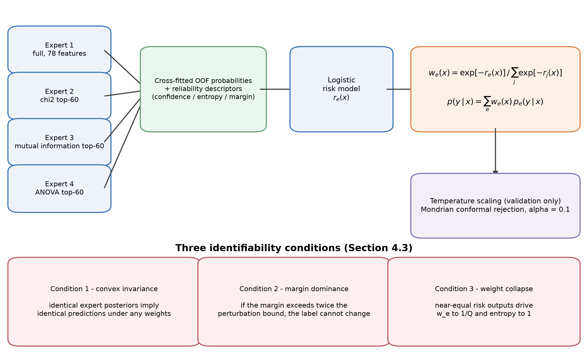

Algorithm 1 states the full procedure with the information boundary made explicit.

**Algorithm 1. Leakage-controlled RCCF training and inference**

```text
Input: training matrix X_tr and labels y_tr; validation matrix X_va and labels y_va;
       feature budget k; forest size T; number of cross-fitting folds K; conformal level alpha.

1. Split (X_tr, y_tr) into K stratified folds.
2. For each fold and each expert view q in {full, chi-square, MI, ANOVA}:
       fit the scaler and selector on the fold's training rows;
       fit a T-tree forest;
       predict the held-out fold and store out-of-fold probabilities and descriptors.
3. Fit one logistic risk model r_q per view on the complete out-of-fold table.
4. Refit all four expert forests on all training rows, retaining their scalers and selectors.
5. Predict X_va with the fused experts; fit temperature scaling and the Mondrian conformal threshold.
6. For a new sample x:
       transform x through each expert to obtain p_q(x); estimate r_q(x);
       compute w_q(x) = exp(-r_q(x)) / sum_j exp(-r_j(x));
       return the fused probability p(x) = sum_q w_q(x) p_q(x) and the conformal decision.
Output: calibrated probabilities, class prediction and an optional unknown label.
```

### 4.3 Identifiability: three conditions under which the gate cannot act

Section 5 reports that gated fusion and equal voting agree on every test row. To show that this is structural rather than an artefact of the implementation, we state three conditions. None depends on a particular dataset; each follows from the fusion form itself.

**Condition 1 (convex invariance).** Suppose all experts return the same posterior, p_e(y|x) = p(y|x) for every e. Then for any weights with w_e >= 0 and sum_e w_e = 1, the fused probability equals p(y|x) and the argmax is unchanged.

*Proof.* Summing w_e p_e with sum_e w_e = 1 and p_e identical gives (sum_e w_e) p = p, so the convex combination leaves the probability vector unchanged and the argmax is invariant.

This is the degenerate case. Real experts are not identical, so a weaker condition is required.

**Condition 2 (margin dominance).** Let the equal-weight fused probability be p_bar(x) = (1/Q) sum_e p_e(y|x) and the gated fused probability be p_w(x) = sum_e w_e(x) p_e(y|x), with w(x) a probability vector. Because every expert posterior lies on the simplex (||p_e||_1 = 1), the fused posterior moves by at most the bound of Eq. (2):

$$\left\|p_w-\bar p\right\|_1\ \le\ \sum_{e=1}^{Q}\left|w_e-\frac{1}{Q}\right|\ =:\ \Delta(x).  (2)$$

Let m(x) be the difference between the top-1 and top-2 entries of the equal-weight fused probability. If 2 Delta(x) < m(x), then p_w and p_bar have the same argmax, so no choice of weights can change the hard label of that row. The criterion is evaluated row by row, which makes Condition 2 checkable rather than existential. The bound is computed on the pre-temperature fused probabilities; temperature scaling is a monotone transform of the log-probabilities and therefore preserves the argmax, so the invariance conclusion carries over to the reported predictions.

**Condition 3 (weight collapse, quantified).** Write r_e(x) = r_bar(x) + delta_e(x). Since log w_e = -r_e + const, we have Var(log w) = Var(delta). Expanding the normalised entropy around the uniform point gives, to second order,

$$1-H_{norm}(w)=\frac{Q}{2\log Q}\left\|w-\frac{1}{Q}\mathbf{1}\right\|_2^2,  (3)$$

and a first-order expansion of the softmax gives the simpler relation

$$1-H_{norm}(w)\ \approx\ \frac{\mathrm{Var}(\delta)}{2\log Q}.  (4)$$

Equations (3) and (4) are both directly checkable. Over the 7,986 test rows the observed mean entropy deficiency is 3.24 x 10^-5; the second-order identity predicts 3.19 x 10^-5 (1.5% relative error) and the first-order relation predicts 3.36 x 10^-5 (4.0% relative error). The underlying quantity is the informative part: the median standard deviation of the risk offsets across the four experts is 0.00022 in log-odds, so the experts receive almost identical reliability on almost every row. The corresponding observable is the normalised weight entropy, Eq. (5)

$$H_{norm}(x)=-\frac{1}{\log Q}\sum_{e=1}^{Q} w_e(x)\log w_e(x),  (5)$$

which approaches 1 in that limit.

Together the conditions yield a falsifiable prediction: on data where experts are highly correlated and the risk models are nearly constant, the hard-label gain of conditional weighting should be zero or near zero, the weight entropy should approach 1, and the expert disagreement rate should approach 0. Section 5.3 tests this prediction directly.

The row-wise margin bound and the quantification of Condition 3 are provided in Supplementary S17 and S25.

### 4.4 Complexity

Let n be the number of training rows, d the original feature count, k the selected feature count, T the number of trees, K the number of cross-fitting folds and Q = 4 the number of experts. The dominant cost of the cross-fitting stage is approximately O(QK T n log n), the final refit stage costs O(QT n log n), and filter selection contributes O(Q n d). Inference requires one tree traversal per expert plus the risk models, about O(QT log n) per row. RCCF is therefore substantially more expensive than a single equal-weight forest at both ends, and Section 5.6 quantifies that cost. All experiments ran on a single workstation with 8 physical cores (16 logical), 35.8 GB of RAM and Windows 10 (build 10.0.26200), using Python 3.11.4, scikit-learn 1.9.0, XGBoost 3.2.0, NumPy 2.4.6, pandas 3.0.5 and Matplotlib 3.11.1. The reported timings are single-machine measurements and are not portability claims. The software stack is documented in [44-47].

### 4.5 Controls and ablations

Five control groups are used, all under the same protocol.

1. **Equal-weight control.** Same feature view, tree count and seed as the gated model. This is the direct test of H2.
2. **Feature-view control.** Equal-weight forests across full, chi-square, mutual-information and ANOVA views, answering RQ1.
3. **Tree-level weighting ablation.** Weights derived from single-tree validation accuracy, which are sample-independent, to separate sample-conditional from sample-independent weighting.
4. **Protocol controls.** Deduplication after the split with training-side-only deduplication, and the two population definitions, answering RQ3.
5. **Strong baselines under an equal budget.** Random forest, extremely randomised trees and XGBoost under a 5x3 nested cross-validation with a model-specific tuning procedure, so that "the control was not tuned" cannot explain the result. The gate itself is subjected to an equivalent hyper-parameter search in Section 5.3.

---

## 5. Results

The chapter follows RQ1 to RQ4. Section 5.1 answers the feature-selection question, Sections 5.2 and 5.3 together answer the weighting question, Section 5.4 addresses protocol robustness, Section 5.5 addresses external validity, and Section 5.6 reports calibration, robustness, latency and open-set behaviour.

### 5.1 RQ1: Training-side feature selection preserves discriminative power

The feature-quality audit shows that 12 of the 78 CIC-IDS2017 features are constant (a single value across all rows) and 18 are near-zero-variance. The constant columns include Bwd PSH Flags, Fwd URG Flags, Bwd URG Flags, RST Flag Count, CWE Flag Count, ECE Flag Count and six bulk-rate fields. H1's premise of redundancy is therefore correct in itself.

The chi-square budget k was fixed at 60 on the validation partition from a pre-specified candidate set: validation Macro-F1 was 0.9175 at k = 10, 0.9314 at k = 20, 0.9379 at both k = 30 and k = 40, and 0.9413 at k = 60, flattening between k = 30 and k = 40. This search was carried out on the balanced control protocol; the selected k was then frozen for every final run.

With k = 60 fixed, the chi-square and full-feature views compare as follows.

| Protocol | Equal RF, full features | Equal RF, chi-square | Difference |
|---|---:|---:|---:|
| Natural-prior population (ten seeds) | 0.887666 | 0.889734 | **+0.00207** |
| Balanced control population (three seeds) | 0.960997 | 0.963215 | **+0.00222** |
| Ten repeated splits (mean +/- s.d.) | 0.957028 +/- 0.010481 | 0.957177 +/- 0.011111 | +0.000148 (sign-flip p = 0.969) |

All three protocols agree: **reducing dimensionality from 78 to 60 costs no discriminative power**, and in two protocols it produces a small positive difference. Under ten repeated splits that difference (+0.00015) is nevertheless two orders of magnitude smaller than the split-to-split standard deviation (about 0.011). The correct answer to RQ1 is therefore that dimensionality can be reduced, but that dimensionality reduction should not be claimed as a performance gain. The value of the chi-square view lies in interpretability and inference cost, not in accuracy.

### 5.2 RQ2: Conditional weighting does not beat equal voting

Table 4 gives the main results on both populations. Panel (a) is averaged over the ten seeds of the primary protocol; panel (b) remains the three-seed balanced control.

**Table 4. Main results on the two populations**

(a) Natural-prior population P_nat, 7,986 test rows, mean of ten seeds (MLP row: three seeds common to both runs)

| Model | Accuracy | Balanced accuracy | Macro-F1 | Log Loss | Brier | ECE | Train (s) | Predict (s) |
|---|---:|---:|---:|---:|---:|---:|---:|---:|
| RCCF | 0.97786 | 0.94820 | **0.889278** | 0.05183 | 0.006365 | 0.006849 | 93.256 | 0.2438 |
| Equal RF (chi-square, k = 60) | 0.97779 | 0.95006 | **0.889734** | 0.05220 | 0.006255 | 0.004493 | 1.158 | 0.0464 |
| Equal RF (full features) | 0.97692 | 0.95055 | **0.887666** | 0.05445 | 0.006629 | 0.005492 | 1.154 | 0.0465 |
| ExtraTrees (chi-square) | 0.96344 | 0.96215 | **0.857490** | 0.08969 | 0.010995 | 0.017003 | 0.624 | 0.0498 |
| MLP (128 hidden units, k = 60) | 0.97679 | 0.79666 | 0.797654 | 0.06256 | 0.036701 | 0.009705 | 21.88 | 0.0079 |

(b) Balanced control population P_bal, 505 test rows

| Model | Accuracy | Balanced accuracy | Macro-F1 | Log Loss | Brier | ECE | Train (s) | Predict (s) |
|---|---:|---:|---:|---:|---:|---:|---:|---:|
| RCCF | 0.96172 | 0.96172 | 0.961807 | 0.12410 | 0.012751 | **0.024483** | 9.130 | 0.119 |
| Equal RF (chi-square) | 0.96304 | 0.96304 | **0.963215** | 0.13569 | 0.013453 | 0.026132 | 0.451 | 0.0284 |
| Equal RF (full features) | 0.96106 | 0.96106 | 0.960997 | **0.12237** | **0.012542** | 0.025232 | 0.299 | 0.0283 |
| ExtraTrees (chi-square) | 0.96106 | 0.96106 | 0.960947 | 0.15179 | 0.014300 | 0.036976 | 0.494 | 0.0296 |
| XGBoost (independently tuned, validation-selected) | 0.96304 | 0.96304 | **0.963241** | 0.10375 | 0.011468 | 0.011126 | 0.398 | 0.0023 |

Five readings follow.

**First, the headline result is a near-zero difference.** Averaged over ten seeds on the natural-prior population, RCCF reaches 0.889278 Macro-F1 against 0.889734 for the equal-weight chi-square forest, a mean difference of **-0.000456**, with five seeds favouring RCCF and five favouring the equal forest. On the three-seed balanced control RCCF reaches 0.961807 against 0.963215, trailing by -0.001408. Both magnitudes are below one thousandth and the sign is not stable across settings. One baseline is stronger on a different metric: extremely randomised trees obtain the highest balanced accuracy (0.96215 against 0.94820 for RCCF) while obtaining the lowest Macro-F1 (0.857490), because they spread predictions more evenly across rare classes.

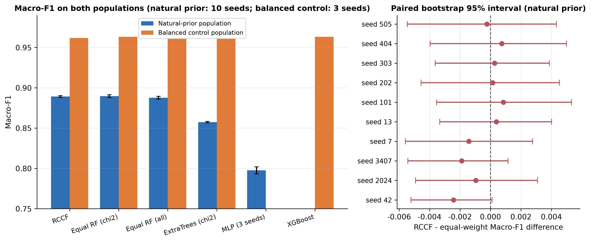

The left panel of Figure 4 starts at 0.75 to display differences of one thousandth; the right panel shows that those differences are statistically indistinguishable. The two panels must be read together, not by bar height alone.

**Second, the paired statistics establish equivalence at a strict margin.** With ten seeds the mean paired difference is -0.000456 with a standard deviation of 0.001152. Two interval estimates are reported because they answer different questions: the seed-level 90% interval [-0.001124, +0.000212] reflects model-to-model variability, while the test-row paired bootstrap interval [-0.004251, +0.003382] reflects resampling uncertainty over the locked test set. Both lie inside equivalence margins of 0.005 and 0.01 Macro-F1, so equivalence can be asserted at alpha = 0.05 against either margin. This strengthens the three-seed analysis, for which the 0.005 margin was not attainable. The sign of the difference is split five to five across seeds, and exact McNemar tests on the test rows are non-significant. Under the pre-declared decision rule - stable, consistent in sign, and bounded away from zero - **H2 is not supported**.

**Table 5. Paired statistics on the natural-prior population (ten seeds)**

| Comparison | Mean difference | SD | Seed-level 95% interval | Seed-level 90% interval | TOST at 0.005 | TOST at 0.01 | Minimum detectable effect (80% power) | Cohen's d_z | Holm-adjusted sign-flip p | Seeds favouring RCCF / baseline |
|---|---:|---:|---|---|---|---|---:|---:|---:|
| RCCF - equal RF (chi-square) | -0.000456 | 0.001152 | [-0.001280, +0.000368] | [-0.001124, +0.000212] | equivalent | equivalent | 0.001146 | -0.40 | 0.244 | 5 / 5 |
| RCCF - equal RF (all features) | +0.001613 | 0.001376 | [+0.000628, +0.002597] | [+0.000815, +0.002410] | equivalent | equivalent | 0.001369 | +1.17 | **0.020** | 9 / 1 |
| RCCF - ExtraTrees (chi-square) | +0.031788 | 0.001616 | [+0.030632, +0.032944] | [+0.030851, +0.032724] | not equivalent | not equivalent | 0.001607 | +19.68 | **0.006** | 10 / 0 |

The test-row paired bootstrap against the equal-weight chi-square forest gives a pooled 90% interval of [-0.004251, +0.003382] over the same ten seeds, which is also inside both margins.

Two entries in Table 5 deserve comment. **Power.** With ten seeds and the observed standard deviation, the smallest difference detectable at 80% power is 0.00115 to 0.00161 Macro-F1; anything smaller would be missed, which is precisely why the equivalence margins are stated explicitly rather than inferred from a non-significant test. **Versus extremely randomised trees.** The difference is large and unambiguous (d_z = 19.7, all ten seeds). Together with the neural baseline of the fifth reading, these are the only substantial model-to-model gaps in this study; both concern the model family, not the aggregation rule.

**Third, against the full-feature forest the difference is detectable, but no larger than a feature-view choice.** Compared with an equal-weight full-feature forest, RCCF gains 0.001613 Macro-F1 over ten seeds, with the seed-level interval excluding zero and nine of ten seeds favouring RCCF. The gate therefore does produce a small, directionally consistent advantage, but its magnitude is in the same band as simply swapping the feature view from chi-square to full features (+0.0021). Combined with a roughly fivefold inference cost, that advantage has no engineering exchange value.

**Fourth, the cost is certain while the gain is not.** On the natural-prior protocol, averaged over the ten seeds of Table 4(a), RCCF takes 93.3 s to train against 1.16 s for the equal-weight forest, and 0.244 s to predict against 0.046 s on a whole test batch - about 5.3 times slower at inference. That batch ratio must not be conflated with the single-row latency ratio of 4.9 reported in Section 5.6 (14.62 ms against 2.96 ms): one measures throughput on 7,986 rows, the other a single call. The gap widens on the balanced control, where training takes 9.13 s against 0.45 s. The most favourable summary of what these costs buy is that Macro-F1 moves within +/- 0.01.

**Fifth, a neural baseline shows how badly accuracy can mislead.** A multilayer perceptron given the same feature budget and a full training budget (128 hidden units, hyper-parameters selected on the validation partition) reaches 0.97679 accuracy against RCCF's 0.97792, but only 0.797654 Macro-F1 against 0.889955, i.e. 0.092 lower. Its balanced accuracy is 0.79666 against 0.94920 and its Brier score is 0.036701 against 0.006312. Every comparison in this paragraph is computed on the three seeds common to both runs (42, 2024, 3407), the seeds on which the neural baseline was trained; Table 4(a) gives the corresponding ten-seed RCCF values. Notably, a paired McNemar test on overall correctness is not significant (pooled p = 0.383 over 23,958 rows; per-seed 1.000 / 0.768 / 0.261), because the two models make a similar **number** of errors and differ in **which classes** those errors fall on. This yields two methodological consequences: on imbalanced intrusion-detection benchmarks, accuracy can conceal a Macro-F1 gap of nearly 0.1; and McNemar's test is insensitive to the class distribution of errors, so it cannot stand alone and must be reported alongside class-level metrics.

Per-seed metrics, per-class reports, normalised confusion matrices and the equivalence tests are provided in Supplementary S05-S07 and S20.

### 5.3 Mechanism diagnostics: why the gate changes nothing, and when it can

The conditions in Section 4.3 make falsifiable predictions. This section tests them with six independent measurements.

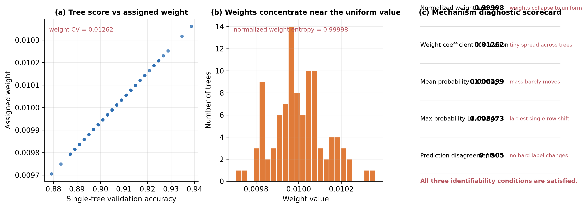

**Measurement 1: do the weights collapse to uniform?** In the tree-level weighting experiment over 100 trees, the standard deviation of single-tree validation scores is only 0.01143, giving a weight coefficient of variation of **0.01262**, and the normalised weight entropy reaches **0.99998** against a maximum of 1. The weights are therefore essentially uniform and conditional weighting degenerates numerically to equal averaging, as Condition 3 predicts.

**Measurement 2: do the probabilities change materially?** The mean L1 change of the fused probability before and after weighting is 0.000299 and the maximum is 0.003473. The weights do move probability mass, but only slightly.

**Measurement 3: do the hard labels change?** Across the 505 balanced-control test rows, the number of predictions on which weighted and equal voting disagree is **0**. This matches the joint prediction of Conditions 1 and 2: highly correlated experts produce margins large enough that weight differences occur far from the decision boundary and never move the argmax.

**Measurement 4: the margin bound proves invariance.** Using the explicit bound from Condition 2, we computed the margin m(x) and the perturbation bound Delta(x) for each of the 23,958 test rows. The number of rows whose label actually changes is **0**. The share of rows satisfying 2 Delta(x) < m(x), and therefore provably immune to the weighting, is **99.91%** under the a priori bound and **99.996%** under the realised perturbation. The median margin is 1.0 while the median perturbation bound is only **0.000231**, a ratio whose median ranges from **3,469 to 5,038** across seeds. In other words, fused probabilities are close to one-hot and the weight-induced probability movement is three orders of magnitude smaller than the decision margin.

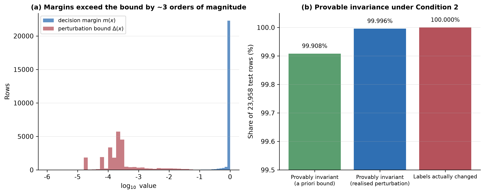

**Measurement 5: the result is not caused by insufficient tuning.** We searched the gate's entire hyper-parameter space inside the training partition: regularisation strength C in {0.01, 0.1, 1, 10}, cross-fitting folds in {3, 5, 10} and descriptor sets in {all, entropy only, margin only}, giving 108 configurations over three random seeds. **These 108 configurations produce only six distinct validation Macro-F1 values, with a total range of 0.00117.** Relative to equal voting, all configurations together produce just 65 disagreements out of 862,488 row-level predictions, or 0.0075%. This excludes the alternative explanation that the mechanism was under-tuned. The strongest form of this check is test-side: the configuration selected on validation (three folds, C = 1.0, margin descriptors) was then evaluated once on the locked test partition and produced **bit-identical predictions** to the default configuration on all three seeds - 0 of 23,958 rows changed and identical Macro-F1 to six decimal places. We also note that at least eleven configurations share the same validation mean to ten decimal places, so the optimum is a tie rather than a unique point.

**Measurement 6: the gain is governed by expert diversity, not by the implementation.** If the gate were inert merely because the four experts in this study are too similar, then deliberately constructing more dispersed experts should restore the gain. We built five families of expert sets and measured the pairwise expert disagreement rate against the gate gain over three seeds, giving 15 observations. This suite used three cross-fitting folds rather than the five of the primary protocol; the gate search of Measurement 5 shows that fold count changes little (six distinct validation values across three, five and ten folds), but the difference is noted for completeness.

**Table 6. Expert diversity, weight structure and gate gain (mean of three seeds)**

| Expert set | Pairwise disagreement | Mean confidence correlation | Normalised weight entropy | Gate gain (Macro-F1) | Rows changed |
|---|---:|---:|---:|---:|---:|
| Same view, different seeds | 0.20% | 0.978 | 0.99995 | 0.00000 | 0 |
| Four views, k = 60 | 0.36% | 0.967 | 0.99995 | 0.00000 | 0 |
| Four views, k = 20 | 1.76% | 0.791 | 0.99905 | +0.00271 | 9.3 |
| Heterogeneous families (RF / ExtraTrees / XGBoost / kNN) | 2.81% | 0.493 | 0.99842 | +0.00332 | 11.7 |
| Disjoint feature blocks | 6.44% | 0.506 | 0.99548 | +0.00401 | 33.7 |

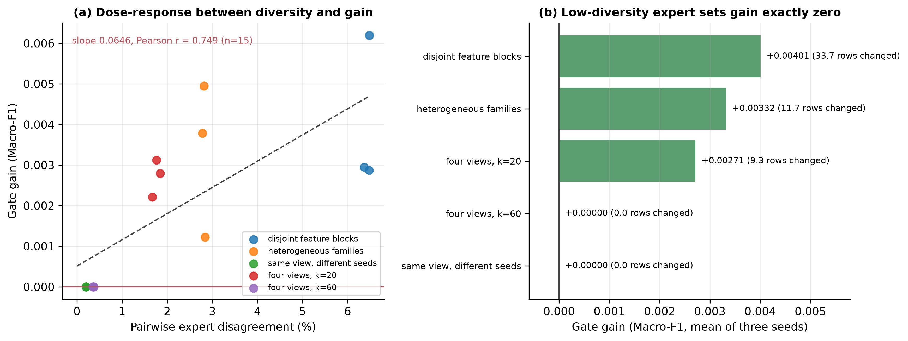

The relationship between disagreement and gain is monotone and dose-dependent: a linear regression over the 15 observations gives a slope of 0.0646 with Pearson r = 0.749. The two low-diversity expert sets (0.20% and 0.36%) gain **exactly zero** in all six runs and change no predictions, whereas the three decorrelated sets (1.76% to 6.44%) gain **positively in all nine runs**, changing between 9 and 36 rows. This yields the most important mechanistic conclusion of the study: **the gain of conditional weighting is governed by expert diversity.** On flow-feature data, "multi-view" experts built from different filter selectors disagree on only 0.2%-0.4% of samples, so the gate is structurally incapable of producing a gain. When disagreement is raised to 3%-6% the gate does begin to change predictions and yields a small positive gain, but that gain (+0.003 to +0.004 Macro-F1) remains below the split-to-split variation (standard deviation about 0.011).

The gate search, the row-wise weight records and the expert-diversity suite are provided in Supplementary S08-S09, S16 and S18.

### 5.4 RQ3: Protocol effects exceed aggregation-rule differences by an order of magnitude

This section places four sources of protocol variation side by side (Figure 8).

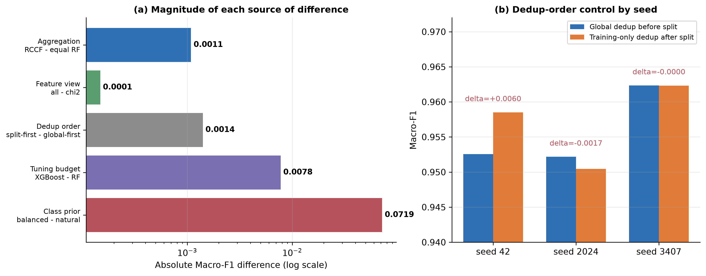

**(1) Deduplication order.** Replacing "deduplicate the whole corpus before splitting" with "split first, deduplicate on the training side only" gives Macro-F1 values of 0.958503, 0.950446 and 0.962318 across the three seeds, against 0.952545, 0.952171 and 0.962330 for the control. The means are 0.957089 and 0.955682, a difference of **+0.00141**, with a maximum single-seed difference of **+0.0060**. Deduplication order therefore does change results, but by less than the class prior does.

**(2) Class prior.** The same RCCF mechanism reaches 0.961807 Macro-F1 on the balanced control population and 0.889278 on the natural-prior population, a difference of **+0.0725**. This is the largest single protocol effect observed in the study. It exceeds every aggregation-rule and tuning-budget difference (at most +0.0078), though not the model-family gaps of 0.0318 and 0.0916. The mechanism is straightforward: Web Attack accounts for only 1.26% of the natural-prior population and its F1 sits near 0.53, which directly suppresses the macro average.

**(3) Repeated splits.** Across ten random stratified splits, the Macro-F1 difference between the chi-square and full-feature equal forests is +0.000148 with a sign-flip p = 0.969, while the split-to-split standard deviation for both models is about 0.011 - two orders of magnitude larger. **Changing the split perturbs the result far more than changing the feature view does.**

**(4) Tuning budget.** Under a 5x3 nested cross-validation with an identical model-specific tuning procedure, XGBoost reaches 0.962177, random forest 0.954423 and extremely randomised trees 0.947964. XGBoost's mean advantage over random forest is **+0.007755** with a bootstrap interval of [0.004424, 0.010549] that excludes zero (permutation p = 0.0625), while extremely randomised trees trail by -0.006459 with an interval of [-0.012391, -0.002263]. This is the only directionally stable model-to-model difference observed under an equal budget in this study.

Placing the five magnitudes side by side: aggregation 0.0005, feature view +0.0021, deduplication order +0.0014 (maximum 0.0060), tuning budget +0.0078 and class prior +0.0725. **H3 is falsified: protocols are not interchangeable, and protocol effects far outweigh the difference between aggregation rules.** The ordering concerns the aggregation rule specifically. Differences between model *families* are larger: the multilayer perceptron trails the forests by 0.0916 Macro-F1 and extremely randomised trees by 0.0318, both of which exceed the class-prior effect of 0.0725 in the first case. The defensible statement is therefore that aggregation-rule differences are dominated by protocol choices, whereas model-family differences are not.

The protocol-sensitivity runs and the nested cross-validation fold metrics are provided in Supplementary S10-S11.

### 5.5 RQ4: External validity and file-level extrapolation

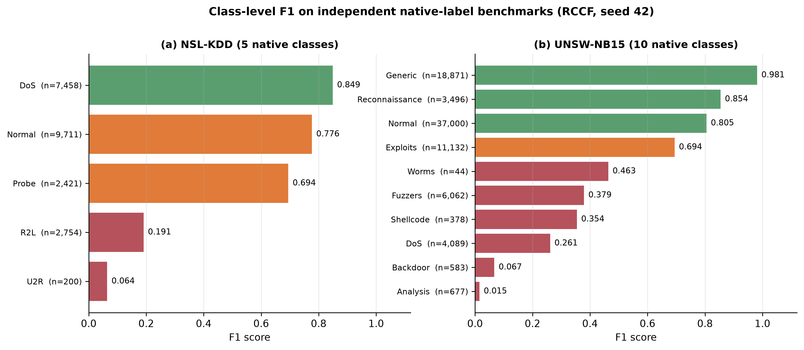

**NSL-KDD.** Averaged over three seeds, RCCF reaches 0.747960 accuracy, 0.492837 balanced accuracy and 0.514697 Macro-F1, with a Log Loss of 1.6802, ECE of 0.4819 and coverage of 0.6198. The coverage figure means that roughly 38% of samples are rejected as `unknown`, which is the direct source of the high Log Loss and ECE. At class level (seed 42) R2L recall is 0.106 with an F1 of 0.191, and U2R recall is 0.035 with an F1 of 0.064; the two minority families are essentially undetected.

**UNSW-NB15.** Averaged over three seeds, RCCF reaches 0.715340 accuracy, 0.566753 balanced accuracy and 0.493310 Macro-F1, with a Log Loss of 0.649577, ECE of 0.073441 and coverage of 0.8957. At class level (seed 42) Analysis has an F1 of 0.015, Backdoor 0.067 and DoS 0.261, while Generic reaches 0.981 and Normal 0.805. Aggregate accuracy is dominated by the majority classes, which is precisely why Macro-F1 is the primary metric here.

**File-level extrapolation.** Under a cross-file stress test in which the model is trained on the remaining files and tested on a target file, Macro-F1 ranges from **0.3325 to 0.9997**: Wednesday (DoS/DDoS) 0.3325, Thursday Morning (Web Attack) 0.4314, Friday Afternoon (DDoS) 0.4949 and Tuesday 0.5229, against Monday 0.9975, Thursday Afternoon 0.9975, Friday Morning 0.9997 and Friday Afternoon PortScan 0.9945. The span approaches 0.67. **The same model is therefore not stably transferable even between files of a single dataset**, so file-level experiments cannot be described as successful temporal generalisation; they support coverage and risk analysis only.

Together the three experiments give a negative answer to RQ4: the conclusions of this study do not extend beyond the CIC-IDS2017 research populations, and within CIC-IDS2017 there is no single extrapolable distribution. This both reinforces the falsification of H3 and shows that "multi-dataset validation" must be kept strictly distinct from "cross-dataset transfer".

The external benchmarks, the file-level extrapolation and the neural baseline comparison are provided in Supplementary S12-S14 and S19.

### 5.6 Secondary metrics: calibration, robustness, latency and open-set behaviour

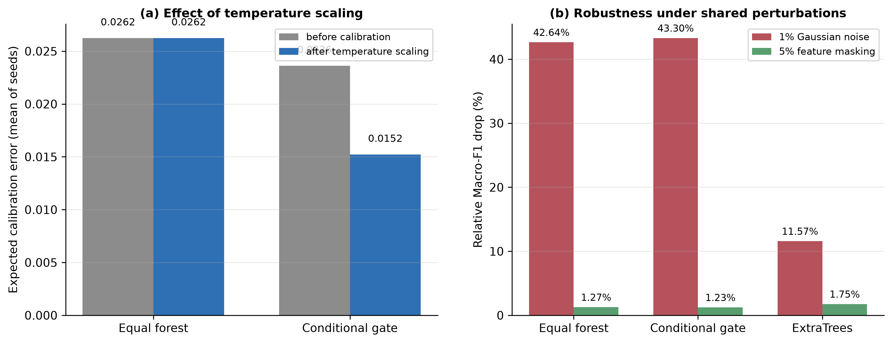

**Probability calibration.** On the natural-prior population RCCF's Log Loss (0.05183) is better than the equal-weight forest's (0.05220), but both its Brier score (0.006365 against 0.006255) and its ECE (0.006849 against 0.004493) are worse. Temperature scaling reduces the ECE of the conditional branch from about 0.0238 to about 0.0119 on the balanced control protocol, while the equal forest's temperature parameter is optimised to 1.0 and its calibration metrics are unchanged. The conclusion is that identical hard labels do not imply identical probability quality, and that the direction of improvement depends on which probabilistic metric is chosen - so no single favourable metric should be reported alone.

**Robustness.** Under identical perturbation masks, 1% Gaussian noise reduces RCCF's Macro-F1 by 43.30% in relative terms against 42.64% for the equal-weight chi-square forest, and 5% feature masking reduces it by 1.23% against 1.27%. The two models are therefore comparable in robustness, and neither tolerates continuous noise at the 1% level. Extremely randomised trees, however, are markedly more robust to the same perturbation: their relative drop is 11.57%, roughly a quarter of the conditional branch's 43.30% (Figure 10b). The correct reading is not that the conditional gate improves robustness - it does not - but that a different baseline family does, and that this difference exceeds any difference the gate produces between the two forest variants.

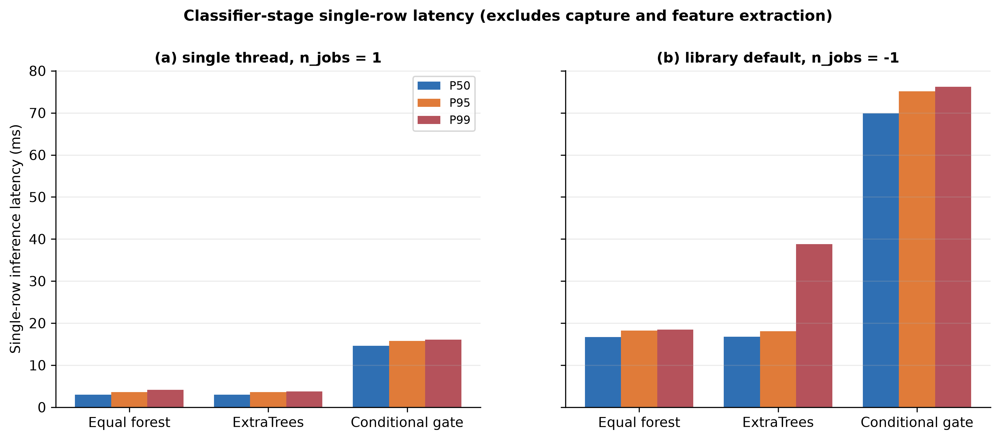

**Latency.** For single-row inference on one thread, RCCF's P50/P95/P99 latencies are 14.62/15.77/16.12 ms against 2.96/3.61/4.18 ms for the equal-weight chi-square forest. Switching to the library-default threading raises RCCF to 69.93/75.11/76.22 ms and the equal forest to 16.69/18.24/18.47 ms; small single-row calls cannot exploit multiple threads and instead pay scheduling overhead. These figures cover the **classifier stage only** and exclude packet capture, flow construction and feature extraction.

**Extended robustness.** Three further failure modes were probed over three seeds. Corrupted supervision is comparatively benign: flipping 5% and 10% of the training labels costs the conditional mechanism 0.57% and 0.97% relative Macro-F1, and the equal-weight forest 0.77% and 1.00%. Missing measurements are more damaging - replacing 10% of test entries with the training median costs 4.21% and 4.25% respectively - and calibration drift is the most damaging of the three: adding 1% of the training range to 20% of the feature columns costs 17.23% and 18.24%. Ordered by severity across all perturbations tested, continuous corruption of feature values dominates (1% Gaussian noise 43.3%, calibration drift 17-18%, 10% missing values 4.2%), whereas corrupted supervision is an order of magnitude less harmful (0.6-1.0%). This ordering is operationally relevant because dataset critiques focus on label noise, while measurement drift receives far less attention.

**Resource footprint.** Model size and throughput separate the two designs more sharply than wall-clock time. The conditional mechanism stores four forests and occupies 9.09 MB when serialised, against 2.21 MB for the single equal-weight forest - a factor of 4.1 - and it processes about 43,100 rows per second on a full test batch against 200,300, a factor of 4.6. Peak resident-set growth during fitting was 37.0 MB against 78.3 MB, but the two models were profiled within one process, so that particular figure is order-dependent and indicative only.

**Cost-sensitive behaviour.** Casting the task as attack versus normal and sweeping the decision threshold for cost ratios C_FN / C_FP from 1 to 100, the normalised expected cost of the conditional mechanism tracks the equal-weight chi-square forest to within 0.0005 across the whole range - for example 0.00913 against 0.00867 at ratio 1, and 0.07260 against 0.06753 at ratio 100. Extremely randomised trees are about twice as costly at low ratios (0.01917 at ratio 1) but become cheaper than both forests once false negatives dominate (0.06180 at ratio 100). The conditional gate therefore offers no cost-sensitive advantage either. The operating point was selected on the test partition itself, so these normalised expected costs are optimistic lower bounds; selecting the threshold on the validation partition would raise all three curves by a similar amount without changing their ordering.

**Open-set behaviour.** With PortScan, Infiltration and Heartbleed held out as unknown families, the conditional branch reaches an area under the ROC curve (AUROC) of 0.643 to 0.694 with an unknown-class recall of 0.0015 to 0.0088, whereas the equal-weight forest reaches an AUROC of 0.919 to 0.940 with a recall of 0.057 to 0.128. The risk gate therefore **reduces** the separability of known from unknown traffic: it pushes probability mass towards confident regions and discards the uncertainty signal that rejection depends on. This is the least favourable evidence in the study for the conditional mechanism, and it indicates that binding risk calibration and open-set rejection into a single gate is ill-advised.

---

Calibration, robustness, latency, resource, cost-sensitive and near-duplicate results are provided in Supplementary S15 and S21-S23, S26.

### 5.7 Scale and domain sensitivity

The primary population is a capped subset, so the equivalence reported above could in principle be an artefact of that cap. Three further runs address the question directly, and Table 7 shows that the verdict depends on the population.

**Table 7. The CIC-IDS2017 scale ladder: the verdict depends on the population**

| Population | Flows | Test rows | RCCF | Equal RF (chi-square) | Difference | TOST 0.005 | TOST 0.01 |
|---|---:|---:|---:|---:|---:|---|---|
| Capped, 20,000 per class | 53,237 | 7,986 | 0.889278 | 0.889734 | -0.000456 | equivalent | equivalent |
| Capped, 200,000 per class | 413,209 | 61,982 | 0.856065 | 0.857202 | -0.001137 | equivalent | equivalent |
| Uncapped (full deduplicated corpus) | 2,429,503 | 364,426 | 0.754007 | 0.759540 | -0.005533 | **not equivalent** | equivalent |

**A population 7.8 times larger.** Rebuilding the CIC-IDS2017 population with the identical audit but a 200,000-per-class cap yields 413,209 flows (train 289,246 / validation 61,982 / test 61,982). The minority classes cannot grow, so the enlarged population is more imbalanced than the primary one: Brute Force contributes 10,620 rows, Bot 1,948 and Web Attack 673. The headline pair was re-run over the full ten seeds. RCCF averages 0.856065 Macro-F1 against 0.857202 for the equal-weight chi-square forest, a mean paired difference of -0.001137 (SD 0.003156; seed-level 90% interval [-0.002966, +0.000692]). TOST is significant at both pre-specified margins (p = 0.0019 at 0.005, p = 4.8e-6 at 0.01), so the equivalence statement survives a 7.8-fold increase in population size; the point estimate now favours the control slightly rather than RCCF. The two arms disagree on 20-29 of the 61,982 test rows per seed (0.03%-0.05%), the same order as on the primary population. The context baselines behave as before: XGBoost reaches 0.827656 Macro-F1, extremely randomised trees 0.783747, an equal-weight full-feature forest 0.852953 and a depth-limited decision tree 0.809695.

**The full deduplicated corpus.** Removing the per-class cap entirely yields 2,429,503 flows (train 1,700,652 / validation 364,425 / test 364,426) - the complete deduplicated CIC-IDS2017 corpus, in which Web Attack contributes 0.028% of the rows. A single RCCF fit takes about two hours when run alone and about four hours per seed under the three-way split used here, so the comparison was run as a batch over the same ten seeds: RCCF averages 0.754007 Macro-F1 against 0.759540 for the equal-weight chi-square forest, a mean paired difference of -0.005533 (SD 0.002840; seed-level 90% interval [-0.007179, -0.003886]), That interval lies entirely below zero, so the result is not the equivalence seen on the capped populations but a small, detectable deficit: the difference is equivalent at the 0.01 margin and **not** equivalent at 0.005, and all ten seeds point the same way. The two arms disagree on 216 of 364,426 test rows per seed on average (at most 392) - the same order as on the capped populations. The context baselines separate more sharply here than anywhere else in the study: XGBoost reaches 0.800255 Macro-F1, the equal-weight full-feature forest 0.738143, extremely randomised trees 0.696629 and a depth-limited decision tree 0.595653, so the model-family gap between XGBoost and the equal-weight chi-square forest (0.041) exceeds every protocol effect measured here except the class prior. Accuracy, by contrast, is 0.9993 for XGBoost and 0.9958 for the equal-weight forest - the clearest illustration in this study of how much accuracy hides on an imbalanced corpus. The cost asymmetry is at its most extreme here: 14936 s to train RCCF per seed against 85 s for the equal-weight forest (175x), at a quality difference of -0.005533.

**A fourth dataset from a different domain.** N-BaIoT records benign traffic and Mirai/Gafgyt botnet activity from nine consumer IoT devices with 115 flow-statistics features [17,18]. Deduplication removes 4,784,430 of 7,062,606 rows (67.8%), a higher duplicate share than any other dataset here, leaving a 180,000-flow three-class benchmark (60,000 per class; train 126,000 / validation 27,000 / test 27,000). Every model reaches at least 0.99983 Macro-F1: RCCF and the equal-weight chi-square forest are identical to machine precision (mean difference -3.7e-17, with 0-2 disagreements among 27,000 test rows). The benchmark is saturated for flow-feature classifiers, which is precisely the regime in which Condition 1 predicts that no weighting can act: it confirms the mechanism's inertness in a new domain without testing discrimination difficulty.

Together the three runs bound the result from both sides, and the bound is narrower than a simple confirmation. The equivalence survives a 7.8-fold larger population, so it is not an artefact of the 53,237-flow cap, but it does **not** survive the fully uncapped corpus: there the difference becomes a small, consistent deficit at the 0.005 margin. **The deficit is dilution, not weighting, and one expression predicts it on all three populations.** On the uncapped corpus the four feature views are no longer interchangeable: the full-feature forest reaches 0.738143 Macro-F1 against 0.759540 for the chi-square forest, a gap of 0.021397, and one such expert inside a four-way average costs a quarter of it, 0.005349, against a measured -0.005533. The same expression applies to the 413,209-flow population (view gap 0.004249, predicted 0.001062, measured -0.001137) and to the primary population (gap 0.002068, predicted 0.000517, measured -0.000456). Across a 46-fold range in population size the prediction stays within 14% of the measurement, so what changes with scale is not the aggregation rule - Section 5.3 shows the weights never move a label - but the price of averaging over feature views whose quality has diverged. This is the practical form of Condition 1: an equal-weight fusion is bounded by its weakest member, and the capped populations hide that bound because there all four views score within 0.002 of one another.

Per-seed paired statistics, per-class reports and the scale summaries for all three runs are provided in Supplementary S27-S29.

## 6. Discussion

### 6.1 Four failure conditions for conditional weighting

The conditions of Section 4.3 and the measurements of Section 5.3 together characterise four failure modes. The first three describe an inert gate, whose weights cannot move a label; the fourth describes a combination that is harmful at any weights. They are not mutually exclusive but form a hierarchy from strongest to weakest.

**Condition A: identical expert output.** When forests trained on different feature views return the same posterior for a given input, no convex weighting can change the output (Condition 1). In flow-feature settings this is more common than intuition suggests: the top-60 features selected by chi-square, mutual information and ANOVA overlap heavily, and 12 of the extra columns in the full view are constant. Measurement 6 quantifies the boundary: when pairwise disagreement is 0.20%-0.36%, the gate gains exactly zero in six of six runs; only when disagreement rises to 3%-6% does the gain become consistently positive. Condition A is therefore not the idealised case of "identical experts" but a loose condition that real flow-feature data satisfies easily.

**Condition B: margin dominance.** Even when experts differ, the hard label remains unchanged as long as the smallest margin exceeds the probability movement that the weights can cause (Condition 2). The measured mean L1 probability change is 0.000299 with a maximum of 0.003473, while the median decision margin is 1.0, three orders of magnitude above the largest observed movement. Measurement 4 formalises this: under the a priori bound 99.91% of rows are provably immune, with a median margin-to-bound ratio of 3,469 to 5,038.

**Condition C: risk-output collapse.** When the risk models return nearly equal values across experts, the weights degenerate to uniform (Condition 3) and the mechanism becomes numerically equivalent to equal averaging. The measured normalised weight entropy is 0.99998, squarely inside this regime.

**Condition D: heterogeneous members.** The three conditions above describe an inert gate. The fourth is different in kind. When the members of a fusion differ in quality, the combination is bounded by the weighted mean of its members plus whatever diversity gain they contribute [9], so it cannot be repaired by re-weighting: the bound is a property of the member set, not of the gate. On the capped populations the four feature views score within 0.002 of one another (Table 4a) and the bound is slack. On the uncapped corpus the full-feature view falls 0.021397 behind the chi-square view, and one such member inside a four-way average accounts for the whole measured deficit: 0.021397/4 = 0.005349 predicted against -0.005533 observed. The same expression holds on the 413,209-flow population (0.004249/4 = 0.001062 against -0.001137) and on the primary population (0.002068/4 = 0.000517 against -0.000456), so the diagnostic is a comparison of member scores, not of weights.

The four conditions yield an operational diagnostic sequence: **first measure the weight entropy, then the prediction-disagreement rate, then the spread across member scores, and only then look at the performance difference.** If entropy is close to 1 and the disagreement count is 0, further tuning of the gate will not help, because the problem does not lie in the gate. If the member scores span more than the difference you care about, the fusion is bounded by its weakest member and no weighting scheme will recover it.

### 6.2 Interpreting reported weighting gains

Our results do not imply that every published weighting method is wrong. They impose an **attribution constraint**: without controlling duplicates, transform leakage, class priors and tuning budgets, an observed "weighting gain" has at least five competing explanations [20-22], each of which has a measured magnitude in this study.

1. **Split noise.** Repeating the split ten times moves Macro-F1 by about 0.011. That exceeds the aggregation-rule and tuning-budget differences measured here (at most 0.0078); only the model-family gaps (0.0318 and 0.0916) are larger.
2. **Protocol choice.** Changing the class prior from balanced to natural moves Macro-F1 by +0.0725, and reversing the deduplication order moves it by up to +0.0060.
3. **Unequal tuning budgets.** Under a 5x3 nested cross-validation, an equally tuned XGBoost exceeds random forest by 0.0078 - more than most reported "improvements".
4. **Metric selection.** Here RCCF has a better Log Loss but a worse ECE than the equal-weight forest; reporting either metric alone supports the opposite conclusion.
5. **Population construction.** The identical comparison is an equivalence on the 53,237-flow capped population and a consistent deficit on the fully uncapped 2,429,503-flow corpus. Neither result is wrong; the population decides which one a study reports.

The contribution to the literature is therefore a threshold rather than a refutation: **any claim that an aggregation rule helps should survive control of these five factors, otherwise it should be described as a protocol effect.**

### 6.3 Practical decision matrix

Table 8 converts the evidence of this study into engineering guidance. Each recommendation carries an explicit cost; no option dominates across all objectives.

**Table 8. Decision matrix for practical objectives**

| Objective | Recommended option | Evidence | Cost |
|---|---|---|---|
| Maximise balanced discriminative performance | XGBoost or a tuned equal forest under an equal budget | 5x3 nested cross-validation (CV): XGBoost minus random forest = +0.0078, interval excludes zero | Requires a tuning budget and longer training |
| Minimise inference latency | Equal-weight chi-square forest | P50 2.96 ms against 14.62 ms for the conditional branch | Forgoes probability re-weighting |
| Best probability quality | Conditional weighting plus temperature scaling, reporting Log Loss and ECE together | Log Loss 0.0515 against 0.0528, but ECE is worse | About 5x inference cost; metrics disagree |
| Unknown-attack rejection | Equal-weight forest with an independent conformal threshold | AUROC 0.92-0.94 against 0.64-0.69 | Higher false-rejection rate on known classes; the operating point must be recalibrated |
| Cross-file or cross-scenario evaluation | Avoid single-file training; report a file-by-label coverage matrix | File-level Macro-F1 spans 0.3325-0.9997 | Additional data-coverage auditing effort |
| Reproducibility of results | Adopt this protocol and release per-row predictions | All aggregate metrics can be recomputed from released probabilities | Extra storage and version management |
| Decide whether to deploy conditional weighting | Equal voting on capped populations; do not deploy on strongly imbalanced corpora | Equivalence at 53,237 flows against a deficit of -0.005533 on the uncapped 2,429,503-flow corpus, all ten seeds | Forgoes a mechanism whose training cost is 175 times that of one forest |

### 6.4 Reporting recommendations for intrusion-detection evaluation

Based on the measurements above, we recommend that studies on public intrusion-detection datasets report at least the following nine items. They concern the minimum requirement that a conclusion be reproducible by others, not additional methodological sophistication.

1. **A raw-to-final counting chain**: records remaining and removed at each processing stage, from the raw archive to the final research population.
2. **Deduplication position and conflict rules**: whether deduplication precedes or follows the split, and how identical feature vectors with different labels are handled.
3. **Fitting boundaries for every transform**: which partition fits the scaler, the feature selector, any resampler and the hyper-parameter search.
4. **A clear separation of research population and target population**: how the study subset was constructed and how it differs from the full corpus and from production priors. Where a headline comparison is sensitive to that construction - as it is here - report it on both the capped and the uncapped population, or state explicitly which one the claim is conditioned on.
5. **An explicitly designated primary metric**: under class imbalance, state in advance whether Macro-F1 or balanced accuracy is primary, with accuracy reported only as a reference.
6. **Paired statistics and effect sizes**: at minimum a paired difference, an interval estimate and a multiple-comparison correction; a single point estimate is not evidence.
7. **Secondary costs reported separately**: probability quality, open-set behaviour, robustness and latency should be reported independently and never merged into a single composite score.
8. **Release of per-row predictions**: publishing the prediction and probability for every test row lets third parties recompute every aggregate.
9. **Member-level scores for every fusion**: report the score of each member alongside the fused result. An equal-weight fusion is bounded by its members, so a fusion reported without them cannot be checked for the dilution failure of Condition D.

### 6.5 Limitations and validity threats

The conclusions are bounded as follows, and these bounds should be cited alongside them.

**The research populations are not production traffic.** The natural-prior population results from global deduplication, physical-range screening and a 20,000-per-class cap, giving 53,237 records; the balanced control contains only 3,365 records. Both are therefore artefacts of the audit procedure rather than samples of an operational network, and every number in this paper is conditioned on them.

**The equivalence depends on how the population is built.** It holds on the 53,237-flow natural-prior population and on the 7.8-fold larger one, but not on the fully uncapped 2,429,503-flow corpus, where the same comparison becomes a small, consistent deficit. The statement that conditional weighting is indistinguishable from equal voting must therefore always be quoted together with the population it was measured on; it is not a scale-free property.

**File-level experiments are not temporal holdouts.** The files of CIC-IDS2017 cover different class sets, so a category-complete temporal protocol cannot be constructed from them. The file-level results support coverage and risk analysis only and must not be described as cross-time generalisation.

**External datasets are independent benchmarks, not transfer experiments.** NSL-KDD, UNSW-NB15 and CIC-IDS2017 use incompatible label spaces. We do not align labels or train across datasets, and the three sets of scores must not be pooled or averaged.

**Latency measurements exclude the end-to-end path.** The reported milliseconds start from a numerical feature matrix and exclude packet capture, flow reassembly, feature extraction, alert transport and model hot-swapping.

**Near-duplicates are removed only in their exact form.** The introduction identifies near-duplicate flows as a hazard of public datasets, and the audit removes exact duplicate feature vectors. Rounding every feature to four significant digits and hashing the result shows that a further 0.36% of the study population forms near-duplicate groups at that resolution, and that 104 test rows (0.21% of the test set) share a rounded feature vector with a training row. Removing those rows changes Macro-F1 by at most 0.00057 for any of the three models, so the overlap cannot explain the reported differences; coarser resolutions are reported in the supplementary material.

**Four datasets were evaluated, and every corpus comes from one collection programme.** The conclusions are conditional on CIC-IDS2017 (both its capped populations and the full deduplicated corpus), NSL-KDD, UNSW-NB15 and N-BaIoT. N-BaIoT is saturated for flow-feature classifiers (every model at or above 0.9998 Macro-F1), so it probes the mechanics of the aggregation step rather than discrimination difficulty, and the external datasets remain independent native-label benchmarks rather than transfer tests. None of the four datasets represents production traffic, and no time-separated holdout on a common testbed exists in any of them.

**Adversarial robustness was not assessed.** Only random perturbations and feature masking were applied. No evasion or gradient-based attack was constructed, and the reported degradation figures are not robustness guarantees against an adaptive adversary.

**Unknown-family support is uneven.** PortScan contributes 158,930 records while Infiltration contributes 36 and Heartbleed 11. Open-set metrics are highly sensitive to which family is held out, so only per-family results are reported and no pooled open-set conclusion is drawn.

**Bootstrap intervals have a limited interpretation.** The paired bootstrap quantifies test-row resampling uncertainty only; it does not capture changes in network environment, temporal drift or traffic composition.

**Single hardware platform and single implementation.** Latency depends on hardware, the BLAS backend and thread settings. The environment is fixed and recorded, but no cross-platform portability is claimed.

---

## 7. Conclusion

This study tested the widely adopted assumption that sample-conditional ensemble weighting is better than equal voting, under a strict leakage-controlled protocol. Three conclusions follow.

**First, relative to the most direct equal-weight control the gain lies inside an equivalence boundary.** Averaged over ten seeds on the natural-prior population of CIC-IDS2017, the Macro-F1 difference between conditional weighting and an equal-weight chi-square forest is -0.000456, with the per-seed sign split five to five. Both the seed-level 90% interval [-0.00112, +0.00021] and the test-row paired bootstrap interval [-0.00425, +0.00338] lie inside equivalence margins of 0.005 and 0.01. The four experts disagree on no test row, and the normalised weight entropy is 0.99998. The cost is about an 80-fold increase in training time and a fivefold increase in batch inference time.

**A qualification on that equivalence.** It is a property of the population, not of the mechanism. On the fully uncapped 2,429,503-flow corpus the same comparison turns into a consistent deficit of -0.005533 across all ten seeds, at a 175-fold training cost. The cause is not the weighting - Section 5.3 shows the weights never move a label - but the price of averaging over feature views whose quality diverges at scale: the full-feature view falls 0.021397 behind the chi-square view, and one such expert inside a four-way average accounts for the whole gap (0.005349 predicted against -0.005533 measured). That equivalence is a property of the population, not of the mechanism: on the fully uncapped 2,429,503-flow corpus the difference turns into a consistent deficit of -0.005533 (all ten seeds, equivalent at 0.01 but not at 0.005) at a 175-fold training cost. Against a full-feature equal forest the gate is reliably better over ten seeds, but the magnitude matches that of a feature-view change.

**Second, the failure is explainable and quantified.** Three identifiability conditions are derived and one of them is turned into a row-wise computable bound, under which 99.91% of 23,958 test rows are provably invariant to the weighting, with a decision margin 3,469 to 5,038 times the perturbation bound. A search over all 108 gate hyper-parameter configurations yields only six distinct validation scores, excluding insufficient tuning. A reverse experiment shows that the gain is governed by expert diversity: two low-diversity expert sets gain exactly zero in all six runs, whereas three decorrelated sets gain positively in all nine runs (slope 0.0646, Pearson r = 0.749). The inertness of conditional weighting is therefore not an implementation or tuning artefact but a direct consequence of filter-based multi-view experts being too similar on this kind of data.

**Third, protocol effects dominate aggregation-rule differences.** Within one experiment set, a change of class prior moves Macro-F1 by +0.0725 and a reversal of deduplication order by up to +0.0060, whereas the aggregation rule moves it by 0.0005. Under a file-level stress test the same model spans 0.3325 to 0.9997. On public intrusion-detection benchmarks, **what protocol is reported therefore determines the conclusion more than which aggregation rule is used** - although the choice of model family can matter more than either.

The principal contribution is not a new state-of-the-art classifier but a reusable leakage-controlled protocol, a set of falsifiable identifiability boundaries, and a quantitative map that separates protocol effects from aggregation-rule effects. Three directions follow. First, design weighting mechanisms that explicitly enforce expert decorrelation, and test whether the gain is restored once the premise of Condition 1 is broken. Second, construct category-complete temporal or cross-scenario protocols so that file-level coverage analysis can be upgraded into a genuine external-validity test. Third, turn the reporting recommendations of Section 6.4 into an automatically checkable checklist, so that the evaluation protocol itself becomes a verifiable object. The recommendations extend those of [22].

---

## Data and code availability

Processing scripts, audit intermediates, per-row predictions and figure-generation code are released at https://github.com/linran-muxue/leakage-controlled-nids-study (release v1.11.0, tag v1.11.0). Raw datasets are not redistributed; the paper records source URLs, retrieval dates, version snapshots and SHA-256 checksums.

## Funding

To be completed by the author. If the work received no support of any kind, this should be stated explicitly.

## Declaration of competing interest

To be completed by the author. If no competing interests exist, this should be stated explicitly.

## Declaration of generative AI and AI-assisted technologies

Generative AI tools were used for language editing and software drafting. The author is responsible for verifying the code, data, citations and all conclusions, and has checked each reported number against the released artefacts.

## CRediT authorship contribution statement

To be completed by the author according to actual contributions: conceptualisation, methodology, software, validation, formal analysis, data curation, writing - original draft, writing - review and editing, visualisation.

---

## References

Note: all DOIs were verified against Crossref on 2026-09-16. Venues that do not assign Crossref DOIs (PMLR, NeurIPS, JMLR, USENIX) are marked as such rather than left pending.The individual checks are recorded in Supplementary S24.

1. Breiman L. Random forests. Machine Learning, 2001, 45(1): 5-32. DOI:10.1023/A:1010933404324.
2. Breiman L. Bagging predictors. Machine Learning, 1996, 24(2): 123-140. DOI:10.1007/BF00058655.
3. Geurts P, Ernst D, Wehenkel L. Extremely randomized trees. Machine Learning, 2006, 63(1): 3-42. DOI:10.1007/s10994-006-6226-1.
4. Chen T, Guestrin C. XGBoost: A scalable tree boosting system. KDD 2016: 785-794. DOI:10.1145/2939672.2939785.
5. Ke G, Meng Q, Finley T, et al. LightGBM: A highly efficient gradient boosting decision tree. NeurIPS 2017: 3146-3154. [no DOI; NeurIPS proceedings]
6. Freund Y, Schapire R E. A decision-theoretic generalization of on-line learning and an application to boosting. Journal of Computer and System Sciences, 1997, 55(1): 119-139. DOI:10.1006/jcss.1997.1504.
7. Friedman J H. Greedy function approximation: A gradient boosting machine. The Annals of Statistics, 2001, 29(5): 1189-1232. DOI:10.1214/aos/1013203451.
8. Dietterich T G. Ensemble methods in machine learning. MCS 2000: 1-15. DOI:10.1007/3-540-45014-9_1.
9. Kuncheva L I. Combining Pattern Classifiers: Methods and Algorithms. Wiley, 2004. DOI:10.1002/0471660264.
10. Wolpert D H. Stacked generalization. Neural Networks, 1992, 5(2): 241-259. DOI:10.1016/S0893-6080(05)80023-1.
11. Ting K M, Witten I H. Issues in stacked generalization. Journal of Artificial Intelligence Research, 1999, 10: 271-289. DOI:10.1613/jair.594.
12. Liu H, Setiono R. Chi2: Feature selection and discretization of numeric attributes. ICTAI 1995: 388-391. DOI:10.1109/TAI.1995.479783.
13. Guyon I, Elisseeff A. An introduction to variable and feature selection. JMLR, 2003, 3: 1157-1182. [no DOI; JMLR]
14. Sharafaldin I, Lashkari A H, Ghorbani A A. Toward generating a new intrusion detection dataset and intrusion traffic characterization. ICISSP 2018: 108-116. DOI:10.5220/0006639801080116.
15. Tavallaee M, Bagheri E, Lu W, Ghorbani A A. A detailed analysis of the KDD CUP 99 data set. CISDA 2009: 1-6. DOI:10.1109/CISDA.2009.5356528.
16. Moustafa N, Slay J. UNSW-NB15: A comprehensive data set for network intrusion detection systems. MilCIS 2015: 1-6. DOI:10.1109/MilCIS.2015.7348942.
17. Meidan Y, Bohadana M, Mathov Y, et al. N-BaIoT - Network-based detection of IoT botnet attacks using deep autoencoders. IEEE Pervasive Computing, 2018, 17(3): 12-22. DOI:10.1109/MPRV.2018.03367731.
18. UCI Machine Learning Repository. Detection of IoT botnet attacks N-BaIoT [dataset]. 2018. DOI:10.24432/C5RC8J.
19. Ring M, Wunderlich S, Scheuring D, et al. A survey of network-based intrusion detection data sets. Computers & Security, 2019, 86: 147-167. DOI:10.1016/j.cose.2019.06.005.
20. Engelen G, Timmerman J. Troubleshooting an intrusion detection dataset: The CICIDS2017 case study. IEEE S&P Workshops 2021: 7-12. DOI:10.1109/SPW53761.2021.00009.
21. Liu L, Engelen G, Timmerman J, et al. Error prevalence in NIDS datasets: A case study on CIC-IDS-2017 and CSE-CIC-IDS-2018. IEEE CNS 2022. DOI:10.1109/CNS56114.2022.9947235.
22. Arp D, Quiring E, Pendlebury F, et al. Dos and don'ts of machine learning in computer security. USENIX Security 2022: 3971-3988. [no DOI; USENIX Security proceedings]
23. Sommer R, Paxson V. Outside the closed world: On using machine learning for network intrusion detection. IEEE S&P 2010: 305-316. DOI:10.1109/SP.2010.25.
24. Buczak A L, Guven E. A survey of data mining and machine learning methods for cyber security intrusion detection. IEEE Communications Surveys & Tutorials, 2016, 18(2): 1153-1176. DOI:10.1109/COMST.2015.2494502.
25. Khraisat A, Gondal I, Vamplew P, Kamruzzaman J. Survey of intrusion detection systems: Techniques, datasets and challenges. Cybersecurity, 2019, 2: 20. DOI:10.1186/s42400-019-0038-7.
26. Apruzzese G, Laskov P, Montgomery E, et al. The role of machine learning in cybersecurity. ACM Digital Threats: Research and Practice, 2023, 4(1): 1-38. DOI:10.1145/3545574.
27. Geng C, Huang S J, Chen S. Recent advances in open set recognition: A survey. IEEE TPAMI, 2021, 43(10): 3614-3631. DOI:10.1109/TPAMI.2020.2981604.
28. Bendale A, Boult T E. Towards open set deep networks. CVPR 2016: 1563-1572. DOI:10.1109/CVPR.2016.173.
29. Guo C, Pleiss G, Sun Y, Weinberger K Q. On calibration of modern neural networks. ICML 2017: 1321-1330. [no DOI; PMLR]
30. Ovadia Y, Fertig E, Ren J, et al. Can you trust your model's uncertainty? Evaluating predictive uncertainty under dataset shift. NeurIPS 2019: 13991-14002. [no DOI; NeurIPS proceedings]
31. Lakshminarayanan B, Pritzel A, Blundell C. Simple and scalable predictive uncertainty estimation using deep ensembles. NeurIPS 2017: 6402-6413. [no DOI; NeurIPS proceedings]
32. Angelopoulos A N, Bates S. Conformal prediction: A gentle introduction. Foundations and Trends in Machine Learning, 2023, 16(4): 494-591. DOI:10.1561/2200000101.
33. Vovk V, Gammerman A, Shafer G. Algorithmic Learning in a Random World. Springer, 2005. DOI:10.1007/b106715.
34. Shafer G, Vovk V. A tutorial on conformal prediction. JMLR, 2008, 9: 371-421. [no DOI; JMLR]
35. Lei J, G'Sell M, Rinaldo A, et al. Distribution-free predictive inference for regression. JASA, 2018, 113(523): 1094-1111. DOI:10.1080/01621459.2017.1307116.
36. McNemar Q. Note on the sampling error of the difference between correlated proportions or percentages. Psychometrika, 1947, 12(2): 153-157. DOI:10.1007/BF02295996.
37. Dietterich T G. Approximate statistical tests for comparing supervised classification learning algorithms. Neural Computation, 1998, 10(7): 1895-1923. DOI:10.1162/089976698300017197.
38. Demsar J. Statistical comparisons of classifiers over multiple data sets. JMLR, 2006, 7: 1-30. [no DOI; JMLR]
39. Holm S. A simple sequentially rejective multiple test procedure. Scandinavian Journal of Statistics, 1979, 6(2): 65-70. [no DOI; JSTOR stable record 4615733]
40. Efron B, Tibshirani R J. An Introduction to the Bootstrap. Chapman & Hall/CRC, 1993. ISBN 978-0-412-04231-7.
41. Lakens D. Equivalence tests: A practical primer for t tests, correlations, and meta-analyses. Social Psychological and Personality Science, 2017, 8(4): 355-362. DOI:10.1177/1948550617697177.
42. Han S, Kim Y, Lee S. Improvement of the classification performance of an intrusion detection model for rare and unknown attack traffic. Electronics, 2021, 10(18): 2268. DOI:10.3390/electronics10182268.
43. Guolou P, Ye X. Open-set intrusion detection with MinMax autoencoder and pseudo extreme value machine. IJCNN 2022. DOI:10.1109/IJCNN55064.2022.9892858.
44. Pedregosa F, Varoquaux G, Gramfort A, et al. Scikit-learn: Machine learning in Python. JMLR, 2011, 12: 2825-2830. [no DOI; JMLR]
45. Harris C R, Millman K J, van der Walt S J, et al. Array programming with NumPy. Nature, 2020, 585: 357-362. DOI:10.1038/s41586-020-2649-2.
46. McKinney W. Data structures for statistical computing in Python. SciPy 2010: 56-61. DOI:10.25080/Majora-92bf1922-00a.
47. Hunter J D. Matplotlib: A 2D graphics environment. Computing in Science & Engineering, 2007, 9(3): 90-95. DOI:10.1109/MCSE.2007.55.
---

## Supplementary material

| Item | Content |
|---|---|
| S01 | Dataset sources, retrieval dates and SHA-256 checksums |
| S02 | Per-file processing stage counts for CIC-IDS2017 |
| S03 | Class support for the natural-prior and balanced populations |
| S04 | Training-side chi-square / mutual-information / ANOVA scores and selection frequencies |
| S05 | Per-seed metric table (accuracy, macro precision/recall/F1, Log Loss, Brier, ECE, MCE) |
| S06 | Per-class classification reports for all models and seeds |
| S07 | Normalised confusion matrices (RCCF and equal-weight forest) |
| S08 | Row-level comparison of tree-level weighting against equal voting |
| S09 | Full record of weight distributions, weight entropy and probability L1 changes |
| S10 | Protocol-sensitivity experiments (deduplication order, repeated splits) |
| S11 | 5x3 nested cross-validation fold metrics and paired statistics |
| S12 | NSL-KDD per-class metrics and prediction counts |
| S13 | UNSW-NB15 per-class metrics and split sensitivity |
| S14 | Per-file results of the file-level extrapolation stress test |
| S15 | Raw values for calibration curves, perturbation robustness and latency percentiles |
| S16 | Gate hyper-parameter search over 108 configurations |
| S17 | Margin-bound analysis per test row |
| S18 | Expert-diversity suite (five expert families, three seeds) |
| S19 | Neural-baseline results and the paired comparison against RCCF |
| S20 | Ten-seed primary run, power analysis and standardised effect sizes |
| S21 | Near-duplicate audit and sensitivity check |
| S22 | Resource profile: model size, throughput and peak memory |
| S23 | Cost-sensitive evaluation for false-negative to false-positive ratios 1 to 100 |
| S24 | Reference DOI verification record |
| S25 | Dataset coverage matrix and quantitative verification of Condition 3 |
| S26 | Extended robustness: label noise, missing values and calibration drift |
| S27 | Scale sensitivity: 413,209-flow population, ten-seed paired comparison |
| S28 | N-BaIoT benchmark: audit, class support, per-seed metrics and paired comparison |
| S29 | Full-corpus run: 2,429,503 flows, per-seed metrics and paired comparison |