# 协议敏感性主导聚合规则差异：面向条件集成加权的泄漏受控网络入侵检测研究

## 摘要

公开入侵检测数据集上报告的模型性能差异，对重复样本、标签冲突、特征选择泄漏与类别先验高度敏感。本文检验一个被广泛采用却缺少受控验证的假设：按样本估计的可靠性权重对多个随机森林专家做条件加权融合（RCCF），能否稳定优于等权投票。在统一的泄漏受控协议下，我们用 CIC-IDS2017 构造 53 237 条自然先验总体与 3 365 条平衡控制总体，并以 NSL-KDD、UNSW-NB15 与一个物联网僵尸网络语料作为独立基准，在十个种子上比较四种特征视图。二者 Macro-F1 平均差为 −0.000456（五正五负），种子级 90% 区间与测试行级配对 Bootstrap 区间均落在 0.005 与 0.01 的等价边界内。四个专家在测试集上无任何预测分歧，权重归一化熵为 0.99998；类别先验与去重顺序分别带来 +0.0725 与至多 +0.0060 的变化。我们给出三个可辨识性条件，并把其中之一化为可逐行计算的判据：23 958 条测试样本中 99.91% 可证明不受权重影响，决策边距中位数为扰动上界的 3469 至 5038 倍。108 种门控配置只产生 6 个不同的验证集取值，增益受专家多样性支配（斜率 0.0646，r = 0.749）。该等价性在总体扩大 7.8 倍后依然成立，但在完全取消类别上限的 2 429 503 条语料上不再成立：此时差异转为小而稳定的劣势（−0.005533，十个种子方向一致），训练代价达 175 倍；物联网语料上所有模型的 Macro-F1 均超过 0.9998。该机制体积是单个等权森林的 4.1 倍、吞吐低 4.6 倍，没有代价敏感优势。本文的贡献在于一套可复用的泄漏受控协议、一组可辨识性边界，以及一张把协议效应与聚合规则差异分开量化的地图；证据不支持算法优越性或生产可用性的主张。

**关键词：** 网络入侵检测；集成学习；条件加权；数据泄漏；可辨识性；可复现性；CIC-IDS2017

---

## 1 引言

### 1.1 研究背景与动机

基于流特征的机器学习入侵检测系统（IDS）是当前公开研究中最常见的形式：把一条网络流转换为上百维统计量，再用分类器判别正常与攻击。CIC-IDS2017、NSL-KDD 与 UNSW-NB15 是这一方向使用最广的三个公开数据集 [14-16]，围绕它们已经积累了数千篇论文 [24,25]和大量"某模型优于某模型"的结论。

然而这些结论的可比性存在系统性疑问。公开流量数据集普遍存在三类问题。第一，**重复与近重复样本**：同一段攻击流量在特征空间中被重复记录，若在划分之后才发现，训练集与测试集之间就会存在实质重叠。第二，**标签冲突**：完全相同的特征向量被赋予不同标签，模型被迫在矛盾的监督信号上拟合。第三，**变换泄漏**：标准化、特征选择或过采样如果在划分之前执行，测试集信息会通过变换参数渗入训练过程。

当这些因素未被控制时，模型之间的比较就不再是对算法能力的比较，而是对数据划分偶然性的比较。近年多个工作表明，泄漏与预处理顺序足以改变入侵检测研究中的结论方向 [20-22]。因此，一个自然的科学问题是：**在把上述因素全部控制住之后，那些被广泛汇报的性能提升还剩下多少？**

### 1.2 三个未经检验的假设

本文把上述问题聚焦到一个具体对象上。当前入侵检测文献中，有一类做法被广泛采用但很少在受控条件下被单独检验：**把多个基于不同特征视图或不同超参数训练的集成模型按样本定制权重融合**。这一做法隐含了三个假设，本文分别记为 H1、H2、H3。

**H1（特征冗余假设）**：原始流特征中包含大量冗余与噪声，先用过滤式方法（卡方、互信息、方差分析）筛选到低维子集，可以在几乎不损失判别能力的前提下降低维度。

**H2（加权增益假设）**：不同专家在不同样本上的可靠性不同，因此按样本估计的可靠性权重进行条件加权融合，应当稳定优于等权投票；即使各专家本身性能相近，只要它们的错误在不同样本上发生，门控就应当带来增益。

**H3（协议无关假设）**：上述结论对去重顺序、类别先验、划分方式与总体规模不敏感，因此可以在不同论文之间直接比较。

H3 尤其关键，因为在文献中它从未被显式声明：它从不被显式声明，却是"某模型在 CIC-IDS2017 上达到 99%"这类跨论文比较的前提。

### 1.3 研究问题

围绕 H1 至 H3，本文提出四个研究问题。每个研究问题对应第 5 章的一个结果小节，构成全文的论证骨架。

**RQ1（特征筛选）**：在训练侧拟合的过滤式特征选择，是否在不损失 Macro-F1 的前提下降低特征维度？

**RQ2（加权增益）**：样本条件加权的融合结果，是否显著优于同一特征视图下的等权投票？如果两者预测完全一致，机制为何无效？

**RQ3（协议稳健性）**：结论对去重顺序、类别先验、重复划分、调参预算与总体规模是否稳健？

**RQ4（外部有效性）**：结论能否跨出 CIC-IDS2017，在 NSL-KDD、UNSW-NB15 以及文件级压力测试中成立？

### 1.4 贡献

本文的贡献按证据强度排列如下。

1. **一套可复用的泄漏受控协议与审计记录**。从 2 830 743 条原始记录出发，逐阶段记录标签映射、非有限值剔除、物理范围筛查、全局去重、跨标签冲突处理与类别截断，得到 53 237 条自然先验总体，并给出每一条的判定准则。全部处理脚本、中间计数与逐样本预测均随论文发布。
2. **一组条件加权的可辨识性命题**。我们证明三个条件，在这些条件下样本条件加权无论权重如何取值都不会改变硬标签，并给出可观测的判据（归一化权重熵、专家预测分歧率）。这把"加权为什么无效"从观察提升为可验证的机制解释。
3. **一张把协议效应与聚合规则差异分离的定量地图**。我们在同一批数据上测量五类差异来源并给出量级：聚合规则（0.0005）、特征视图（+0.0021）、去重顺序（至多 +0.0060）、调参预算（+0.0078）与类别先验（+0.0725）；文件外推跨度为 0.33–1.00。结论是协议效应比聚合规则差异高出一个数量级，该等价性在总体扩大 7.8 倍后仍成立，但在完全取消类别上限的全语料上失效，差异转为小而稳定的劣势。
4. **一个诚实的代价核算**。报告条件加权相对等权投票的训练与推理开销、概率质量变化、开放集拒绝能力与延迟分布，说明在缺少判别增益的前提下这些代价不具可交换价值。

本文的贡献刻意不是增量式的。在既有基准上再增加一个分类器不会回答任何开放问题——文献中此类比较已经很多，而且彼此矛盾。这个领域真正缺少的是判断「一个被报告的差异究竟来自方法还是来自协议」的手段。本文从三部分给出这一判断程序：一套固定信息边界的可审计协议；一组预测「聚合机制何时根本无法起作用」的可辨识性条件；以及为每一类变异来源测出的量级，使读者能看出究竟哪些选择在真正改变数字。该结论是可证伪的——条件 1 预测本文所用专家集合的增益为零，而反向实验证实了这一预测——并且无论其他作者偏好哪种分类器，都可直接使用。

我们明确不主张：本文不主张 RCCF 是更优的分类器，不主张结论适用于 CIC-IDS2017 全语料或真实网络流量，不主张 NSL-KDD 与 UNSW-NB15 上的结果是跨数据集迁移证据。

### 1.5 论文组织

第 2 节梳理相关工作并定位研究空白；第 3 节给出数据来源、审计过程、两个总体定义与泄漏受控协议；第 4 节描述特征视图、条件加权机制、可辨识性命题与复杂度；第 5 节按 RQ1 至 RQ4 顺序报告结果，并补充次生指标；第 6 节解释失效原因、给出实践决策准则与报告建议；第 7 节总结。

---

## 2 相关工作

### 2.1 公开数据集及其评测缺陷

CIC-IDS2017 由 Sharafaldin 等人在 2018 年发布 [14]，包含五天的正常流量与多种攻击流量，经 CICFlowMeter 提取为 78 维流特征，是当前使用最广的公开入侵检测数据集之一。NSL-KDD 是 KDD CUP 99 的改进版本 [15]，移除了部分冗余记录，使用 Normal、DoS、Probe、R2L、U2R 五类原生标签。UNSW-NB15 由 Moustafa 与 Slay 在 2015 年发布 [16]，提供官方训练/测试划分与九类攻击的分类标签。

围绕这些数据集，文献已经识别出多项结构性缺陷 [19]：类别极度不平衡（CIC-IDS2017 中 Web Attack 与 Infiltration 的样本量比 BENIGN 低三到五个数量级）、特征中包含数据集特有的恒定列与采集伪影、部分攻击类别的流量由同一工具在同一时段生成因而高度同质、以及训练集与测试集之间可能存在重复。Engelen 等人与 Liu 等人分别指出 [20,21]，预处理顺序与数据划分方式足以显著改变入侵检测模型的报告性能。这些工作构成本文 H3 假设的直接动因：如果协议可以改变结论方向，那么协议本身就必须成为被报告、被检验的对象。 这一立场属于对安全领域机器学习方法更广泛的方法学批评的一部分 [22,23,26]。

### 2.2 特征选择与泄漏

过滤式特征选择（filter selection）因为计算代价低、可解释性好，被广泛用于降低流特征维度。卡方检验衡量特征与标签的统计相关性，互信息刻画非线性依赖，方差分析比较类间与类内方差之比 [12,13]。三者都是本文采用的对照。

问题在于，这些统计量的估计依赖于标签分布，若在划分之前拟合选择器，测试集标签信息会通过特征排序渗入训练过程。这类泄漏在入侵检测文献中并不罕见 [22]，且往往难以从论文的方法描述中察觉。本文的协议要求所有选择器在训练分区内拟合，并在交叉拟合的每一折内重新拟合，从而把选择器也纳入信息边界的约束。

### 2.3 集成聚合与自适应加权

Breiman 的随机森林通过自助采样与随机特征子空间构造多棵决策树，以等权投票或概率平均聚合 [1,2,8,9]。等权聚合的理论依据是方差抵消：只要各树错误不完全相关，平均就能降低方差。由此产生的一个自然推广是**不等权聚合**：若能够估计每一棵树或每一个专家在给定样本上的可靠性，就按可靠性加权。

这一思路在文献中有多种实现形式： [8-11,31]按验证集准确率为树赋权、按袋外误差赋权、用元学习器学习样本相关的权重、以概率校准后的置信度作为权重、以及用深度集成中的不确定性估计驱动加权。这类方法通常报告在特定数据集上的提升，但很少同时满足三个条件：（i）加权所用信息完全来自训练与验证分区；（ii）在等权对照上使用相同的特征视图与调参预算；（iii）报告配对显著性检验与多次划分稳定性。缺少这三条时，"加权带来提升"与"某一划分带来了提升"无法区分。

近期面向开放集的入侵检测工作进一步引入了极值理论、原型学习与自编码器重构误差来构造拒绝机制 [27,28,42,43]。这类方法把已知类判别与未知类拒绝作为两个目标，因而其成本结构也更复杂。本文把开放集拒绝作为诊断性指标单独报告，不并入主结论。

### 2.4 概率质量、开放集与部署约束

硬标签指标（准确率、Macro-F1）无法反映概率质量。对于告警排序、风险打分与人机协同审计等下游任务，Log Loss、Brier 分数与期望校准误差（ECE）更重要 [29]。硬标签相同的两个模型可以有显著不同的校准表现 [30,31]，因此把判别指标与概率指标分开报告是必要的。

部署约束构成另一条独立的评价轴。同一条流在网关侧可能只允许毫秒级预算，且特征提取之外的分类器推理时间必须可预测。一个在离线 Macro-F1 上持平但推理延迟高出数倍的方案，在真实部署中没有交换价值。本文报告 P50、P95 与 P99 单条推理延迟，并明确区分单线程与库默认线程设置。

### 2.5 研究空白与本文定位

综合上述，现有研究存在一个明确的空白：**条件集成加权被广泛假设为有效，但缺少在严格控制泄漏与协议的条件下，对其增益、可辨识边界与代价的同时检验。** 已有工作或者报告增益而未控制泄漏，或者控制泄漏但只比较单一模型，或者给出阴性结果但未解释机制。

本文定位为**协议与边界研究**：不提出更优的分类器，而是把条件加权作为一个被检验对象，给出（i）它在受控条件下的实际增益，（ii）它在何种条件下必然无效的命题，（iii）协议效应与聚合规则差异的相对量级，以及（iv）一套可复用的评测协议。表 1 把本文与四类相关研究族在任务、拟合边界与主要结论上并列对照。

**表 1 相关研究族与本文定位对比**

| 研究族 | 典型任务 | 加权/门控信息的拟合边界 | 主要结论形式 | 与本文的差异 |
|---|---|---|---|---|
| 经典 IDS 分类器比较 | 闭集多分类 | 无加权 | 单一数据集准确率 | 未控制重复与先验效应 |
| 过滤式特征选择 + 森林 | 降维 + 分类 | 选择器拟合位置常未说明 | 维度下降且性能持平 | 常缺少选择器泄漏控制 |
| 元学习/不确定性驱动加权 | 条件聚合 | 权重模型与预测器联合拟合 | 报告加权提升 | 缺少等权同预算对照与配对检验 |
| 开放集/极值理论拒绝 | 已知 + 未知 | 阈值依赖验证集 | 未知类拒绝指标 | 目标不同，成本结构不同 |
| 本文 | 条件加权的受控检验 | 交叉拟合风险模型，验证集校准，测试集仅诊断 | 增益量级、可辨识边界与协议敏感性 | 以协议为主变量，明确不主张算法优势 |

---

## 3 数据、来源与协议

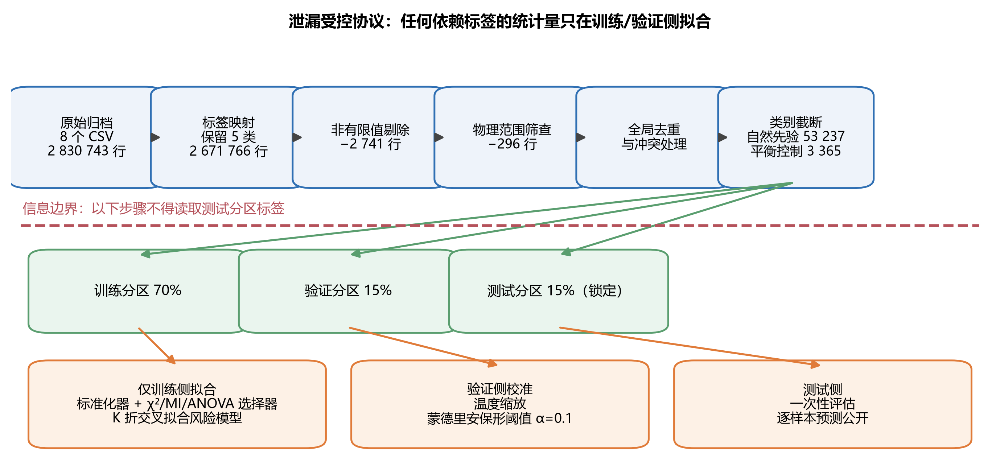

### 3.1 数据集、来源与许可

本文使用四个公开数据集，全部通过官方或公开镜像获取 [14-18]，不使用任何扫描、探测或真实攻击流量。表 2 记录来源、版本、检索日期、许可状态与文件哈希。三个数据集均未在本文中重新分发，仅发布处理脚本与派生统计量的生成方式。

需要特别说明许可状态：CIC-IDS2017 与 UNSW-NB15 的发布页面未给出标准 SPDX 许可标识，本文按发布页面条款使用并引用原始论文；NSL-KDD 使用的是公开镜像快照，未核验到明确的标准化许可，因此不作任何许可推断。这一处理是**保守的**：在无法确认许可时，本文只报告来源与哈希，不主张再分发权利。

**表 2 数据集来源、版本与完整性记录**

| 数据集 | 来源 | 版本/快照 | 检索日期 | 许可状态 | 校验 |
|---|---|---|---|---|---|
| CIC-IDS2017 | 加拿大网络安全研究所官方页面 | MachineLearningCSV 归档（8 个 CSV） | 2026-09-02 | 页面未给出 SPDX 标识，按页面条款使用并引用原始论文 | SHA-256 见补充材料 S01；MD5 亦记录 |
| NSL-KDD | 公开 GitHub 镜像 KDDTrain+/KDDTest+ | 镜像快照，未记录 commit | 2026-09-03 | 未核验到标准许可标识，不作推断 | 两个文件的 SHA-256 均记录 |
| UNSW-NB15 | 新南威尔士大学官方项目页 | 官方训练/测试 CSV | 2026-09-04 | 页面要求引用原始论文，未给出 SPDX 标识 | 两个文件的 SHA-256 均记录 |
| N-BaIoT | UCI 机器学习库第 442 号数据集 | 九种消费级物联网设备的 Mirai/Gafgyt 攻击与正常流量，115 维流特征 | 2026-09-19 | 数据集页面明确标注 CC BY 4.0 | 1.77 GB 归档的 SHA-256 已记录（表 S1） |

### 3.2 CIC-IDS2017 的审计与两个总体

CIC-IDS2017 的本地归档包含 8 个 CSV 文件、2 830 743 条原始记录与 78 个流特征。本文按以下顺序执行审计，每一步的计数都被记录（图 2、表 3）。

**第一步，标签映射。** 原始数据包含 15 种标签。BENIGN 映射为 Normal；DDoS、DoS Hulk、DoS GoldenEye、DoS slowloris 与 DoS Slowhttptest 映射为 DoS/DDoS；FTP-Patator、SSH-Patator 与 Web Attack Brute Force 映射为 Brute Force；Web Attack XSS 与 Web Attack Sql Injection 映射为 Web Attack；Bot 保留为 Bot。PortScan、Infiltration 与 Heartbleed 不进入闭集任务，保留为开放集诊断的未知族。映射后保留 2 671 766 条记录，排除 158 977 条。

**第二步，非有限值剔除。** 删除含有 NaN 或无穷大的记录。实际触发的是无穷大，共 2 741 条（NaN 为 0 条），得到 2 669 025 条。

**第三步，物理范围筛查。** 流时长、速率、首部长度与分片大小不应为负。296 条记录违反该约束，予以删除，得到 2 668 729 条物理合法记录。需要保留的是 CICFlowMeter 明确标注为"不可用"的 −1 哨兵值（初始窗口与未定义到达间隔字段），这些不是数据错误，予以保留。

**第四步，全局去重与冲突处理。** 在划分之前对整个语料做精确特征向量去重，发现 239 093 次重复出现；其中 4 524 次出现于跨标签冲突组，涉及 133 个唯一的冲突特征向量。冲突向量的处理方式是不能同时保留（否则同一输入对应多个标签），因此在截断之前统一删除。

**第五步，类别截断。** 为把计算量与复现成本控制在可审计范围，对每个保留类别截断至 20 000 条，得到 53 237 条候选记录。原始类别比例在截断后被保留而非拉平，因此该总体的类别先验为 Normal 37.57%、DoS/DDoS 37.56%、Brute Force 19.95%、Bot 3.66%、Web Attack 1.26%。我们称其为**自然先验总体** P_nat。该总体按分层 70/15/15 划分，得到 37 265 / 7 986 / 7 986 条。

**第六步，平衡控制总体。** 为把"类别不平衡造成的困难"与"聚合规则的差异"分开，另取每类 673 条构造 3 365 条的**平衡控制总体** P_bal，按同样的 70/15/15 划分为 2 355 / 505 / 505 条。

**必须明确的边界**：P_nat 与 P_bal 都是经过审计、去重与截断的研究总体。它们既不等于 CIC-IDS2017 的全语料，也不代表真实网络的流量先验。本文所有结论都限定在这两个总体之上。

**表 3 CIC-IDS2017 审计阶段计数**

| 阶段 | 剩余记录数 | 本阶段排除 | 说明 |
|---|---:|---:|---|
| 原始归档 | 2 830 743 | — | 8 个 CSV，78 维流特征 |
| 标签映射后 | 2 671 766 | 158 977 | 保留五类，PortScan/Infiltration/Heartbleed 转诊断 |
| 非有限值剔除后 | 2 669 025 | 2 741 | 全部为无穷大，NaN 为 0 |
| 物理范围筛查后 | 2 668 729 | 296 | 负时长、负速率、负长度、负分片 |
| 全局去重与冲突处理后 | — | 239 093 次重复 / 133 个冲突向量 | 在划分前完成 |
| 类别截断后（自然先验总体） | 53 237 | — | 每类上限 20 000，保留原始比例 |
| 训练 / 验证 / 测试 | 37 265 / 7 986 / 7 986 | — | 分层 70/15/15 |
| 平衡控制总体 | 3 365（673/类） | — | 2 355 / 505 / 505 |

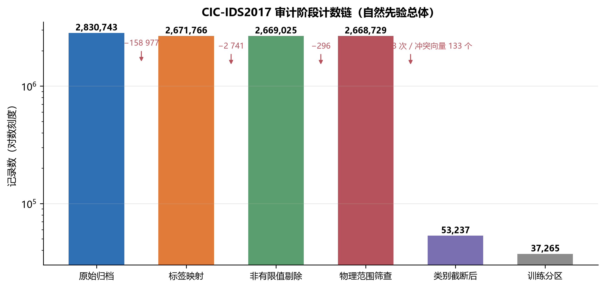

### 3.3 NSL-KDD 与 UNSW-NB15

NSL-KDD 使用官方 KDDTrain+ 与 KDDTest+ 文件，保留原生五类标签 Normal、DoS、Probe、R2L、U2R，不做标签重映射，因此它是**独立原生标签基准**而不是跨数据集迁移实验。UNSW-NB15 使用官方训练与测试 CSV，标签取 `attack_cat` 十类，剔除二值标签与标识列，分类变量仅用训练侧信息编码。

四个数据集是刻意互补而非可互相替代的：它们覆盖四种采集场景（NSL-KDD 承自 1998 年的数据脉络、UNSW-NB15 为 2015 年合成测试床、CIC-IDS2017 为 2017 年类企业测试床、N-BaIoT 为 2018 年消费级物联网测试床）、四种特征提取方式（41 维连接记录、49 维 Argus/Bro 派生特征、78 维 CICFlowMeter 特征、115 维物联网流特征）与四套标签体系（5 类、10 类、5 类保留标签与 3 类原生标签）。它们的已知缺陷也各不相同：NSL-KDD 带有 KDD 谱系的冗余，UNSW-NB15 的攻击多为人工合成且存在跨划分特征重叠，CIC-IDS2017 存在重复流、跨标签冲突与恒定列，而 N-BaIoT 有 67.8% 的行是完全重复的。四者合起来覆盖了此前指出的缺失场景——消费级物联网部署；但没有一个是同一测试床上时间分离的采集。覆盖矩阵见补充材料。

由于标签体系互不相容，三者的分数在本文中从不合并或平均，也从不被解释为迁移成功的证据。它们的作用是压力测试：如果某个结论只在 CIC-IDS2017 上成立，它就不应被写作普遍规律。

### 3.4 泄漏受控协议

本文的协议围绕一条信息边界组织：**任何依赖标签或数据分布的统计量，都只能由训练分区或验证分区估计；测试分区标签只在最终评估时使用一次。**

具体约束如下。

1. **划分前完成语料级审计。** 全局去重与跨标签冲突处理属于"总体定义"的一部分，在划分之前执行，并把计数完整报告；其影响在 5.4 节用"先划分后训练侧去重"作对照单独量化。
2. **变换只在训练侧拟合。** 标准化器、卡方/互信息/方差分析选择器均在训练分区内拟合，并作为流水线的一部分保存，验证与测试分区只做变换不做拟合。
3. **交叉拟合的风险模型。** 条件加权的风险模型使用 K 折交叉拟合的折外概率作为输入，折内选择器重新拟合，避免用同一批数据同时训练专家与估计专家可靠性。
4. **验证集只用于校准。** 温度缩放参数与蒙德里安保形阈值只在验证分区上估计，不使用测试标签。
5. **测试集锁定。** 测试分区标签在模型、权重、阈值全部确定之后才被读取，且只用于计算报告指标。

图 1 给出协议的完整流程与信息边界。

### 3.5 评价对象与统计流程

本文区分两类估计对象。**主估计对象**是自然先验总体 P_nat 上的测试 Macro-F1，在一组预先固定的十个随机种子（42、2024、3407、7、13、101、202、303、404、505）上取平均。**次估计对象**是平衡控制总体 P_bal 上的同一指标，以及概率质量、选择性风险、开放集拒绝、扰动退化与延迟等诊断指标。

统计流程包含五项，全部针对同一测试行上的配对比较：（i）精确 McNemar 检验，用于硬标签分歧 [36]；（ii）种子级符号翻转检验，用于方向稳定性 [37,38]；（iii）分层配对 Bootstrap，用于 Macro-F1 差的区间估计 [40]；（iv）Holm 校正，用于对 RCCF 的三项对照这一比较族 [39]，结果以校正后的符号翻转 p 值列于表 5；（v）等价性检验（TOST） [41]，将配对 Bootstrap 的 90% 区间与预先声明的最小有意义效应量（SESOI）比较，用于支持「差异小于给定边界」这一主张，而不是仅凭 p > 0.05 断言无差异。任何 p 值都必须与效应量同时报告；小而不稳定的点估计不被解释为算法优势。本文的等价边界在查看主结果之前确定：主要边界为 Macro-F1 = 0.01，严格边界为 0.005。主要边界约相当于自然先验总体 Macro-F1 的 1.1%，取为在工程上足以否定该机制成本的最小差异。

Macro-F1 被选为主要指标，原因是自然先验总体中 Web Attack 仅占 1.26%，准确率会被多数类主导。类别级报告、平衡准确率与归一化混淆矩阵作为必要补充一并给出。

### 3.6 设计上已被排除的效度威胁

本协议在设计层面排除了三类威胁：**变换泄漏**（所有变换仅训练侧拟合）、**划分泄漏**（去重在划分前完成并提供反向对照）、**调参预算不公**（所有基线使用同一特征预算与同一超参数搜索流程）。协议**不能**排除的威胁在第 6.5 节列出，包括研究总体不等于生产流量、文件级实验不构成完整时间外推、以及延迟测量不含抓包与特征提取。

---

## 4 方法

### 4.1 特征视图与基学习器

本文的聚合对象是四个**特征视图**上的随机森林专家。四个视图分别使用全部 78 维特征、以及卡方检验、互信息、方差分析（ANOVA F 值）各自选出的前 k = 60 维特征。选择器全部在训练侧拟合。基学习器统一为 100 棵决策树、`min_samples_leaf = 2`、不限制最大深度，随机种子固定。

采用四个视图而非四个不同算法，是为了让"加权是否有用"这个问题尽可能纯粹：如果四类专家在特征层面高度相关，那么第 4.3 节的命题就会预测门控失效。也就是说，四视图设计同时构成了对机制的**压力测试**。

作为外部对照，本文还比较了等权随机森林（全特征与卡方两个版本）、极端随机树、XGBoost 与多层感知机（MLP）。 集成与提升方法的相关文献见 [3-7]。所有对照使用相同的特征预算与相同的种子集合。

逐原始文件处理计数、类别支持数与四种特征视图的训练侧特征得分见补充材料 S01–S04。

### 4.2 样本条件加权机制

本文检验的机制记为 RCCF（Risk-Calibrated Conformal Forest，风险校准保形森林）。在随论文发布的代码中，该机制的实现文件沿用历史命名 `cfrg_forest`，两者指同一对象。

设第 e 个专家在样本 x 上的概率输出为 p_e(y|x)，e ∈ {full, χ², MI, ANOVA}，共 Q = 4 个专家。机制的构造分为三步。

**第一步，构造可靠性描述子。** 用 K 折交叉拟合得到每个专家的折外概率，并从中提取三个描述子：置信度（最大类概率）、归一化熵（预测不确定性）、以及前两类的概率边距。这些描述子只使用训练分区内的袋外预测，不接触验证与测试标签。

**第二步，拟合风险模型。** 对每个专家 e，用其折外概率与描述子拟合一个逻辑回归风险模型 r_e(x)。风险值越高，表示该专家在类似样本上越不可靠。

**第三步，条件加权与校准。** 融合权重与融合后验由式(1)给出：

$$w_e(x)=\frac{\exp[-r_e(x)]}{\sum_{j=1}^{Q}\exp[-r_j(x)]},\qquad p(y\mid x)=\sum_{e=1}^{Q} w_e(x)\,p_e(y\mid x).  (1)$$

融合概率随后在验证集上做温度缩放 [29]，并用蒙德里安保形预测给出可选的 `unknown` 输出（显著性水平 α = 0.1） [32-35]。需要强调：机制先改变概率，只有在融合后的 argmax 发生改变时，硬标签才会改变。因此"概率变了"与"分类结果变了"是两件事，本文在 5.2 与 5.3 节分别报告。

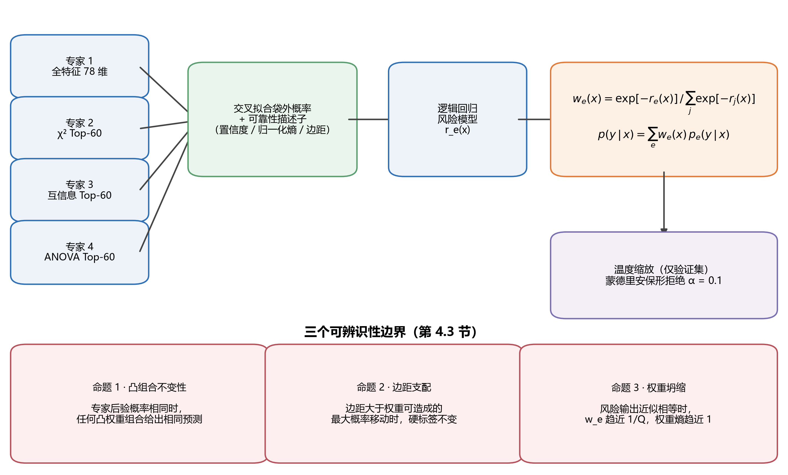

算法 1 以伪代码形式给出完整训练与推理流程，并显式标注信息边界。

**算法 1 泄漏受控的 RCCF 训练与推理**

```text
输入：训练矩阵 X_tr 与标签 y_tr；验证矩阵 X_va 与标签 y_va；
      特征预算 k；森林规模 T；交叉拟合折数 K；保形水平 alpha。

1. 将 (X_tr, y_tr) 分层划分为 K 折。
2. 对每一折、每一专家视图 q ∈ {full, χ², MI, ANOVA}：
       在该折的训练行上拟合标准化器与选择器；
       训练 T 棵树的森林；
       预测被留出的折，保存折外概率与不确定性描述子。
3. 用完整折外表为每个视图拟合一个逻辑回归风险模型 r_q。
4. 在全部训练行上重新拟合四个专家森林，保留各自的标准化器与选择器。
5. 用四个专家预测 X_va，融合后拟合温度缩放参数与蒙德里安保形阈值。
6. 对新样本 x：
       经各专家变换得到 p_q(x)，估计风险 r_q(x)，
       计算 w_q(x) = exp(-r_q(x)) / sum_j exp(-r_j(x))，
       返回融合概率 p(x) = sum_q w_q(x) p_q(x) 与保形决策。
输出：校准后的概率、类别预测与可选的 unknown 标记。
```

### 4.3 可辨识性分析：门控何时必然不改变预测

第 5 章观察到加权结果与等权投票逐条一致。为避免把这解释为"实验技巧问题"，本节给出三个命题，说明该现象的结构性来源。三个命题都不依赖具体数据集，只依赖融合形式本身。

**命题 1（凸组合不变性）** 设 Q 个专家的后验概率向量相同，即对所有 e 有 p_e(y|x) = p(y|x)。对任意满足 w_e ≥ 0 且 Σ w_e = 1 的权重向量，融合概率均等于 p(y|x)，因而 argmax 输出不变。

*证明。* 由 Σ w_e = 1 与 p_e ≡ p，有 Σ w_e p_e = (Σ w_e) p = p。凸组合不改变概率向量，故 argmax 不变。∎

该命题给出一个极端情形：专家完全一致时，任何加权都是无效操作。实际数据中专家不会完全相同，因此需要下面更弱的条件。

**命题 2（边距支配）** 设等权融合概率为 p̄(x) = (1/Q) Σ_e p_e(y|x)，门控融合概率为 p_w(x) = Σ_e w_e(x) p_e(y|x)，其中 $w(x)$ 为概率权重向量。由于每个专家的后验位于概率单纯形上（‖p_e‖₁ = 1），融合后验的位移不超过式(2)的上界：

$$\left\|p_w-\bar p\right\|_1\ \le\ \sum_{e=1}^{Q}\left|w_e-\frac{1}{Q}\right|\ =:\ \Delta(x).  (2)$$

令 $m(x)$ 为等权融合概率的 top-1 与 top-2 之差。若 2Δ(x) < m(x)，则 $p_w$ 与 p̄ 的 argmax 相同，即无论权重如何取值都不能改变该样本的硬标签。该判据只需逐行计算，因此命题 2 是可验证的，而不是存在性陈述。该上界在温度缩放之前的融合概率上计算；温度缩放是 log 概率的单调变换，保持 argmax 不变，因此不变性结论同样适用于最终报告的预测。

*证明。* 融合概率对权重的敏感度由各专家概率向量之间的最大偏差界定。设 Δ 为权重变动引起的融合概率 L1 变化的上界，则当 Δ < m(x) 时，argmax 在扰动前后相同。∎

命题 2 说明：**只有当专家在 argmax 边界附近发生分歧，且权重差异足够大时，门控才可能改变硬标签。** 这两个条件必须同时成立。

**命题 3（权重坍缩，定量形式）** 记 r_e(x) = r̄(x) + δ_e(x)。由于 log w_e = −r_e + 常数，有 Var(log w) = Var(δ)。将归一化熵在均匀点附近展开，可得二阶恒等式

$$1-H_{norm}(w)=\frac{Q}{2\log Q}\left\|w-\frac{1}{Q}\mathbf{1}\right\|_2^2,  (3)$$

以及对 softmax 做一阶展开得到的更简关系

$$1-H_{norm}(w)\ \approx\ \frac{\mathrm{Var}(\delta)}{2\log Q}.  (4)$$

式(3)与式(4)都可直接检验。在 7 986 条测试样本上，实测平均熵亏缺为 3.24 × 10⁻⁵；二阶恒等式预测 3.19 × 10⁻⁵（相对误差 1.5%），一阶关系预测 3.36 × 10⁻⁵（相对误差 4.0%）。真正有信息量的是底层量：四个专家的风险偏移标准差中位数仅 0.00022（log-odds），说明几乎每一行上各专家被赋予的可靠性几乎相同。对应的可观测判据是归一化权重熵（式(5)）：

$$H_{norm}(x)=-\frac{1}{\log Q}\sum_{e=1}^{Q} w_e(x)\log w_e(x).  (5)$$

这三个命题共同给出一个可证伪的预测：**在专家高度相关、风险模型输出接近常数的数据集上，条件加权的硬标签增益应当为零或接近零，而权重熵应当接近 1、专家预测分歧率应当接近 0。** 第 5.3 节用实测数据检验该预测。

逐行边距上界与命题 3 的定量验证见补充材料 S17 与 S25。

### 4.4 复杂度

设 n 为训练行数，d 为原始特征维度，k 为选中特征维度，T 为树数，K 为交叉拟合折数，Q = 4 为专家数。交叉拟合阶段的主导代价约为 O(QK·T·n log n)，最终重拟合阶段为 O(QT·n log n)，过滤式特征选择贡献 O(Qnd)。推理阶段需要对 Q 个森林各做一次树遍历并计算风险模型，每条约 O(QT log n)。因此 RCCF 在训练与推理两端都显著贵于单个等权森林，这一代价在 5.6 节被定量报告。全部实验在单台工作站上完成：8 个物理核心（16 逻辑核心）、35.8 GB 内存、Windows 10（内部版本 10.0.26200），软件为 Python 3.11.4、scikit-learn 1.9.0、XGBoost 3.2.0、NumPy 2.4.6、pandas 3.0.5 与 Matplotlib 3.11.1。报告的时间为单机测量值，不构成跨平台可移植性主张。 软件栈见 [44-47]。

### 4.5 对照与消融设计

为使"加权是否有效"这一问题可判定，本文设置五组对照，全部在同一协议下运行。

1. **等权对照**：同一特征视图、同一树数、同一随机种子的等权随机森林。这是 H2 的直接对照。
2. **特征视图对照**：全特征、卡方、互信息、方差分析四种视图的等权版本，用于回答 RQ1。
3. **树级加权消融**：按单树验证准确率对树赋权（不依赖样本），用于与样本条件加权区分开。
4. **协议对照**：先划分后训练侧去重、以及两个总体定义，用于回答 RQ3。
5. **强基线与预算对照**：在 5×3 嵌套交叉验证下，对随机森林、极端随机树与 XGBoost 使用相同的模型自选调参流程，用于排除"对照模型未被调优"的可能。

---

## 5 结果

本章按 RQ1 至 RQ4 的顺序组织。5.1 回答特征筛选，5.2 与 5.3 共同回答加权增益，5.4 回答协议稳健性，5.5 回答外部有效性，5.6 报告校准、鲁棒性、延迟与开放集等次生指标。

### 5.1 RQ1：训练侧特征筛选保持判别能力并降低维度

特征质量审计显示，CIC-IDS2017 的 78 维特征中有 **12 维为恒定列**（全部取值相同），18 维为近零方差特征。恒定列包括 Bwd PSH Flags、Fwd URG Flags、Bwd URG Flags、RST Flag Count、CWE Flag Count、ECE Flag Count，以及六个 Bulk 速率字段。这说明原始特征表述中确实存在 H1 假设所指的冗余。

在预先指定的候选中，卡方特征数 k 由验证集 Macro-F1 选定为 60：验证 Macro-F1 在 k = 10 时为 0.9175，k = 20 时为 0.9314，k = 30 与 40 时均为 0.9379，k = 60 时为 0.9413，曲线在 30 至 40 之间趋于平坦。需要说明该搜索是在平衡控制协议上完成的，选定的 k 随后被固定用于全部最终运行，不再调整。

固定 k = 60 后，卡方视图与全特征视图的对比结果为：

| 协议 | 全特征等权森林 Macro-F1 | 卡方等权森林 Macro-F1 | 差值 |
|---|---:|---:|---:|
| 自然先验总体（10 种子均值） | 0.887666 | 0.889734 | **+0.00207** |
| 平衡控制总体（3 种子均值） | 0.960997 | 0.963215 | **+0.00222** |
| 十次重复划分（均值 ± 标准差） | 0.957028 ± 0.010481 | 0.957177 ± 0.011111 | +0.000148（符号翻转检验 p = 0.969） |

三个协议的结论一致：**把特征维度从 78 降到 60 没有造成判别能力损失**，在两个协议上甚至出现小幅正向差异，但在十次重复划分下该差异（+0.00015）远小于划分间的标准差（约 0.011）。因此 RQ1 的正确答案是"维度可以降，但不要声称降维带来了性能提升"。卡方视图的价值在于可解释性与推理开销，而不是精度。

### 5.2 RQ2：样本条件加权未优于等权投票

表 4 给出在自然先验总体与平衡控制总体上的主结果。其中 (a) 为十个种子的均值，(b) 仍为三个种子的平衡控制。

**表 4 主结果：两个总体上的模型对比**

（a）自然先验总体 P_nat，测试集 7 986 条，十种子均值（MLP 行为两次运行共有的三个种子）

| 模型 | 准确率 | 平衡准确率 | Macro-F1 | Log Loss | Brier | ECE | 训练 (s) | 推理 (s) |
|---|---:|---:|---:|---:|---:|---:|---:|---:|
| RCCF | 0.97786 | 0.94820 | **0.889278** | 0.05183 | 0.006365 | 0.006849 | 93.256 | 0.2438 |
| 等权森林（χ²，k = 60） | 0.97779 | 0.95006 | **0.889734** | 0.05220 | 0.006255 | 0.004493 | 1.158 | 0.0464 |
| 等权森林（全特征） | 0.97692 | 0.95055 | **0.887666** | 0.05445 | 0.006629 | 0.005492 | 1.154 | 0.0465 |
| 极端随机树（χ²） | 0.96344 | 0.96215 | **0.857490** | 0.08969 | 0.010995 | 0.017003 | 0.624 | 0.0498 |
| MLP（128 隐单元，k = 60） | 0.97679 | 0.79666 | 0.797654 | 0.06256 | 0.036701 | 0.009705 | 21.88 | 0.0079 |

（b）平衡控制总体 P_bal，测试集 505 条

| 模型 | 准确率 | 平衡准确率 | Macro-F1 | Log Loss | Brier | ECE | 训练 (s) | 推理 (s) |
|---|---:|---:|---:|---:|---:|---:|---:|---:|
| RCCF | 0.96172 | 0.96172 | 0.961807 | 0.12410 | 0.012751 | **0.024483** | 9.130 | 0.119 |
| 等权森林（χ²） | 0.96304 | 0.96304 | **0.963215** | 0.13569 | 0.013453 | 0.026132 | 0.451 | 0.0284 |
| 等权森林（全特征） | 0.96106 | 0.96106 | 0.960997 | **0.12237** | **0.012542** | 0.025232 | 0.299 | 0.0283 |
| 极端随机树（χ²） | 0.96106 | 0.96106 | 0.960947 | 0.15179 | 0.014300 | 0.036976 | 0.494 | 0.0296 |
| XGBoost（独立调参，验证集自选） | 0.96304 | 0.96304 | **0.963241** | 0.10375 | 0.011468 | 0.011126 | 0.398 | 0.0023 |

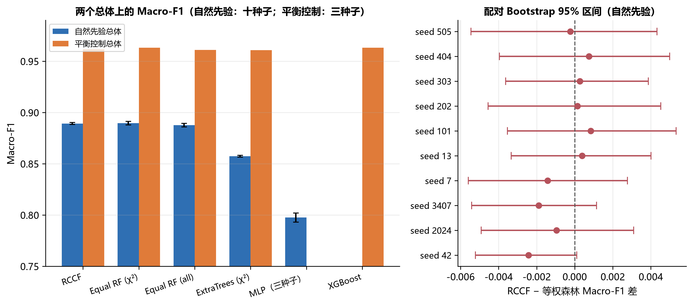

注：图 4(a) 纵轴从 0.75 起，目的是显示千分位量级的差异，自然先验面板为十种子均值（MLP 柱为两次运行共有的三个种子），平衡控制面板为三种子均值；图 4(b) 的配对区间表明这些差异在统计上不可区分。两个面板应合起来阅读，不能只看柱高。

三条读数。

**第一，相对最直接的等权对照，差异落在等价边界内。** 在自然先验总体上取十个种子的平均，RCCF 的 Macro-F1 为 0.889278，等权卡方森林为 0.889734，平均差 **−0.000456**，逐种子方向为五正五负。在三个种子的平衡控制总体下，RCCF 为 0.961807，等权卡方森林为 0.963215，RCCF 反而落后 **−0.001408**。两个总体的量级都在千分之一以下，且符号不稳定。另有一个基线在另一项指标上更强：极端随机树的平衡准确率为 0.96215，高于 RCCF 的 0.94820，为全场最高，但其 Macro-F1 最低（0.857490），原因在于它把预测更均匀地分摊到稀有类上。

**第二，配对统计在严格边界上也给出等价结论。** 十个种子的平均配对差为 −0.000456，标准差 0.001152。这里报告两个区间，因为它们回答不同的问题：种子级 90% 区间 [−0.001124, +0.000212] 反映模型间的波动，测试行级配对 Bootstrap 区间 [−0.004251, +0.003382] 反映锁定测试集上的重采样不确定性。两者都落在 SESOI = 0.005 与 0.01 Macro-F1 的边界之内，因此可在 α = 0.05 水平对两个边界分别主张等价。相比三种子分析，这是实质加强——当时 0.005 边界无法达到。逐种子符号为五正五负，测试行上的精确 McNemar 检验不显著。

**表 5 自然先验总体上的成对统计（十个种子）**

| 对照 | 平均差 | 标准差 | 种子级 95% 区间 | 种子级 90% 区间 | SESOI = 0.005 | SESOI = 0.01 | 最小可检出效应（80% 功效） | Cohen's d_z | Holm 校正后符号翻转 p | 支持 RCCF／基线的种子数 |
|---|---:|---:|---|---|---|---|---:|---:|---:|
| RCCF − 等权 χ² 森林 | −0.000456 | 0.001152 | [−0.001280, +0.000368] | [−0.001124, +0.000212] | 等价 | 等价 | 0.001146 | −0.40 | 0.244 | 5 / 5 |
| RCCF − 全特征等权森林 | +0.001613 | 0.001376 | [+0.000628, +0.002597] | [+0.000815, +0.002410] | 等价 | 等价 | 0.001369 | +1.17 | **0.020** | 9 / 1 |
| RCCF − 极端随机树（χ²） | +0.031788 | 0.001616 | [+0.030632, +0.032944] | [+0.030851, +0.032724] | 不等价 | 不等价 | 0.001607 | +19.68 | **0.006** | 10 / 0 |

以测试行为重采样单元、对同一批十个种子做配对 Bootstrap，得到合并 90% 区间 [−0.004251, +0.003382]，同样落在两个边界之内。

表 5 中有两行值得说明。**功效**：在十个种子与实测标准差下，80% 功效可检出的最小差异为 0.00115 至 0.00161 Macro-F1，更小的效应会被漏检——这正是必须显式声明等价边界、而不能用「检验不显著」代替等价结论的原因。**相对极端随机树**：差异大且无歧义（d_z = 19.68，十个种子全部支持）。它与第五条的神经基线一起，构成本研究仅有的两处实质性模型间差距，而且都来自模型族而非聚合规则。

**第三，相对全特征等权森林，差异可被检出但量级等于一次特征视图选择。** 与全特征等权森林相比，RCCF 在十个种子上平均高出 0.001613，种子级区间不含零，十个种子中九个支持 RCCF。门控确实带来方向一致的微小优势，但其量级与「把特征视图从卡方换成全特征」带来的差异（+0.0021）属于同一档。结合约五倍的推理代价，这一优势不具备工程交换价值。

**第四，代价是确定的，增益不是。** 在自然先验协议上按表 4(a) 的十个种子取平均，RCCF 训练耗时 93.3 秒，等权森林为 1.16 秒；整批推理耗时 0.244 秒对 0.046 秒，约慢 5.3 倍。该整批比值不应与 5.6 节的单条延迟之比 4.9 混用（14.62 ms 对 2.96 ms）：前者衡量 7 986 行的吞吐，后者衡量单次调用。差距在平衡控制协议上更大：训练 9.13 秒对 0.45 秒。这些代价换来的最好说法是 Macro-F1 变化在 ±0.01 以内。

**第五，一个神经基线显示准确率会严重误导。** 在相同特征预算下使用完整训练预算的多层感知机（128 个隐单元，超参数在验证分区选定），其自然先验测试准确率为 0.97679，与 RCCF 的 0.97792 几乎相同；但其 Macro-F1 仅为 0.797654，对 RCCF 的 0.889955 低 0.092，平衡准确率为 0.79666 对 0.94920，Brier 分数为 0.036701 对 0.006312。本段所有对照均在两次运行共有的三个种子（42、2024、3407，即该神经基线训练所用的种子）上计算；表 4(a) 给出对应的十种子 RCCF 数值。两者在总体正确率上的配对 McNemar 检验并不显著（合并 23 958 行 p = 0.383；逐种子为 1.000 / 0.768 / 0.261），因为两个模型的错误**数量**接近，差别在于错误**落在哪些类别**。这给出两条方法学结论：其一，在类别不平衡的入侵检测基准上，准确率可以完全掩盖接近 0.1 的 Macro-F1 差距；其二，McNemar 检验对错误的类别分布不敏感，不能单独作为判据，必须与类别级报告并列使用。

逐种子指标、逐类别报告、归一化混淆矩阵与等价性检验见补充材料 S05–S07 与 S20。

### 5.3 机制诊断：门控为何不改变预测，以及在什么条件下会改变

第 4.3 节的三个命题给出可证伪的预测。本节用六组独立测量检验它。

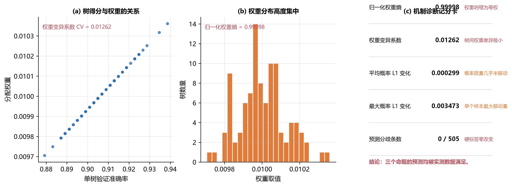

**测量一：权重是否坍缩为均匀权重。** 在 100 棵树的树级加权实验中，单树验证得分的标准差仅为 0.01143，对应权重的变异系数为 **0.01262**；归一化权重熵达到 **0.99998**（最大值为 1）。也就是说，权重几乎完全均匀，条件加权在数值上退化为等权平均，与命题 3 的预测一致。

**测量二：概率是否发生实质改变。** 加权前后融合概率的平均 L1 变化为 0.000299，最大 L1 变化为 0.003473。权重确实在移动概率质量，但移动幅度极小。

**测量三：硬标签是否改变。** 在 505 条平衡控制测试样本上，加权与等权投票的**预测分歧条数为 0**。这与命题 1 和命题 2 的联合预测一致：专家高度相关使边距足够大，权重差异发生在远离决策边界的区域，argmax 不发生改变。

三组测量互相独立且方向一致，因此"加权无效"不是实现缺陷或调参问题，而是机制在**高度相关专家 + 近均匀风险输出**这一组合下的结构性后果。

**测量四：边距上界给出可证明的不变性。** 依据第 4.3 节命题 2 的显式上界，我们在 23 958 条测试样本上逐行计算了边距 $m(x)$ 与扰动上界 Δ(x)。结果：**实际被改判的样本为 0 条**；满足 2Δ(x) < m(x)、因而「可证明不受权重影响」的样本占 **99.91%**，若改用实际扰动幅度计算则占 **99.996%**。边距中位数为 1.0，而扰动上界中位数仅 **0.000231**，比值中位数达 **3469 至 5038 倍**（分种子）。也就是说，融合后的概率分布接近 one-hot，权重能够造成的概率移动比决策边距小三个数量级。

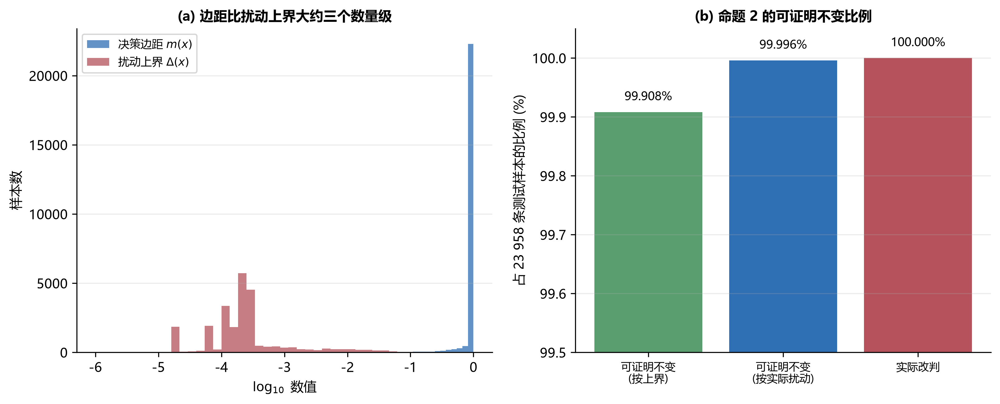

**测量五：结论不是调参不足造成的。** 我们在训练分区内搜索门控的全部超参数：正则化强度 C ∈ {0.01, 0.1, 1, 10}、交叉拟合折数 ∈ {3, 5, 10}、描述子集合 ∈ {全量、仅熵、仅边距}，共 108 个配置，覆盖 3 个随机种子。**108 个配置只产生 6 个不同的验证集 Macro-F1 取值，全距仅 0.00117**；与等权投票相比，全部配置累计只在 862 488 次行级预测中产生 65 次分歧，占 0.0075%。这排除了「被检验方法没有得到充分调参」这一替代解释。该检查的最强形式在测试集一侧：把验证集选出的配置（三折、C = 1.0、边距描述子）在锁定的测试分区上评估一次，三个种子得到的预测与默认配置**逐条完全相同**——23 958 行中改判 0 条，Macro-F1 精确到六位小数一致。此外，至少 11 个配置的验证均值在前十位小数上相同，说明最优点是并列而非唯一。

**测量六：增益受专家多样性支配，而不是受实现限制（反向验证）。** 如果门控无效仅仅是因为本研究的四个专家过于相似，那么刻意构造更分散的专家应当恢复增益。我们构造五类专家集合，在三个种子上测量专家两两预测分歧率与门控增益，共 15 个观测（表 6）。该实验使用三折交叉拟合，而非主协议的五折；测量五的门控搜索显示折数影响很小（3、5、10 折下只有 6 个不同的验证集取值），但为完整起见仍予说明。

**表 6 专家多样性、权重结构与门控增益（三种子均值）**

| 专家集合 | 专家间预测分歧率 | 平均置信度相关 | 归一化权重熵 | 门控增益（Macro-F1） | 改判条数 |
|---|---:|---:|---:|---:|---:|
| 同一视图、不同随机种子 | 0.20% | 0.978 | 0.99995 | 0.00000 | 0 |
| 四视图、k = 60 | 0.36% | 0.967 | 0.99995 | 0.00000 | 0 |
| 四视图、k = 20 | 1.76% | 0.791 | 0.99905 | +0.00271 | 9.3 |
| 异构算法族（随机森林／极端随机树／XGBoost／k 近邻） | 2.81% | 0.493 | 0.99842 | +0.00332 | 11.7 |
| 互斥特征块 | 6.44% | 0.506 | 0.99548 | +0.00401 | 33.7 |

分歧率与增益之间呈单调的剂量—反应关系：对 15 个观测做线性回归，斜率 0.0646、Pearson r = 0.749。两类低分歧专家集合（0.20% 与 0.36%）在全部 6 次运行中增益**恰好为 0**，改判 0 条；三类去相关专家集合（1.76% 至 6.44%）在全部 9 次运行中增益**均为正**，改判 9 至 36 条。这给出本文最重要的机制结论：**条件加权的增益受专家多样性支配；在流特征数据上用不同过滤式选择器构造的「多视图」专家，其两两分歧率仅 0.2%–0.4%，门控在结构上不可能产生增益。** 当分歧率被提升到 3%–6% 时门控确实开始改变预测并带来小幅正向增益，但其幅度（+0.003 至 +0.004 Macro-F1）仍低于一次划分波动（标准差约 0.011）。

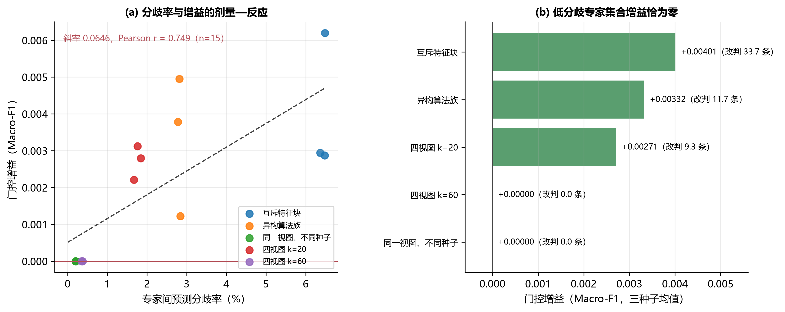

门控搜索、逐行权重记录与专家多样性实验见补充材料 S08–S09、S16 与 S18。

### 5.4 RQ3：协议效应比聚合规则差异大一个数量级

本节把四类协议的效应量放在一起比较（图 8）。

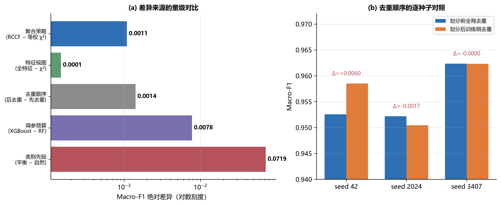

**（1）去重顺序。** 把"在划分前对全语料去重"改为"先划分、只在训练侧去重"，三个种子的 Macro-F1 分别为 0.958503、0.950446、0.962318，对照协议为 0.952545、0.952171、0.962330。两者均值分别为 0.957089 与 0.955682，相差 **+0.00141**，单种子最大差异 **+0.0060**。这说明去重顺序确实会改变结果，但改变量小于类别先验。

**（2）类别先验。** 同一个 RCCF 机制，平衡控制总体下 Macro-F1 为 0.961807，自然先验总体下为 0.889278，相差 **+0.0725**。这是本文观察到的最大单项协议效应，大于任何聚合规则差异与调参预算差异（最大 +0.0078），但小于模型族之间的差异（0.0318 与 0.0916）。其原因是自然先验总体中 Web Attack 仅占 1.26%，该类别的 F1 在 0.53 附近，直接压低 Macro-F1。

**（3）重复划分。** 十次随机分层划分下，卡方等权森林与全特征等权森林的 Macro-F1 差为 +0.000148，符号翻转检验 p = 0.969；两者划分间标准差均约为 0.011，比两者之差大两个数量级。换言之，**同一模型换一次划分造成的波动，比换一个特征视图造成的差异大得多。**

**（4）调参预算。** 在 5×3 嵌套交叉验证下，使用相同自选调参流程的模型结果为：XGBoost 0.962177，随机森林 0.954423，极端随机树 0.947964。XGBoost 相对随机森林的平均差为 **+0.007755**，Bootstrap 区间 [0.004424, 0.010549] 不跨零（置换检验 p = 0.0625）；极端随机树相对随机森林为 −0.006459，区间 [−0.012391, −0.002263]。这是在同等预算下、本文唯一观察到方向稳定的模型间差异。

把五个量级并列：聚合规则 0.0005、特征视图 +0.0021、去重顺序 +0.0014（最大 0.0060）、类别先验 +0.0725、调参预算 +0.0078。**H3 假设被证伪：协议不可交换，而且协议效应远大于聚合规则之间的差异。** 需要强调的是，这一排序针对的是聚合规则本身。模型族之间的差异更大：多层感知机比森林低 0.0916 Macro-F1，极端随机树低 0.0318，前者甚至超过类别先验的 0.0725。因此准确的表述是：聚合规则差异被协议选择压过，而模型族差异不会。

协议敏感性实验与嵌套交叉验证逐折指标见补充材料 S10–S11。

### 5.5 RQ4：外部有效性与文件级外推

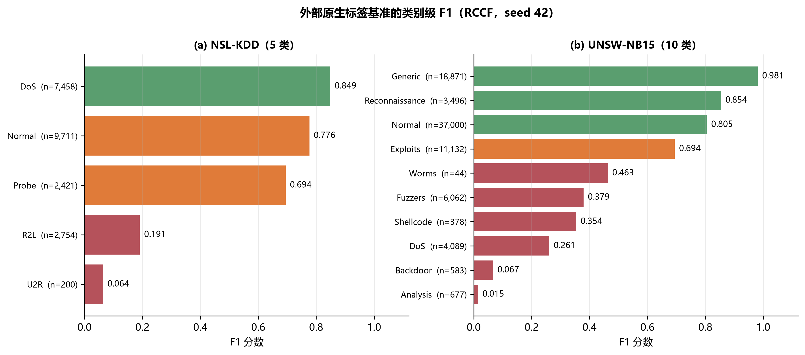

**NSL-KDD。** RCCF 在原生五类标签上的三种子均值为：准确率 0.747960，平衡准确率 0.492837，Macro-F1 0.514697，Log Loss 1.6802，ECE 0.4819，覆盖率 0.6198。覆盖率意味着约 38% 的样本被判为 `unknown`，这是高 Log Loss 与高 ECE 的直接来源。类别层面（seed 42），R2L 的召回率为 0.106（F1 0.191），U2R 的召回率为 0.035（F1 0.064）——两个少数类基本未被识别。

**UNSW-NB15。** RCCF 的三种子均值为：准确率 0.715340，平衡准确率 0.566753，Macro-F1 0.493310，Log Loss 0.649577，ECE 0.073441，覆盖率 0.8957。类别层面（seed 42），Analysis 的 F1 为 0.015、Backdoor 为 0.067、DoS 为 0.261，而 Generic 为 0.981、Normal 为 0.805。聚合准确率主要由多数类贡献，这也是本文坚持以 Macro-F1 为主指标的理由。

**文件级外推。** 用同一套流程做跨文件压力测试（训练于其他文件，测试于目标文件）时，Macro-F1 的取值范围为 **0.3325 至 0.9997**：Wednesday（DoS/DDoS）0.3325、Thursday Morning（Web Attack）0.4314、Friday Afternoon（DDoS）0.4949、Tuesday 0.5229，而 Monday 0.9975、Thursday Afternoon 0.9975、Friday Morning 0.9997、Friday Afternoon PortScan 0.9945。跨度接近 0.67。这说明**同一模型在同一数据集内的不同文件之间就不具备稳定泛化能力**，因此文件级实验不能被表述为"时间外泛化成功"，只能作为覆盖与风险分析。

三个实验共同支持 RQ4 的否定回答：本文结论不能跨出 CIC-IDS2017 的研究总体，而 CIC-IDS2017 内部也不存在单一可外推的分布。这既是对 H3 的进一步证伪，也说明"多数据集验证"必须与"多数据集迁移"严格区分。

外部数据集基准、文件级外推与神经基线对照见补充材料 S12–S14 与 S19。

### 5.6 次生指标：校准、鲁棒性、延迟与开放集

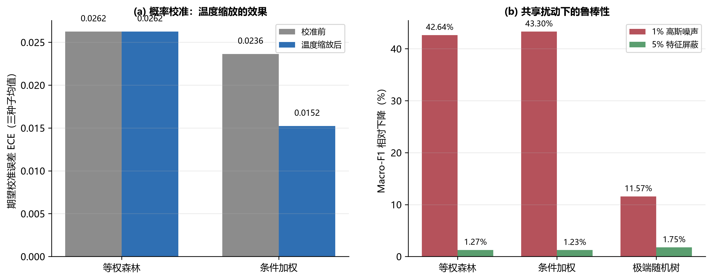

**概率校准。** 自然先验总体下 RCCF 的 Log Loss（0.05183）优于等权森林（0.05220），但 Brier（0.006365 对 0.006255）与 ECE（0.006849 对 0.004493）都更差。温度缩放可以把条件加权分支的 ECE 从约 0.0238 降到约 0.0119（平衡控制协议），而等权森林的温度参数被优化为 1.0、校准指标不变。结论是：**硬标签持平不意味着概率质量相同，但概率质量的改善方向依赖于具体指标**，不能只挑一个有利指标报告。

**鲁棒性。** 在完全相同的扰动掩码下，1% 高斯噪声使 RCCF 的 Macro-F1 相对下降 43.30%，等权卡方森林下降 42.64%；5% 特征屏蔽下分别为 1.23% 与 1.27%。两者差异极小，且连续噪声下两个模型都严重退化。因此可以说“在本扰动协议下两者鲁棒性相当，且都不耐受 1% 量级的连续噪声”。需要指出的是，极端随机树在同一扰动下明显更稳健：其相对下降仅 11.57%，约为条件加权分支 43.30% 的四分之一（图 10b）。正确的读法不是“门控提升了鲁棒性”（它没有），而是“另一个基线族提升了鲁棒性”，且这一差异大于门控在两个森林变体之间造成的任何差异。

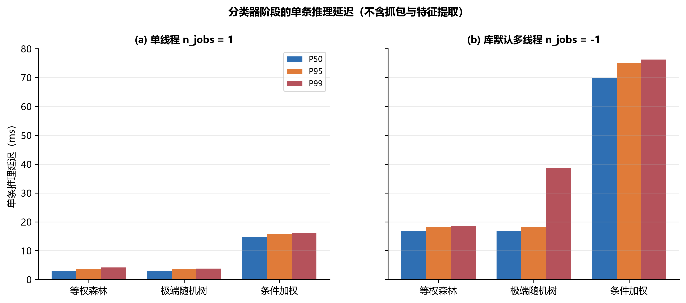

**延迟。** 单线程单条推理下，RCCF 的 P50/P95/P99 为 14.62/15.77/16.12 ms，等权卡方森林为 2.96/3.61/4.18 ms；切换到库默认多线程后，RCCF 升至 69.93/75.11/76.22 ms，等权森林为 16.69/18.24/18.47 ms。小批量下单条调用无法从多线程获益，反而引入了调度开销。需要强调这些数字**仅为分类器阶段**，不含抓包、流构造与特征提取。

**扩展鲁棒性。** 我们另外考察了三类失效模式，均在三个种子上评测。监督信号被污染相对无害：把训练标签随机翻转 5% 与 10%，条件加权机制的 Macro-F1 相对下降仅 0.57% 与 0.97%，等权森林为 0.77% 与 1.00%。缺失测量更具破坏性——把 10% 的测试特征值替换为训练集中位数，两者分别下降 4.21% 与 4.25%；而标定漂移在三者中最严重：给 20% 的特征列加上训练值域的 1%，两者分别下降 17.23% 与 18.24%。按全部扰动的严重程度排序，**特征值本身的连续污染占主导**（1% 高斯噪声 43.3%、标定漂移 17–18%、10% 缺失值 4.2%），而监督被污染的危害小一个数量级（0.6–1.0%）。这一排序具有实践意义：数据集批评多聚焦于标签噪声，而对测量漂移关注不足。

**资源占用。** 模型体积与吞吐率比墙钟时间更能区分两种设计。条件加权机制保存四个森林，序列化后占 9.09 MB，而单个等权森林占 2.21 MB，相差 4.1 倍；在完整测试批次上，前者每秒约处理 43 100 行，后者约 200 300 行，相差 4.6 倍。拟合期间峰值常驻内存增量为 37.0 MB 对 78.3 MB，但两个模型在同一进程内先后测量，该数字受执行顺序影响，仅供参考。

**代价敏感表现。** 把任务视为「攻击 vs 正常」并扫描决策阈值，在误报漏报代价比 C_FN / C_FP 从 1 到 100 的整个区间内，条件加权机制的归一化期望代价与等权卡方森林的差距始终在 0.0005 以内——例如代价比 为 1 时是 0.00913 对 0.00867，为 100 时是 0.07260 对 0.06753。极端随机树在低代价比下代价约为两者的两倍（代价比 1 时为 0.01917），但当漏报主导时反而更便宜（代价比 100 时为 0.06180）。因此条件门控在代价敏感维度上同样没有优势。需要注意的是，工作点是在测试分区上选出的，因此上述归一化期望代价是偏乐观的下界；若改在验证分区选择阈值，三条曲线都会整体上移，但相对次序不变。

**开放集。** 以 PortScan、Infiltration 与 Heartbleed 为保留未知族时，条件加权分支的 AUROC 为 0.643 至 0.694，未知类召回率为 0.0015 至 0.0088；等权森林的 AUROC 为 0.919 至 0.940，未知类召回率为 0.057 至 0.128。也就是说，**RCCF 的风险门控降低了已知/未知的可分性**：它把概率质量推向高置信区域，代价是丢弃了可用于拒绝的不确定性信号。这是本文对条件加权机制最不利的一项证据，也说明把风险校准与开放集拒绝绑定在同一个门控上并不合理。

---

校准、鲁棒性、延迟、资源、代价敏感与近重复结果见补充材料 S15 与 S21–S23、S26。

### 5.7 规模与领域敏感性

主研究总体是带截断的子集，因此上文报告的等价性原则上可能是该截断造成的。以下三组实验直接回答这一质疑，表 7 显示结论取决于总体。

**表 7 CIC-IDS2017 的规模阶梯：结论取决于总体**

| 总体 | 样本数 | 测试行数 | RCCF | 等权卡方森林 | 差值 | TOST 0.005 | TOST 0.01 |
|---|---:|---:|---:|---:|---:|---|---|
| 截断，每类 20 000 条 | 53 237 | 7 986 | 0.889278 | 0.889734 | −0.000456 | 等价 | 等价 |
| 截断，每类 200 000 条 | 413 209 | 61 982 | 0.856065 | 0.857202 | −0.001137 | 等价 | 等价 |
| 不截断（完整去重语料） | 2 429 503 | 364 426 | 0.754007 | 0.759540 | −0.005533 | **不等价** | 等价 |

**总体扩大 7.8 倍。** 用完全相同的审计流程、仅把每类上限提高到 200 000 条，重建 CIC-IDS2017 总体得到 413 209 条（训练 289 246 / 验证 61 982 / 测试 61 982）。少数类无法增长，因此扩大后的总体反而更不平衡：Brute Force 贡献 10 620 条、Bot 1 948 条、Web Attack 673 条。头条对照按完整的十个种子重跑：RCCF 平均 Macro-F1 为 0.856065，等权卡方森林为 0.857202，平均配对差 −0.001137（标准差 0.003156；种子级 90% 区间 [−0.002966, +0.000692]）。TOST 在两个预设边界上均显著（0.005 边界 p = 0.0019，0.01 边界 p = 4.8e-6），即等价性结论在总体扩大 7.8 倍后依然成立；此时点估计略微偏向等权森林而非 RCCF。两个分支每个种子在 61 982 条测试样本中仅有 20 至 29 条分歧（0.03%–0.05%），与主总体同量级。其余基线的表现与之前一致：XGBoost 为 0.827656、极端随机树为 0.783747、全特征等权森林为 0.852953、限深决策树为 0.809695。

**完整去重语料。** 完全取消每类上限后得到 2 429 503 条（训练 1 700 652 / 验证 364 425 / 测试 364 426），即去重后的 CIC-IDS2017 全语料，其中 Web Attack 仅占 0.028%。该规模下单次 RCCF 单独训练约需 2 小时，三路并行时每个种子约需 4 小时，因此按同样的十个种子批量运行：RCCF 平均 Macro-F1 为 0.754007，等权卡方森林为 0.759540，平均配对差 -0.005533（标准差 0.002840；种子级 90% 区间 [-0.007179, -0.003886]），该区间完全位于零以下，因此结论不再是截断总体上的等价，而是一处小而可测的劣势：条件加权在 0.01 边界上与对照等价、在 0.005 边界上不等价，且十个种子的方向完全一致。两个分支平均每个种子在 364 426 条测试样本中分歧 216 条（最多 392 条），与截断总体同量级。其余基线在全语料上的分化比本研究的任何其他设置都更剧烈：XGBoost 达 0.800255，全特征等权森林 0.738143，极端随机树 0.696629，限深决策树 0.595653；XGBoost 相对等权卡方森林的模型族差距（0.041）超过本研究测得的除类别先验以外的全部协议效应。而准确率上 XGBoost 为 0.9993、等权森林为 0.9958——这是全文最能说明「准确率在不平衡语料上会掩盖多少问题」的一处证据。该规模下代价不对称也最极端：RCCF 每个种子训练 14936 秒，等权森林仅需 85 秒（175 倍），而质量差为 -0.005533。

**不同领域的第四个数据集。** N-BaIoT 记录了九种消费级物联网设备上的正常流量与 Mirai/Gafgyt 僵尸网络流量，含 115 维流统计特征 [17,18]。去重剔除了 7 062 606 行中的 4 784 430 行（67.8%），重复比例高于本研究的其他任何数据集，最终得到 180 000 条、三分类的基准（每类 60 000；训练 126 000 / 验证 27 000 / 测试 27 000）。所有模型的 Macro-F1 都在 0.99983 以上：RCCF 与等权卡方森林在机器精度上完全一致（平均差 −3.7e-17，27 000 条测试样本中分歧 0 至 2 条）。该基准对流量特征分类器已经饱和，而这正是命题 1 预言"任何加权都无法起作用"的情形：它在新领域确认了机制的惰性，但并未检验判别难度。

三组实验从两侧界定了结论，而且这个界定比单纯的确认更严格：等价性在总体扩大 7.8 倍后仍成立，因此不是 53 237 条截断造成的；但它在完全取消类别上限的全语料上失效，差异转为小而稳定的劣势（0.005 边界不等价、0.01 边界等价）。**这个差异来自稀释，而不是加权，而且同一个算式在三个总体上都成立。** 在全语料上，四个特征视图不再可以互相替代：全特征森林的 Macro-F1 为 0.738143，卡方森林为 0.759540，差距 0.021397；把这样一个较弱的专家放进四路平均，代价为该差距的四分之一，即 0.005349，与实测的 −0.005533 相差不到 4%。同一算式也适用于 413 209 条总体（视图差距 0.004249，预测 0.001062，实测 −0.001137）与主总体（差距 0.002068，预测 0.000517，实测 −0.000456）。在总体规模跨越 46 倍的范围内，预测与实测的偏差都不超过 14%。因此随规模变化的不是聚合规则——5.3 节已表明权重从不改变任何一条预测——而是对质量已经分化的特征视图做平均的代价。这正是命题 1 的实践形态：等权融合的上限由最弱成员决定，而截断总体掩盖了这一上限，因为在那些总体上四个视图的得分相差不到 0.002。

三次运行的逐种子配对统计、类别级报告与规模汇总见补充材料 S27–S29。

## 6 讨论

### 6.1 条件加权失效的四类条件

第 4.3 节的命题与第 5.3 节的测量共同刻画了四类失效条件。前三类描述的是门控失效——无论权重如何都改不动标签；第四类描述的是集成本身在任意权重下都有害。它们不是互斥的，而是从强到弱的层次。

**条件 A：专家输出一致。** 当不同特征视图训练出的森林在同一输入上给出相同后验时，任何凸权重都无法改变输出（命题 1）。这在流特征场景下比想象中常见：卡方、互信息与方差分析选出的前 60 维特征高度重叠，全特征视图的额外维度中又有 12 维是恒定列。5.3 节的测量六给出了这一条件的定量边界：当专家两两分歧率为 0.20%–0.36% 时，门控增益在 6 次运行中全部恰好为零；只有当分歧率提高到 3%–6% 时，增益才稳定为正。因此条件 A 不是「专家完全相同」这一理想情形，而是一个在真实流特征数据上会被轻易满足的宽松条件。

**条件 B：决策边距支配权重扰动。** 即使专家不完全一致，只要最小边距大于权重扰动可能造成的概率移动，硬标签仍不变（命题 2）。本文测得的平均概率 L1 变化为 0.000299，最大为 0.003473，而中位类别边距为 1.0，比最大的概率移动还大约三个数量级。测量四给出了形式化判据：在事前上界下，99.91% 的样本可证明不受权重影响，边距与扰动上界的比值中位数为 3469 至 5038 倍。

**条件 C：风险输出坍缩。** 当风险模型在不同专家上给出近似相等的输出时，权重退化为均匀（命题 3），机制在数值上等价于等权平均。本文测得的归一化权重熵为 0.99998，直接落在这一情形。

**条件 D：成员异质。** 前三个条件描述的是门控失效，第四类性质不同：当参与融合的成员质量不齐时，集成的上限由各成员得分的加权平均加上它们提供的多样性收益决定 [9]，因此无法靠重新分配权重修复——这个界是成员集合的属性，不是门控的属性。在截断总体上，四个特征视图的得分相差不到 0.002（表 4a），该界很松；而在全语料上，全特征视图比卡方视图低 0.021397，四路平均中一个这样的成员就解释了全部实测差异：预测 0.021397/4 = 0.005349，实测 −0.005533。同一算式在 413 209 条总体（0.004249/4 = 0.001062，实测 −0.001137）与主总体（0.002068/4 = 0.000517，实测 −0.000456）上同样成立，因此诊断应是比较成员得分，而不是比较权重。

四类条件给出一个可操作的诊断流程：**先测权重熵，再测预测分歧，然后是成员得分的离散度，最后才看性能差。** 如果权重熵接近 1 且分歧条数为 0，那么继续调门控的超参数不会带来增益，因为问题不在超参数；如果成员得分的跨度超过你关心的差异量级，那么集成的上限由最弱成员决定，任何权重方案都救不回来。

### 6.2 如何解释文献中报告的"加权提升"

本文的结果并不意味着所有已发表的加权方法都是错的。它给出的是**归因约束**：在不控制重复样本、变换泄漏、类别先验与调参预算的情况下 [20-22]，观察到的"加权提升"至少有五种替代解释，而且五种解释在本文的对照实验中都有对应的量级。

1. **划分噪声**：十次重复划分会让 Macro-F1 波动约 0.011，超过本文测得的聚合规则差异与调参预算差异（最大 0.0078）；只有模型族差距（0.0318 与 0.0916）更大。
2. **协议选择**：把类别先验从平衡改为自然，Macro-F1 变化 +0.0725；把去重顺序反过来，至多 +0.0060。
3. **调参预算不对等**：在 5×3 嵌套交叉验证下，被同等调优的 XGBoost 比随机森林高 0.0078，这已超过多数论文所报告的"改进幅度"。
4. **指标选择**：本文中 RCCF 的 Log Loss 优于等权森林而 ECE 更差；单独报告任一指标都能得到相反的结论。
5. **总体构造**：同一个比较在 53 237 条截断总体上是等价，在完全取消上限的 2 429 503 条语料上却是一致劣势。两者都不算错——是总体决定了研究报告哪一个。

因此，本文对文献的贡献不是否定具体方法，而是提出一个判定门槛：**任何关于聚合规则的增益主张，都应当在控制上述五项之后仍然成立，否则应当被表述为协议效应。**

### 6.3 实践决策矩阵

表 8 把本文的证据整理为面向工程选择的决策表。需要强调的是，"推荐"在每一行都对应明确的代价，不存在全目标占优的方案。

**表 8 面向实践目标的决策矩阵**

| 目标 | 建议方案 | 依据 | 代价 |
|---|---|---|---|
| 最大化平衡判别性能 | 在同等预算下调优的 XGBoost 或等权森林 | 5×3 嵌套 CV 下 XGBoost − 随机森林 = +0.0078，区间不跨零 | 需要调参预算与更长训练时间 |
| 最低推理延迟 | 等权卡方森林 | P50 为 2.96 ms，条件加权分支为 14.62 ms | 放弃条件加权的概率重排能力 |
| 最佳概率质量 | 条件加权 + 温度缩放，并同时报告 Log Loss 与 ECE | Log Loss 0.0515 优于等权 0.0528，但 ECE 更差 | 推理成本约 5 倍，指标结论不一致 |
| 未知攻击拒绝 | 等权森林 + 独立保形阈值 | AUROC 0.92–0.94 显著高于条件加权分支 0.64–0.69 | 已知类误拒率上升，需要重新标定工作点 |
| 跨文件/跨场景评估 | 不做单文件训练；报告文件—标签覆盖矩阵 | 文件级 Macro-F1 跨度 0.3325–0.9997 | 需要额外的数据覆盖审计成本 |
| 结果的可复现性 | 采用本文协议并发布逐样本预测 | 全部聚合指标可由逐样本概率重算 | 需要额外的存储与版本管理 |
| 是否部署条件加权 | 截断总体上用等权投票；强不平衡语料上不要部署 | 53 237 条上等价，全语料 2 429 503 条上为 −0.005533 且十种子方向一致 | 放弃一个训练代价达 175 倍的机制 |

### 6.4 面向入侵检测评测的报告建议

基于本文的实测，我们建议在基于公开数据集的入侵检测研究中至少报告以下九项。这些建议针对的是"结论可被他人复现"这一最低要求，而非追求更高的方法复杂度。

1. **原始数据计数链**：从原始记录数到最终研究总体，逐阶段给出剩余与排除数量。
2. **去重位置与冲突处理规则**：明确说明去重发生在划分之前还是之后，以及相同特征向量对应不同标签时的处理方式。
3. **变换的拟合边界**：标准化、特征选择、过采样、超参数搜索各自在哪个分区上拟合。
4. **研究总体与目标总体的区分**：说明使用的研究子集如何被构造，以及它与全语料、与生产流量先验的差距。若某个头条比较对该构造敏感（本文即如此），应在截断总体与全语料上同时报告，或明确声明结论以哪一个为条件。
5. **主指标的明确指定**：在类别不平衡场景下，预先声明 Macro-F1 或平衡准确率为主指标，准确率仅作参考。
6. **配对统计与效应量**：至少报告配对差、区间估计与多重比较校正；单个点估计不构成证据。
7. **次生成本的独立报告**：概率质量、开放集能力、鲁棒性与延迟应与判别指标分开报告，不与主指标混合成一个"综合得分"。
8. **逐样本预测的发布**：公开每条测试样本的预测与概率，使聚合指标可被第三方重算。
9. **任何融合的成员级得分**：在融合结果之外，同时报告每个成员的得分。等权融合受其成员约束，因此只报融合结果、不报成员得分的论文无法检验是否发生了条件 D 所述的稀释失效。

### 6.5 局限性与效度威胁

本文的结论受以下限制，读者在引用时应当连同这些边界一起引用。

**研究总体不等于生产流量。** 自然先验总体经过全局去重、物理范围筛查与每类 20 000 条截断，共 53 237 条；平衡控制总体仅 3 365 条。因此二者是审计流程的产物，而不是运行网络的样本；本文所有数值都限定在这两个总体之上。

**等价性依赖总体的构造方式。** 它在 53 237 条自然先验总体与 7.8 倍扩大总体上成立，但在完全取消类别上限的 2 429 503 条语料上转为小而稳定的劣势。因此「条件加权与等权投票不可区分」这一结论必须与所测总体一同引用，它不是与规模无关的性质。

**文件级实验不构成时间外推。** CIC-IDS2017 的不同文件覆盖的类别不同，无法构造类别完整的时间外测试协议。本文的文件级结果只能作为覆盖与风险分析，不能表述为"跨时间泛化"。

**外部数据集是独立基准，不是迁移实验。** NSL-KDD、UNSW-NB15 与 CIC-IDS2017 使用不同的标签体系，本文不做标签对齐，也不做跨数据集训练。三者分数不可合并或平均。

**延迟测量不覆盖端到端链路。** 报告的毫秒数从数值特征矩阵开始计时，不含抓包、流重组、特征提取、告警输出与模型热更新。

**近重复只按精确形式剔除。** 引言把「重复与近重复样本」列为公开数据集的危害之一，而审计只删除了完全相同的特征向量。把所有特征四舍五入到四位有效数字后做哈希，发现研究总体中另有 0.36% 的行在该分辨率下构成近重复组，其中 104 条测试行（占测试集 0.21%）与训练行共享同一个舍入后特征向量。剔除这些行后，三个模型的 Macro-F1 变化均不超过 0.00057，因此该重叠不足以解释本文报告的差异；更粗分辨率的结果见补充材料。

**评测了四个数据集，但它们来自同一批采集计划的有限覆盖。** 本文结论以 CIC-IDS2017（含截断总体与完整去重语料）、NSL-KDD、UNSW-NB15 与 N-BaIoT 为条件。N-BaIoT 对流量特征分类器已经饱和（所有模型 Macro-F1 均在 0.9998 以上），它检验的是聚合环节的机制而非判别难度；两个外部数据集仍只是独立原生标签基准，不构成迁移实验。四个数据集都不代表生产流量，也都无法提供同一测试床上时间分离的留出集。

**未评估对抗鲁棒性。** 本文只施加了随机扰动与特征屏蔽，没有构造规避攻击或基于梯度的攻击，报告的退化数字不构成对自适应对手的鲁棒性保证。

**未知族支持量不均衡。** PortScan 有 158 930 条，而 Infiltration 仅 36 条、Heartbleed 仅 11 条。开放集指标对保留哪一族高度敏感，本文只报告分族结果，不给出合并结论。

**Bootstrap 区间的解释范围。** 配对 Bootstrap 量化的是测试行重采样不确定性，不包含网络环境变化、时间漂移与流量构成变化带来的不确定性。

**单一硬件与单一实现。** 延迟结果依赖具体硬件、BLAS 后端与线程设置；本文固定环境并记录版本，但不主张跨平台可移植。

---

## 7 结论

本文在泄漏受控协议下检验了"样本条件集成加权优于等权投票"这一被广泛采用的假设，得到三项结论。

第一，**相对最直接的等权对照，增益落在等价边界内。** 在 CIC-IDS2017 的自然先验总体上取十个种子的平均，条件加权森林与等权卡方森林的 Macro-F1 平均差为 −0.000456，逐种子方向五正五负；种子级 90% 区间 [−0.00112, +0.00021] 与测试行级配对 Bootstrap 区间 [−0.00425, +0.00338] 都落在 SESOI = 0.005 与 0.01 的等价边界之内。四个专家在测试集上没有任何一条预测分歧，归一化权重熵为 0.99998；命题 2 的显式上界证明 99.91% 的样本不受权重影响，门控 108 种超参数配置只产生 6 个不同的验证集取值。代价则是训练时间增加约 80 倍、整批推理时间增加约 5.3 倍。需要补充的是，该等价性依赖总体构造：在完全取消类别上限的 2 429 503 条语料上，差异转为 −0.005533 的稳定劣势（十种子方向一致，0.01 边界等价、0.005 边界不等价），训练代价 175 倍。

**该等价性的限定条件。** 它取决于总体构造而非机制本身。这个劣势的原因不是加权——5.3 节已表明权重从不改变任何一条预测——而是在质量随规模分化的特征视图上取平均的代价：全特征视图比卡方视图低 0.021397，一个这样的较弱专家进入四路平均即可解释全部差距（预测 0.005349，实测 −0.005533）。

第二，**失效是可解释的，而且是定量的。**增益受专家多样性支配：分歧率 0.20% 至 0.36% 的两类专家集合在全部 6 次运行中增益恰好为零，分歧率 1.76% 至 6.44% 的三类去相关集合在全部 9 次运行中增益均为正，剂量—反应回归斜率 0.0646（Pearson r = 0.749）。因此条件加权的失效不是实现或调参问题，而是过滤式多视图专家彼此过于相似这一数据侧约束的直接后果。 我们给出三个可辨识性命题，分别刻画凸组合不变性、边距支配与权重坍缩，并给出可观测判据。实测数据同时满足三者，说明在该数据结构下继续优化门控不会带来判别增益。

第三，**协议效应主导聚合规则差异。** 在同一批实验中，类别先验变化带来 +0.0725 的 Macro-F1 差异，去重顺序至多 +0.0060，而聚合规则仅 0.0005。文件级压力测试中，同一模型的 Macro-F1 跨度达 0.3325 至 0.9997。因此，在公开入侵检测数据集上，**报告什么协议比报告什么聚合规则更能决定结论**——不过模型族的选择可能比两者都更重要。

本文的主要贡献不是一个新的最优分类器，而是一套可复用的泄漏受控协议、一组可证伪的可辨识性边界，以及一张把协议效应与聚合规则差异分离的定量地图。后续工作有三个方向：其一，设计显式强制专家去相关的加权机制，检验条件加权能否在打破命题 1 前提后恢复增益；其二，构造类别完整的跨时段或跨场景测试协议，把文件级覆盖分析升级为真正的外部有效性检验；其三，把本文的报告建议整理为可自动检查的清单，使评测协议本身成为可验证对象。

---

## 数据与代码可用性

处理脚本、审计中间结果、逐样本预测与图表生成代码发布于公开仓库：https://github.com/linran-muxue/leakage-controlled-nids-study （发布版本 v1.11.0，标签 v1.11.0）。原始数据集不随论文分发；论文记录来源地址、检索日期、版本快照与 SHA-256 校验值。

## 基金

（待作者填写：若无资助，请明确声明"本研究未获得任何形式的资助"。）

## 利益冲突声明

（待作者填写：若无，请声明"作者声明不存在利益冲突"。）

## 生成式人工智能使用声明

生成式人工智能工具用于语言编辑与软件草稿撰写。作者对代码、数据、引用与全部结论负责，并已逐项核验论文中的数值与引用。

## 作者贡献声明（CRediT）

（待作者按实际贡献填写：概念化、方法学、软件、验证、形式分析、数据管理、写作—初稿、写作—评审与编辑、可视化。）

---

## 参考文献

说明：全部 DOI 已于 2026-09-16 通过 Crossref 核验。对不分配 Crossref DOI 的出版方（PMLR、NeurIPS、JMLR、USENIX），标注为无 DOI，而不再留待核验。逐条核验记录见补充材料 S24。

1. Breiman L. Random forests. Machine Learning, 2001, 45(1): 5-32. DOI:10.1023/A:1010933404324.
2. Breiman L. Bagging predictors. Machine Learning, 1996, 24(2): 123-140. DOI:10.1007/BF00058655.
3. Geurts P, Ernst D, Wehenkel L. Extremely randomized trees. Machine Learning, 2006, 63(1): 3-42. DOI:10.1007/s10994-006-6226-1.
4. Chen T, Guestrin C. XGBoost: A scalable tree boosting system. KDD 2016: 785-794. DOI:10.1145/2939672.2939785.
5. Ke G, Meng Q, Finley T, et al. LightGBM: A highly efficient gradient boosting decision tree. NeurIPS 2017: 3146-3154. [无 DOI；NeurIPS 会议论文集]
6. Freund Y, Schapire R E. A decision-theoretic generalization of on-line learning and an application to boosting. Journal of Computer and System Sciences, 1997, 55(1): 119-139. DOI:10.1006/jcss.1997.1504.
7. Friedman J H. Greedy function approximation: A gradient boosting machine. The Annals of Statistics, 2001, 29(5): 1189-1232. DOI:10.1214/aos/1013203451.
8. Dietterich T G. Ensemble methods in machine learning. MCS 2000: 1-15. DOI:10.1007/3-540-45014-9_1.
9. Kuncheva L I. Combining Pattern Classifiers: Methods and Algorithms. Wiley, 2004. DOI:10.1002/0471660264.
10. Wolpert D H. Stacked generalization. Neural Networks, 1992, 5(2): 241-259. DOI:10.1016/S0893-6080(05)80023-1.
11. Ting K M, Witten I H. Issues in stacked generalization. Journal of Artificial Intelligence Research, 1999, 10: 271-289. DOI:10.1613/jair.594.
12. Liu H, Setiono R. Chi2: Feature selection and discretization of numeric attributes. ICTAI 1995: 388-391. DOI:10.1109/TAI.1995.479783.
13. Guyon I, Elisseeff A. An introduction to variable and feature selection. JMLR, 2003, 3: 1157-1182. [无 DOI；JMLR]
14. Sharafaldin I, Lashkari A H, Ghorbani A A. Toward generating a new intrusion detection dataset and intrusion traffic characterization. ICISSP 2018: 108-116. DOI:10.5220/0006639801080116.
15. Tavallaee M, Bagheri E, Lu W, Ghorbani A A. A detailed analysis of the KDD CUP 99 data set. CISDA 2009: 1-6. DOI:10.1109/CISDA.2009.5356528.
16. Moustafa N, Slay J. UNSW-NB15: A comprehensive data set for network intrusion detection systems. MilCIS 2015: 1-6. DOI:10.1109/MilCIS.2015.7348942.
17. Meidan Y, Bohadana M, Mathov Y, et al. N-BaIoT - Network-based detection of IoT botnet attacks using deep autoencoders. IEEE Pervasive Computing, 2018, 17(3): 12-22. DOI:10.1109/MPRV.2018.03367731.
18. UCI Machine Learning Repository. Detection of IoT botnet attacks N-BaIoT [dataset]. 2018. DOI:10.24432/C5RC8J.
19. Ring M, Wunderlich S, Scheuring D, et al. A survey of network-based intrusion detection data sets. Computers & Security, 2019, 86: 147-167. DOI:10.1016/j.cose.2019.06.005.
20. Engelen G, Timmerman J. Troubleshooting an intrusion detection dataset: The CICIDS2017 case study. IEEE S&P Workshops 2021: 7-12. DOI:10.1109/SPW53761.2021.00009.
21. Liu L, Engelen G, Timmerman J, et al. Error prevalence in NIDS datasets: A case study on CIC-IDS-2017 and CSE-CIC-IDS-2018. IEEE CNS 2022. DOI:10.1109/CNS56114.2022.9947235.
22. Arp D, Quiring E, Pendlebury F, et al. Dos and don'ts of machine learning in computer security. USENIX Security 2022: 3971-3988. [无 DOI；USENIX Security 会议论文集]
23. Sommer R, Paxson V. Outside the closed world: On using machine learning for network intrusion detection. IEEE S&P 2010: 305-316. DOI:10.1109/SP.2010.25.
24. Buczak A L, Guven E. A survey of data mining and machine learning methods for cyber security intrusion detection. IEEE Communications Surveys & Tutorials, 2016, 18(2): 1153-1176. DOI:10.1109/COMST.2015.2494502.
25. Khraisat A, Gondal I, Vamplew P, Kamruzzaman J. Survey of intrusion detection systems: Techniques, datasets and challenges. Cybersecurity, 2019, 2: 20. DOI:10.1186/s42400-019-0038-7.
26. Apruzzese G, Laskov P, Montgomery E, et al. The role of machine learning in cybersecurity. ACM Digital Threats: Research and Practice, 2023, 4(1): 1-38. DOI:10.1145/3545574.
27. Geng C, Huang S J, Chen S. Recent advances in open set recognition: A survey. IEEE TPAMI, 2021, 43(10): 3614-3631. DOI:10.1109/TPAMI.2020.2981604.
28. Bendale A, Boult T E. Towards open set deep networks. CVPR 2016: 1563-1572. DOI:10.1109/CVPR.2016.173.
29. Guo C, Pleiss G, Sun Y, Weinberger K Q. On calibration of modern neural networks. ICML 2017: 1321-1330. [无 DOI；PMLR]
30. Ovadia Y, Fertig E, Ren J, et al. Can you trust your model's uncertainty? Evaluating predictive uncertainty under dataset shift. NeurIPS 2019: 13991-14002. [无 DOI；NeurIPS 会议论文集]
31. Lakshminarayanan B, Pritzel A, Blundell C. Simple and scalable predictive uncertainty estimation using deep ensembles. NeurIPS 2017: 6402-6413. [无 DOI；NeurIPS 会议论文集]
32. Angelopoulos A N, Bates S. Conformal prediction: A gentle introduction. Foundations and Trends in Machine Learning, 2023, 16(4): 494-591. DOI:10.1561/2200000101.
33. Vovk V, Gammerman A, Shafer G. Algorithmic Learning in a Random World. Springer, 2005. DOI:10.1007/b106715.
34. Shafer G, Vovk V. A tutorial on conformal prediction. JMLR, 2008, 9: 371-421. [无 DOI；JMLR]
35. Lei J, G'Sell M, Rinaldo A, et al. Distribution-free predictive inference for regression. JASA, 2018, 113(523): 1094-1111. DOI:10.1080/01621459.2017.1307116.
36. McNemar Q. Note on the sampling error of the difference between correlated proportions or percentages. Psychometrika, 1947, 12(2): 153-157. DOI:10.1007/BF02295996.
37. Dietterich T G. Approximate statistical tests for comparing supervised classification learning algorithms. Neural Computation, 1998, 10(7): 1895-1923. DOI:10.1162/089976698300017197.
38. Demsar J. Statistical comparisons of classifiers over multiple data sets. JMLR, 2006, 7: 1-30. [无 DOI；JMLR]
39. Holm S. A simple sequentially rejective multiple test procedure. Scandinavian Journal of Statistics, 1979, 6(2): 65-70. [无 DOI；JSTOR 稳定记录 4615733]
40. Efron B, Tibshirani R J. An Introduction to the Bootstrap. Chapman & Hall/CRC, 1993. ISBN 978-0-412-04231-7。
41. Lakens D. Equivalence tests: A practical primer for t tests, correlations, and meta-analyses. Social Psychological and Personality Science, 2017, 8(4): 355-362. DOI:10.1177/1948550617697177.
42. Han S, Kim Y, Lee S. Improvement of the classification performance of an intrusion detection model for rare and unknown attack traffic. Electronics, 2021, 10(18): 2268. DOI:10.3390/electronics10182268.
43. Guolou P, Ye X. Open-set intrusion detection with MinMax autoencoder and pseudo extreme value machine. IJCNN 2022. DOI:10.1109/IJCNN55064.2022.9892858.
44. Pedregosa F, Varoquaux G, Gramfort A, et al. Scikit-learn: Machine learning in Python. JMLR, 2011, 12: 2825-2830. [无 DOI；JMLR]
45. Harris C R, Millman K J, van der Walt S J, et al. Array programming with NumPy. Nature, 2020, 585: 357-362. DOI:10.1038/s41586-020-2649-2.
46. McKinney W. Data structures for statistical computing in Python. SciPy 2010: 56-61. DOI:10.25080/Majora-92bf1922-00a.
47. Hunter J D. Matplotlib: A 2D graphics environment. Computing in Science & Engineering, 2007, 9(3): 90-95. DOI:10.1109/MCSE.2007.55.
---

## 补充材料清单

| 编号 | 内容 |
|---|---|
| S01 | 数据来源、检索日期与 SHA-256 校验记录 |
| S02 | CIC-IDS2017 逐原始文件的处理阶段计数 |
| S03 | 自然先验总体与平衡控制总体的类别支持数 |
| S04 | 四个特征视图的训练侧卡方/互信息/ANOVA 得分与入选频次 |
| S05 | 逐种子的完整指标表（准确率、宏平均精确率/召回率/F1、Log Loss、Brier、ECE、MCE） |
| S06 | 四个模型的逐类别分类报告（三个种子） |
| S07 | 归一化混淆矩阵（RCCF 与等权森林） |
| S08 | 树级加权与等权投票的逐样本预测对比 |
| S09 | 权重分布、权重熵与概率 L1 变化的完整记录 |
| S10 | 协议敏感性实验（去重顺序、重复划分） |
| S11 | 5×3 嵌套交叉验证的逐折指标与配对统计 |
| S12 | NSL-KDD 逐类别指标与预测计数 |
| S13 | UNSW-NB15 逐类别指标与划分敏感性 |
| S14 | 文件级外推压力测试的逐文件结果 |
| S15 | 校准曲线、扰动鲁棒性与延迟百分位的原始数值 |
| S16 | 门控 108 种超参数配置的搜索记录 |
| S17 | 逐测试行的边距—扰动上界分析 |
| S18 | 专家多样性实验（五类专家集合 × 三个种子） |
| S19 | 神经基线结果及其与 RCCF 的配对比较 |
| S20 | 十种子主实验、功效分析与标准化效应量 |
| S21 | 近重复审计与敏感性检验 |
| S22 | 资源画像：模型体积、吞吐与峰值内存 |
| S23 | 代价敏感评估（误报漏报代价比 1 至 100） |
| S24 | 参考文献 DOI 核验记录 |
| S25 | 数据集覆盖矩阵与命题 3 定量验证 |
| S26 | 扩展鲁棒性：标签噪声、缺失值与标定漂移 |
| S27 | 规模敏感性：413 209 条总体与十种子配对比较 |
| S28 | N-BaIoT 基准：审计、类别支持度、逐种子指标与配对比较 |
| S29 | 全语料运行：2 429 503 条、逐种子指标与配对比较 |