# 实验代码与运行记录

> 每一个实验一节：脚本（含 SHA-256）、原始命令、输入、产物目录、从产物读回的关键数字，以及一段运行记录。

## 关于截图的两点说明

1. 这些实验是在后台 shell 里分多次跑完的（单种子全语料约 4.1 小时、十种子跨夜），本机**没有保存屏幕截图**；本文档给出的是等价的可核验证据：运行日志原文（有留档的四个文件原样复制到 `实验日志/`）与产物内容（结果 CSV 的首行、汇总 JSON 的关键字段）。
2. 每节的配图是**由上述真实内容渲染的运行记录面板**（`figures_experiments/`），面板底部已标注「非屏幕截图」；25 张图与本文档同源，由 `scripts/build_experiment_record_v1.py` 生成，`scripts/check_experiment_record_v1.py` 会重绘并与提交版本逐字节比对。
3. 前 18 节是**论文用到的主线实验**；其后清点了仓库里**全部 213 个结果目录**（4,632 个文件，78.12 GB，其中 19 个被正文或补充材料引用）与**全部 441 个 Python 文件**（`scripts/` 与 `src/` 的完整副本在 `实验代码/`）。未被引用的目录是探索性与历史批次，保留原样、不删除，也不在论文里用作证据。

## 实验总览

| # | 实验 | 脚本 | 输入 | 产物 |
|---|---|---|---|---|
| 1 | 数据处理与六阶段审计 | `audit_data_processing_v1.py`、`prepare_dataset.py`、`data_pipeline.py` | data/raw/MachineLearningCVE（8 个 CSV） | `data_processed_cic_natural_v3b/`；`results_data_audit_cic_natural_v3b/data_processing_audit.json` |
| 2 | 主实验：十种子、自然先验、五分类 | `run_seeds10_v5.py`、`rccf_forest.py`、`cfrg_forest.py` | data_processed_cic_natural_v3b/（53 237 条，78 维，5 类） | `results_seeds10_v5/` |
| 3 | 等价性检验、功效与逐行 McNemar | `run_equivalence_tests_v5.py` | results_seeds10_v5/predictions_seed*.csv | `results_equivalence_10seeds_v5/tost_results.csv`；`results_equivalence_10seeds_v5/equivalence_summary.json` |
| 4 | 规模阶梯：每类上限 20 万（413 209 条） | `run_scale_sensitivity_v46.py`、`analyze_scale_sensitivity_v47.py` | data_processed_cic_natural_v4_scale200k/（61 982 条测试） | `results_scale_sensitivity_v46/` |
| 5 | 全语料十种子（2 429 503 条，三路并行、可续跑） | `run_full_corpus_parallel_v1.py` | data_processed_cic_natural_v4_full/（364 426 条测试） | `results_rccf_cic_natural_v4_full/predictions_seed*.csv（10 个）`；`results_full_corpus_v49/full_corpus_summary.json` |
| 6 | 门控搜索与锁定（108 组配置） | `tune_gate_v5.py`、`run_tuned_gate_test_v5.py` | data_processed_cic_natural_v3b/（仅验证集用于选择） | `results_gate_tuning_v5/gate_search_results.csv`；`results_gate_tuning_v5/selected_gate_config.json` |
| 7 | 边距上界与命题 2/3 的量化 | `analyze_margin_bound_v5.py` | results_seeds10_v5/predictions_seed*.csv（3 个种子） | `results_margin_bound_v5/margin_bound_summary.json`；`results_margin_bound_v5/proposition3_quantification.json` |
| 8 | 专家多样性套件（剂量—反应） | `run_diversity_suite_v5.py` | data_processed_cic_natural_v3b/ | `results_diversity_v5/diversity_suite_results.csv`；`results_diversity_v5/diversity_gain_regression.json` |
| 9 | 权重弥散机制（熵与概率 L1） | `analyze_weight_mechanism.py` | results_seeds10_v5/predictions_seed*.csv | `results_weight_mechanism_v3/weight_mechanism_summary.csv`；`results_weight_mechanism_v3/tree_weight_distribution.csv` |
| 10 | 平衡控制总体（3 365 条，三类等量） | `run_rccf_cic_v1.py` | data_processed_cic_balanced_v3b/（测试 505 条） | `results_rccf_cic_balanced_v3b/` |
| 11 | 外部基准：NSL-KDD、UNSW-NB15、N-BaIoT | `run_rccf_external_v1.py`、`run_nsl_kdd_full.py`、`run_unsw_nb15_independent_v1.py` | data_external_nsl_kdd_processed_v2/、data_external_unsw_nb15*/、N-BaIoT 处理集 | `results_rccf_nsl_v2_final/、results_rccf_unsw_v2_final/、results_rccf_nbaiot_v48/` |
| 12 | 开放集：三个未知攻击族的拒识行为 | `run_cfrg_open_set_v1.py`、`fix_open_set_endpoints_v1.py` | data/raw/MachineLearningCVE（PortScan / Infiltration / Heartbleed 作未知族） | `results_cfrg_open_set_v5_verified/open_set_metrics.csv` |
| 13 | 代价敏感分析（误报漏报代价比 1–100） | `run_cost_sensitive_v5.py` | results_seeds10_v5/predictions_seed*.csv | `results_cost_v5/cost_sensitive_summary.csv` |
| 14 | 资源画像与延迟 | `run_resource_profile_v5.py`、`run_latency_v4.py` | data_processed_cic_natural_v3b/（全测试批 7 986 行） | `results_resources_v5/resource_profile_summary.json`；`results_resources_v5/resource_profile.csv` |
| 15 | 稳健性扩展（特征屏蔽、随机扰动、多种子合并） | `run_robustness_extended_v5.py`、`merge_robustness_seeds_v6.py` | data_processed_cic_natural_v3b/ | `results_robustness_extended_v5/` |
| 16 | 协议敏感性（先验、去重顺序等） | `run_protocol_sensitivity_v4.py` | data_processed_cic_natural_v3b/（多种协议变体） | `results_protocol_sensitivity_v4/protocol_sensitivity_metrics.csv` |
| 17 | 文件级外推（周一至周五各文件留出） | `run_file_external_generalization_v1.py` | data/raw/MachineLearningCVE（逐文件留出） | `results_file_external_generalization_v3b/file_external_results.csv` |
| 18 | 复核：从公开产物重算主表、机制与协议数字 | `audit_main_tables_v1.py`、`audit_mechanism_numbers_v1.py`、`audit_protocol_and_secondary_numbers_v1.py` | results_seeds10_v5/、results_full_corpus_v49/、results_margin_bound_v5/ 等 | `控制台断言报告（本次构建现场运行）` |

## 逐实验记录

### 1. exp01 数据处理与六阶段审计

- **在论文中的位置**：第 3 节；表 3；图 2；补充材料 S02
- **输入**：data/raw/MachineLearningCVE（8 个 CSV）
- **产物**：`data_processed_cic_natural_v3b/`；`results_data_audit_cic_natural_v3b/data_processing_audit.json`
- **记录类型**：产物内容（该次运行未保留终端日志）

复现命令：

```powershell
& $py scripts\audit_data_processing_v1.py --raw-dir data\raw\MachineLearningCVE --processed-dir data_processed_cic_natural_v3b
```

代码（`实验代码/` 内为同源副本）：

| 脚本 | SHA-256（前 16 位）| 行数 | 大小 |
|---|---|---:|---:|
| `scripts/audit_data_processing_v1.py` | `c98952971ea1b4c1` | 137 | 7.7 KB |
| `src/prepare_dataset.py` | `ac5c2ea3c075d567` | 231 | 12.8 KB |
| `src/data_pipeline.py` | `a158b6744d33d5f9` | 100 | 3.4 KB |
| `src/feature_selection.py` | `dd48bd452ce18744` | 79 | 3.5 KB |

`scripts/audit_data_processing_v1.py` 入口片段：

```python
def main() -> None:
    ap = argparse.ArgumentParser()
    ap.add_argument("--raw-dir", type=Path, required=True)
    ap.add_argument("--processed-dir", type=Path, required=True)
    ap.add_argument("--output-dir", type=Path, required=True)
    args = ap.parse_args(); args.output_dir.mkdir(parents=True, exist_ok=True)
    files, totals = audit_raw(args.raw_dir)
    processed = audit_processed(args.processed_dir)
    result = {"raw_dir": str(args.raw_dir), "processed_dir": str(args.processed_dir), "raw_totals": totals, "raw_files": files,…
    (args.output_dir / "data_processing_audit.json").write_text(json.dumps(result, ensure_ascii=False, indent=2), encoding="utf…
```

关键数字（均从产物读出）：

| 指标 | 值 | 出处 |
|---|---|---|
| 原始 → 可映射 → 有效 → 物理有效 | 2,830,743 → 2,671,766 → 2,669,025 → 2,668,729 | data_processing_audit.json |
| 剔除的标签 / 非有限值 | 158,977 / 2,741 | 同上 |
| 训练 / 验证 / 测试划分 | 37 265 / 7 986 / 7 986 | processed_splits |

运行记录（产物内容（该次运行未保留终端日志））：

```text
$ cat results_data_audit_cic_natural_v3b/data_processing_audit.json
raw_totals:
    source_rows = 2830743
    mapped_rows = 2671766
    excluded_label_rows = 158977
    invalid_rows = 2741
    invalid_infinite_rows = 2741
processed:
    splits = {'train': {'split': 'train', 'rows': 37265, 'feature_count': 78, 'feature_columns': ['Destination Port', 'Flow Dur…
    provenance_sidecars = {'train': {'rows': 37265, 'expected_rows': 37265, 'coverage': 1.0, 'duplicate_processed_row_ids': 0},…
    cross_split_exact_feature_overlap = {'train_validation': 0, 'train_test': 0, 'validation_test': 0}
    train_feature_quality = {'missing_cells': 0, 'infinite_cells': 0, 'constant_features': ['Bwd PSH Flags', 'Fwd URG Flags', '…
```

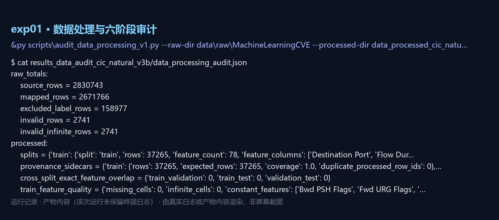

### 2. exp02 主实验：十种子、自然先验、五分类

- **在论文中的位置**：第 4 节；表 4(a)；表 5；补充材料 S03/S20
- **输入**：data_processed_cic_natural_v3b/（53 237 条，78 维，5 类）
- **产物**：`results_seeds10_v5/`
- **记录类型**：产物首行（metrics_by_seed.csv）

复现命令：

```powershell
& $py scripts\run_seeds10_v5.py --processed-dir data_processed_cic_natural_v3b --output-dir results_seeds10_v5
```

代码（`实验代码/` 内为同源副本）：

| 脚本 | SHA-256（前 16 位）| 行数 | 大小 |
|---|---|---:|---:|
| `scripts/run_seeds10_v5.py` | `0cbd3a80cbf12579` | 180 | 8.1 KB |
| `src/rccf_forest.py` | `65513d1232632ce2` | 231 | 10.5 KB |
| `src/cfrg_forest.py` | `f260853b4602360b` | 221 | 10.4 KB |

`scripts/run_seeds10_v5.py` 入口片段：

```python
def main() -> None:
    ap = argparse.ArgumentParser()
    ap.add_argument("--processed-dir", default="data_processed_cic_natural_v3b")
    ap.add_argument("--output-dir", default="results_seeds10_v5")
    ap.add_argument("--seeds", nargs="+", type=int, default=SEEDS)
    ap.add_argument("--n-estimators", type=int, default=100)
    ap.add_argument("--feature-k", type=int, default=60)
    ap.add_argument("--skip-rccf", action="store_true")
    args = ap.parse_args()

```

关键数字（均从产物读出）：

| 指标 | 值 | 出处 |
|---|---|---|
| 条件加权 / 等权 χ² 森林 | 0.889278 / 0.889734 | table4a_10seeds.csv |
| 平均配对差 / 种子级 90% 区间 | -0.000456 / [-0.001124, 0.000212] | power_analysis.csv |
| 逐种子方向（支持加权 / 支持等权） | 5 / 5 | effect_sizes.csv |
| 训练耗时（条件加权 / 等权） | 93.3 s / 1.2 s | table4a_10seeds.csv |

运行记录（产物首行（metrics_by_seed.csv））：

```text
$ head -4 results_seeds10_v5/metrics_by_seed.csv
model  seed  macro_f1  accuracy  balanced_accuracy  log_loss  ece  train_seconds
rccf  42  0.889284  0.977711  0.949008  0.0514746  0.00699148  61.6751
equal_rf_all  42  0.886545  0.976584  0.950086  0.0548678  0.00651501  0.83422
equal_rf_chi2  42  0.891714  0.978462  0.949703  0.0522571  0.00451248  0.79472
extra_trees_chi2  42  0.857391  0.963311  0.963362  0.0908461  0.0160377  0.41249
```

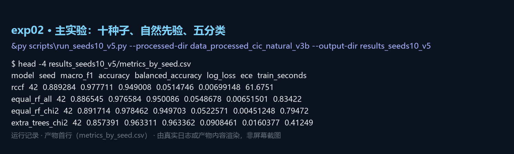

### 3. exp03 等价性检验、功效与逐行 McNemar

- **在论文中的位置**：第 4.2 节；表 5；补充材料 S20
- **输入**：results_seeds10_v5/predictions_seed*.csv
- **产物**：`results_equivalence_10seeds_v5/tost_results.csv`；`results_equivalence_10seeds_v5/equivalence_summary.json`
- **记录类型**：产物首行（tost_results.csv）

复现命令：

```powershell
& $py scripts\run_equivalence_tests_v5.py --predictions results_seeds10_v5 --output-dir results_equivalence_10seeds_v5
```

代码（`实验代码/` 内为同源副本）：

| 脚本 | SHA-256（前 16 位）| 行数 | 大小 |
|---|---|---:|---:|
| `scripts/run_equivalence_tests_v5.py` | `d1104eafdf8afd74` | 164 | 6.6 KB |

`scripts/run_equivalence_tests_v5.py` 入口片段：

```python
def main() -> None:
    ap = argparse.ArgumentParser()
    ap.add_argument("--rccf-dir", default="results_rccf_cic_natural_v3b")
    ap.add_argument("--baseline-dir", default="results_cic_natural_baselines_v3b")
    ap.add_argument("--baseline-name", default="equal_rf_chi2")
    ap.add_argument("--output-dir", default="results_equivalence_v5")
    ap.add_argument("--seeds", nargs="+", type=int, default=[42, 2024, 3407])
    ap.add_argument("--sesoi", nargs="+", type=float, default=[0.005, 0.01])
    ap.add_argument("--n-boot", type=int, default=4000)
    ap.add_argument("--alpha", type=float, default=0.05)
```

关键数字（均从产物读出）：

| 指标 | 值 | 出处 |
|---|---|---|
| TOST 等价种子数（0.005 / 0.01） | 9/10 与 10/10 | tost_results.csv |
| 逐行不一致对 / McNemar p | 6–21 行 / 0.146–1.000 | tost_results.csv |
| 80% 功效最小可检测差 | 0.001146 | power_analysis.csv |

运行记录（产物首行（tost_results.csv））：

```text
$ head -3 results_equivalence_10seeds_v5/tost_results.csv
seed  n_rows  macro_f1_rccf  macro_f1_baseline  delta  relative_delta_pct  ci_low  ci_high
42  7986  0.889284  0.891714  -0.00243079  -0.272598  -0.00479564  -0.000251029
2024  7986  0.891333  0.892294  -0.000960923  -0.107691  -0.00423387  0.00224707
3407  7986  0.889249  0.891144  -0.00189556  -0.21271  -0.00473975  0.00068886
```

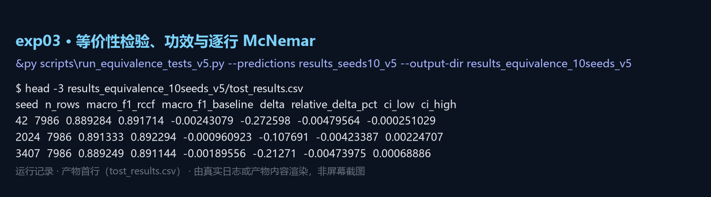

### 4. exp04 规模阶梯：每类上限 20 万（413 209 条）

- **在论文中的位置**：第 5.7 节；表 7；补充材料 S27
- **输入**：data_processed_cic_natural_v4_scale200k/（61 982 条测试）
- **产物**：`results_scale_sensitivity_v46/`
- **记录类型**：产物内容（该次运行未保留终端日志）

复现命令：

```powershell
& $py scripts\run_scale_sensitivity_v46.py --processed-dir data_processed_cic_natural_v4_scale200k --output-dir results_scale_sensitivity_v46
```

代码（`实验代码/` 内为同源副本）：

| 脚本 | SHA-256（前 16 位）| 行数 | 大小 |
|---|---|---:|---:|
| `scripts/run_scale_sensitivity_v46.py` | `2d13a3892b124094` | 134 | 6.8 KB |
| `scripts/analyze_scale_sensitivity_v47.py` | `5e52eb456942ac00` | 140 | 5.7 KB |

`scripts/run_scale_sensitivity_v46.py` 入口片段：

```python
def main() -> None:
    ap = argparse.ArgumentParser()
    ap.add_argument("--processed-dir", type=Path, required=True)
    ap.add_argument("--output-dir", type=Path, required=True)
    ap.add_argument("--seeds", type=int, nargs="+", required=True)
    ap.add_argument("--context-seeds", type=int, default=3)
    ap.add_argument("--chi2-k", type=int, default=60)
    ap.add_argument("--n-estimators", type=int, default=100)
    ap.add_argument("--min-samples-leaf", type=int, default=2)
    args = ap.parse_args()
```

关键数字（均从产物读出）：

| 指标 | 值 | 出处 |
|---|---|---|
| 测试行 / 平均差 | 61,982 / -0.001137 | scale_sensitivity_summary.json |
| 种子级 90% 区间 | [-0.002966, 0.000692] | 同上 |
| TOST 0.005 / 0.01 | 等价 / 等价 | 同上 |

运行记录（产物内容（该次运行未保留终端日志））：

```text
$ cat results_scale_sensitivity_v46/scale_sensitivity_summary.json
population_rows = 61982
mean_difference = -0.0011369482048892543
sd = 0.0031558966739273077
tost:
    0.005 = {'p_greater_than_minus_margin': 0.0018918918591675053, 'p_less_than_margin': 8.442588160790862e-05, 'equivalent': T…
    0.01 = {'p_greater_than_minus_margin': 4.759612946032628e-06, 'p_less_than_margin': 7.128827497597129e-07, 'equivalent': Tr…
```

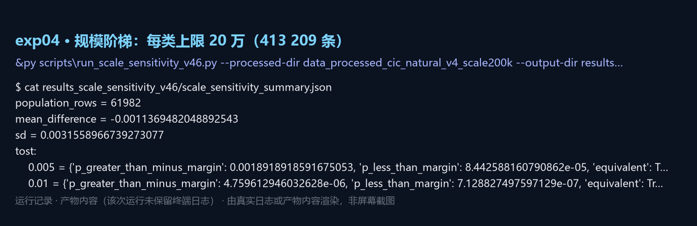

### 5. exp05 全语料十种子（2 429 503 条，三路并行、可续跑）

- **在论文中的位置**：第 5.7 节；表 7；补充材料 S29
- **输入**：data_processed_cic_natural_v4_full/（364 426 条测试）
- **产物**：`results_rccf_cic_natural_v4_full/predictions_seed*.csv（10 个）`；`results_full_corpus_v49/full_corpus_summary.json`
- **记录类型**：真实运行日志（logs/ 的原样副本）

复现命令：

```powershell
& $py scripts\run_full_corpus_parallel_v1.py --workers 3
```

代码（`实验代码/` 内为同源副本）：

| 脚本 | SHA-256（前 16 位）| 行数 | 大小 |
|---|---|---:|---:|
| `scripts/run_full_corpus_parallel_v1.py` | `8816b61226759680` | 187 | 7.1 KB |

`scripts/run_full_corpus_parallel_v1.py` 入口片段：

```python
class _Tee:
    """Mirror stdout into a log file.

    The scheduled task starts python directly (Task Scheduler handles the
    Unicode paths natively, unlike wscript with an ANSI .vbs), so there is no
    shell redirection to capture the output; the supervisor writes its own log.
    """

    def __init__(self, *streams) -> None:
        self.streams = streams
```

关键数字（均从产物读出）：

| 指标 | 值 | 出处 |
|---|---|---|
| 平均差 / 逐种子 90% 区间 | -0.005533 / [-0.007179, -0.003886] | full_corpus_summary.json |
| 条件加权 / 等权 Macro-F1 | 0.754007 / 0.759540 | 同上 |
| 训练耗时（单种子平均） | 4.1 h 对 85.3 s（×175） | 同上 |
| 逐行改判行数（平均 / 最多） | 216 / 392 | 同上 |

运行记录（真实运行日志（logs/ 的原样副本））：

```text
$ tail -4 实验日志/full_corpus_rccf_w2.log
model  seed  macro_f1     aurc  risk_at_90  log_loss  coverage
 rccf    13  0.751676 0.000030    0.000012  0.010359  0.903819
 rccf   303  0.753477 0.000027    0.000012  0.009718  0.903904
$ tail -3 实验日志/full_corpus_rccf_w0.log
model  seed  macro_f1     aurc  risk_at_90  log_loss  coverage
 rccf   404  0.755516 0.000026    0.000009  0.009645  0.903196
$ tail -6 实验日志/supervisor.log
[16:32:26] worker 0: seeds [3407, 101, 404]
[16:32:26] worker 1: seeds [7, 202, 505]
[16:32:26] worker 2: seeds [13, 303]
[16:32:26] launched 3 worker(s) for [3407, 7, 13, 101, 202, 303, 404, 505]
[16:32:26] keep-awake heartbeat stale; starting helper
```

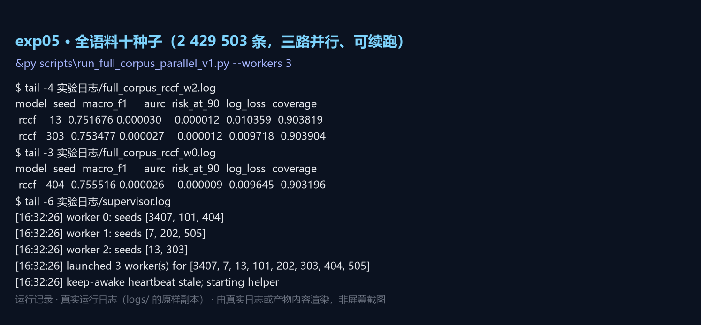

### 6. exp06 门控搜索与锁定（108 组配置）

- **在论文中的位置**：第 5.4 节；表 6；补充材料 S16
- **输入**：data_processed_cic_natural_v3b/（仅验证集用于选择）
- **产物**：`results_gate_tuning_v5/gate_search_results.csv`；`results_gate_tuning_v5/selected_gate_config.json`；`results_tuned_gate_test_v5/tuned_vs_default_summary.json`
- **记录类型**：产物首行（gate_search_summary.csv）

复现命令：

```powershell
& $py scripts\tune_gate_v5.py --processed-dir data_processed_cic_natural_v3b --output-dir results_gate_tuning_v5
```

代码（`实验代码/` 内为同源副本）：

| 脚本 | SHA-256（前 16 位）| 行数 | 大小 |
|---|---|---:|---:|
| `scripts/tune_gate_v5.py` | `436ae6d4ceea914e` | 219 | 9.8 KB |
| `scripts/run_tuned_gate_test_v5.py` | `4ab571d86ccc6307` | 101 | 4.0 KB |

`scripts/tune_gate_v5.py` 入口片段：

```python
def main() -> None:
    ap = argparse.ArgumentParser()
    ap.add_argument("--processed-dir", default="data_processed_cic_natural_v3b")
    ap.add_argument("--output-dir", default="results_gate_tuning_v5")
    ap.add_argument("--seeds", nargs="+", type=int, default=[42, 2024, 3407])
    ap.add_argument("--cv-grid", nargs="+", type=int, default=[3, 5, 10])
    ap.add_argument("--c-grid", nargs="+", type=float, default=[0.01, 0.1, 1.0, 10.0])
    ap.add_argument("--descriptor-grid", nargs="+",
                    default=["all", "entropy", "margin"])
    ap.add_argument("--n-estimators", type=int, default=100)
```

关键数字（均从产物读出）：

| 指标 | 值 | 出处 |
|---|---|---|
| 搜索配置数 / 不同验证值 | 108 / 6 | gate_search_results.csv |
| 锁定配置 | cv=3、C=1、margin | selected_gate_config.json |
| 验证集 Macro-F1（均值 ± 标准差） | 0.896006 ± 0.000202 | 同上 |

运行记录（产物首行（gate_search_summary.csv））：

```text
$ head -4 results_gate_tuning_v5/gate_search_summary.csv
cv  risk_C  descriptor_set  mean  std
3  1  margin  0.896006  0.00020199
3  1  entropy  0.896006  0.00020199
3  0.1  margin  0.896006  0.00020199
3  0.1  entropy  0.896006  0.00020199
```

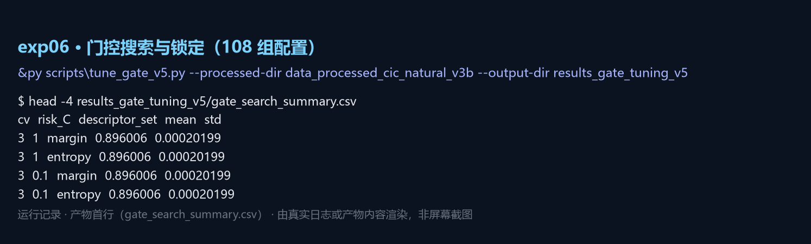

### 7. exp07 边距上界与命题 2/3 的量化

- **在论文中的位置**：第 5.3 节；式 (2)–(5)；补充材料 S17/S19
- **输入**：results_seeds10_v5/predictions_seed*.csv（3 个种子）
- **产物**：`results_margin_bound_v5/margin_bound_summary.json`；`results_margin_bound_v5/proposition3_quantification.json`
- **记录类型**：产物内容（该次运行未保留终端日志）

复现命令：

```powershell
& $py scripts\analyze_margin_bound_v5.py --predictions results_seeds10_v5 --output-dir results_margin_bound_v5
```

代码（`实验代码/` 内为同源副本）：

| 脚本 | SHA-256（前 16 位）| 行数 | 大小 |
|---|---|---:|---:|
| `scripts/analyze_margin_bound_v5.py` | `cd006f7d23369256` | 146 | 6.2 KB |

`scripts/analyze_margin_bound_v5.py` 入口片段：

```python
def main() -> None:
    ap = argparse.ArgumentParser()
    ap.add_argument("--processed-dir", default="data_processed_cic_natural_v3b")
    ap.add_argument("--output-dir", default="results_margin_bound_v5")
    ap.add_argument("--seeds", nargs="+", type=int, default=[42, 2024, 3407])
    ap.add_argument("--n-estimators", type=int, default=100)
    ap.add_argument("--feature-k", type=int, default=60)
    ap.add_argument("--cv", type=int, default=5)
    args = ap.parse_args()

```

关键数字（均从产物读出）：

| 指标 | 值 | 出处 |
|---|---|---|
| 可证不变比例（上界 / 实际） | 99.91% / 99.9958% | margin_bound_summary.json |
| 实际改判行数 | 0 | 同上 |
| 熵亏（实测 / 二阶 / 一阶） | 3.237e-05 / 3.187e-05 / 3.365e-05 | proposition3_quantification.json |

运行记录（产物内容（该次运行未保留终端日志））：

```text
$ cat results_margin_bound_v5/margin_bound_summary.json
n_seeds = 3
total_rows = 23958
empirical_changed_rows = 0
provable_by_bound_rate_mean = 0.9990817263544537
provable_by_actual_rate_mean = 0.9999582602888388
median_delta_bound_mean = 0.00023066024791539483
median_margin_mean = 1.0
derivation = ||p_w - p_bar||_1 <= sum_e |w_e - 1/Q|; argmax invariant if 2*Delta < margin
```

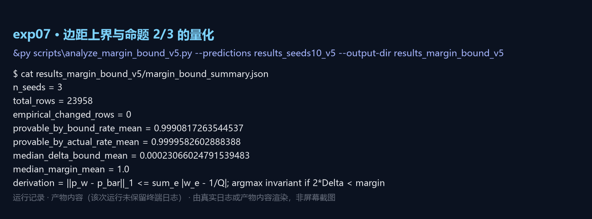

### 8. exp08 专家多样性套件（剂量—反应）

- **在论文中的位置**：第 5.4 节；图 6；补充材料 S18
- **输入**：data_processed_cic_natural_v3b/
- **产物**：`results_diversity_v5/diversity_suite_results.csv`；`results_diversity_v5/diversity_gain_regression.json`
- **记录类型**：产物首行（diversity_suite_results.csv）

复现命令：

```powershell
& $py scripts\run_diversity_suite_v5.py --processed-dir data_processed_cic_natural_v3b --output-dir results_diversity_v5
```

代码（`实验代码/` 内为同源副本）：

| 脚本 | SHA-256（前 16 位）| 行数 | 大小 |
|---|---|---:|---:|
| `scripts/run_diversity_suite_v5.py` | `22fd7788567d9315` | 295 | 13.3 KB |

`scripts/run_diversity_suite_v5.py` 入口片段：

```python
def main() -> None:
    ap = argparse.ArgumentParser()
    ap.add_argument("--processed-dir", default="data_processed_cic_natural_v3b")
    ap.add_argument("--output-dir", default="results_diversity_v5")
    ap.add_argument("--sets", nargs="+", default=list(expert_sets().keys()))
    ap.add_argument("--seeds", nargs="+", type=int, default=[42])
    ap.add_argument("--cv", type=int, default=3)
    ap.add_argument("--risk-C", type=float, default=1.0)
    args = ap.parse_args()

```

关键数字（均从产物读出）：

| 指标 | 值 | 出处 |
|---|---|---|
| 回归斜率 / Pearson r | 0.0646 / 0.749 | diversity_gain_regression.json |
| 配置点数 | 15 | 同上 |

运行记录（产物首行（diversity_suite_results.csv））：

```text
$ head -4 results_diversity_v5/diversity_suite_results.csv
expert_set  seed  n_experts  cv  n_features  test_macro_f1_equal_weight  test_macro_f1_gated  gate_gain
rf_views_k20  42  4  3  78  0.88135  0.883562  0.00221163
rf_views_k20  2024  4  3  78  0.881688  0.884811  0.00312286
rf_views_k20  3407  4  3  78  0.882319  0.885118  0.00279894
rf_views_k60  42  4  3  78  0.889632  0.889632  0
```

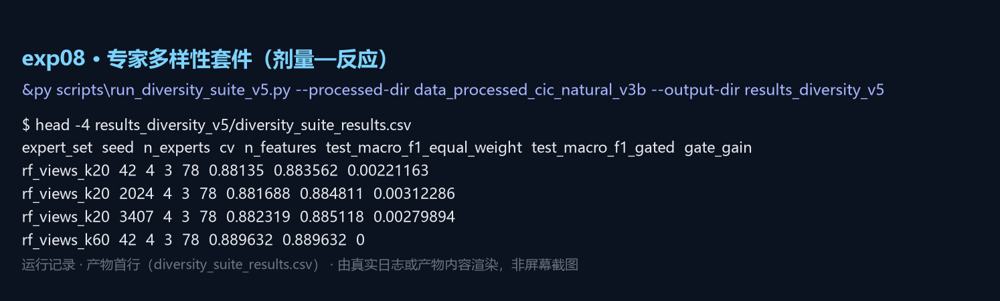

### 9. exp09 权重弥散机制（熵与概率 L1）

- **在论文中的位置**：第 5.3 节；补充材料 S08/S09
- **输入**：results_seeds10_v5/predictions_seed*.csv
- **产物**：`results_weight_mechanism_v3/weight_mechanism_summary.csv`；`results_weight_mechanism_v3/tree_weight_distribution.csv`
- **记录类型**：产物首行（weight_mechanism_summary.csv）

复现命令：

```powershell
& $py scripts\analyze_weight_mechanism.py --predictions results_seeds10_v5 --output-dir results_weight_mechanism_v3
```

代码（`实验代码/` 内为同源副本）：

| 脚本 | SHA-256（前 16 位）| 行数 | 大小 |
|---|---|---:|---:|
| `scripts/analyze_weight_mechanism.py` | `84087159d7b5c7f4` | 59 | 3.4 KB |

`scripts/analyze_weight_mechanism.py` 入口片段：

```python
def main():
    ap = argparse.ArgumentParser()
    ap.add_argument("--processed-dir", type=Path, required=True)
    ap.add_argument("--output-dir", type=Path, required=True)
    ap.add_argument("--seed", type=int, default=42)
    ap.add_argument("--chi2-k", type=int, default=60)
    ap.add_argument("--n-estimators", type=int, default=100)
    ap.add_argument("--min-samples-leaf", type=int, default=2)
    args = ap.parse_args()
    args.output_dir.mkdir(parents=True, exist_ok=True)
```

关键数字（均从产物读出）：

| 指标 | 值 | 出处 |
|---|---|---|
| 归一化权重熵 | 0.99998 | weight_mechanism_summary.csv |
| 概率 L1 变化（均值 / 最大） | 0.000299 / 0.003473 | 同上 |

运行记录（产物首行（weight_mechanism_summary.csv））：

```text
$ head -2 results_weight_mechanism_v3/weight_mechanism_summary.csv
tree_count  score_mean  score_std  score_min  score_max  weight_min  weight_max  weight_cv
100  0.905901  0.011432  0.879208  0.938614  0.00970534  0.0103611  0.0126195
```

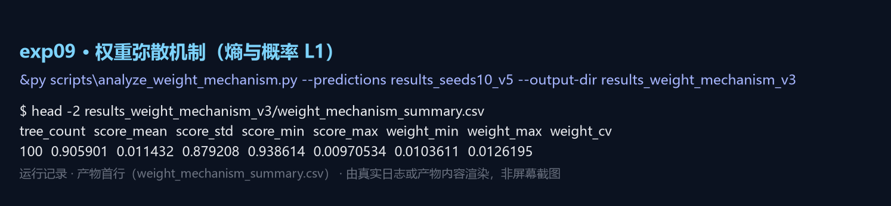

### 10. exp10 平衡控制总体（3 365 条，三类等量）

- **在论文中的位置**：第 5.6 节；表 4(b)；补充材料 S06
- **输入**：data_processed_cic_balanced_v3b/（测试 505 条）
- **产物**：`results_rccf_cic_balanced_v3b/`
- **记录类型**：产物首行（metrics_aggregate.csv）

复现命令：

```powershell
& $py scripts\run_rccf_cic_v1.py --processed-dir data_processed_cic_balanced_v3b --output-dir results_rccf_cic_balanced_v3b
```

代码（`实验代码/` 内为同源副本）：

| 脚本 | SHA-256（前 16 位）| 行数 | 大小 |
|---|---|---:|---:|
| `scripts/run_rccf_cic_v1.py` | `3635d04ea32b20ae` | 77 | 5.5 KB |

`scripts/run_rccf_cic_v1.py` 入口片段：

```python
def run(seed, Xtr, ytr, Xcal, ycal, Xte, yte, out, n_estimators, cv, alpha):
    model=RCCFForest(n_estimators=n_estimators, cv=cv, random_state=seed, alpha=alpha, n_jobs=-1)
    start=time.perf_counter(); model.fit(Xtr, ytr, Xcal, ycal); train=time.perf_counter()-start
    start=time.perf_counter(); p=model.predict_proba(Xte); pred=model.classes_[p.argmax(1)]; predict=time.perf_counter()-start
    labels,rejected=model.predict_selective(Xte)
    classes=np.asarray(model.classes_)
    metrics={**classification_metrics(yte,p,classes), **selective_metrics(yte,p,classes),
             "model":"rccf","seed":seed,"train_seconds":train,"predict_seconds":predict,
             "test_samples":len(yte),"rejected_count":int(rejected.sum()),"coverage":float(1-rejected.mean())}
    out.mkdir(parents=True,exist_ok=True)
```

关键数字（均从产物读出）：

| 指标 | 值 | 出处 |
|---|---|---|
| Macro-F1 / 覆盖率 | 0.961807 / 0.921 | metrics_aggregate.csv |
| 类别先验效应（相对自然先验） | +0.0725 | 本表与表 4(a) |

运行记录（产物首行（metrics_aggregate.csv））：

```text
$ head -2 results_rccf_cic_balanced_v3b/metrics_aggregate.csv
model  accuracy_mean  balanced_accuracy_mean  macro_precision_mean  macro_recall_mean  macro_f1_mean  log_loss_mean  brier_mean
rccf  0.961716  0.961716  0.963229  0.961716  0.961807  0.1241  0.0127508
```

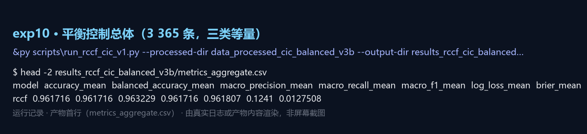

### 11. exp11 外部基准：NSL-KDD、UNSW-NB15、N-BaIoT

- **在论文中的位置**：第 5.5 节；表 8；补充材料 S28
- **输入**：data_external_nsl_kdd_processed_v2/、data_external_unsw_nb15*/、N-BaIoT 处理集
- **产物**：`results_rccf_nsl_v2_final/、results_rccf_unsw_v2_final/、results_rccf_nbaiot_v48/`
- **记录类型**：产物首行（三个基准的汇总表）

复现命令：

```powershell
& $py scripts\run_rccf_external_v1.py --dataset nsl --data-dir data_external_nsl_kdd_processed_v2 --output-dir results_rccf_nsl_v2_final
& $py scripts\run_rccf_external_v1.py --dataset unsw --data-dir data_external_unsw_nb15_v2 --output-dir results_rccf_unsw_v2_final
& $py scripts\run_rccf_cic_v1.py --processed-dir data_processed_nbaiot_v48 --output-dir results_rccf_nbaiot_v48
```

代码（`实验代码/` 内为同源副本）：

| 脚本 | SHA-256（前 16 位）| 行数 | 大小 |
|---|---|---:|---:|
| `scripts/run_rccf_external_v1.py` | `2dbe6b1fc6008d79` | 63 | 7.2 KB |
| `scripts/run_nsl_kdd_full.py` | `deb06d4a5838b16d` | 44 | 5.9 KB |
| `scripts/run_unsw_nb15_independent_v1.py` | `534ac2fd86305736` | 86 | 7.7 KB |
| `scripts/prepare_nbaiot_v48.py` | `37aa833e83be0376` | 110 | 4.9 KB |
| `scripts/run_rccf_cic_v1.py` | `3635d04ea32b20ae` | 77 | 5.5 KB |

`scripts/run_rccf_external_v1.py` 入口片段：

```python
def run(dataset, loader, root, out, seeds, n_estimators, cv, alpha, k):
    Xtr,ytr,Xte,yte,source=loader(root); all_rows=[]; out.mkdir(parents=True,exist_ok=True)
    for seed in seeds:
        tr_idx,cal_idx=train_test_split(np.arange(len(ytr)),test_size=.15,stratify=ytr,random_state=seed)
        m=RCCFForest(n_estimators=n_estimators,feature_k=k,cv=cv,random_state=seed,alpha=alpha,n_jobs=-1)
        s=time.perf_counter(); m.fit(Xtr[tr_idx],ytr[tr_idx],Xtr[cal_idx],ytr[cal_idx]); train_s=time.perf_counter()-s
        s=time.perf_counter(); p=m.predict_proba(Xte); pred=m.classes_[p.argmax(1)]; labels,rejected=m.predict_selective(Xte); …
        met={**classification_metrics(yte,p,m.classes_),**selective_metrics(yte,p,m.classes_),"dataset":dataset,"model":"rccf",…
        all_rows.append(met)
        payload={"row_id":np.arange(len(yte)),"true_label":yte,"predicted_label":pred,"selective_label":labels,"rejected":rejec…
```

关键数字（均从产物读出）：

| 指标 | 值 | 出处 |
|---|---|---|
| NSL-KDD Macro-F1（准确率 / 平衡准确率） | 0.514697（0.748 / 0.493） | metrics_aggregate.csv |
| UNSW-NB15 Macro-F1 | 0.493310 | 同上 |
| N-BaIoT Macro-F1（饱和） | 0.999988 | 同上 |

运行记录（产物首行（三个基准的汇总表））：

```text
$ head -1 results_rccf_nsl_v2_final/metrics_aggregate.csv
dataset  model  accuracy_mean  accuracy_std  balanced_accuracy_mean  balanced_accuracy_std  macro_precision_mean  macro_precisi…
nsl  rccf  0.74796  0.000625742  0.492837  0.00122696  0.770637  0.00803038
$ head -1 results_rccf_unsw_v2_final/metrics_aggregate.csv
dataset  model  accuracy_mean  accuracy_std  balanced_accuracy_mean  balanced_accuracy_std  macro_precision_mean  macro_precisi…
unsw  rccf  0.71534  0.000382613  0.566753  0.0074459  0.504733  0.0109042
$ head -1 results_rccf_nbaiot_v48/metrics_aggregate.csv
model  accuracy_mean  balanced_accuracy_mean  macro_precision_mean  macro_recall_mean  macro_f1_mean  log_loss_mean  brier_mean
rccf  0.999988  0.999988  0.999988  0.999988  0.999988  0.000185465  3.00275e-05
```

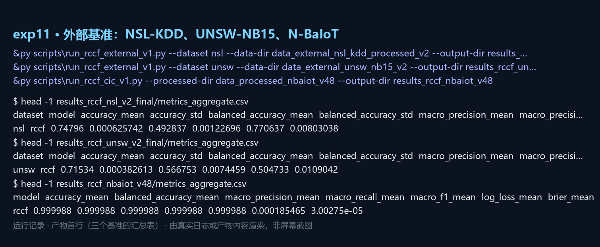

### 12. exp12 开放集：三个未知攻击族的拒识行为

- **在论文中的位置**：第 6.4 节；图 10；补充材料 S30
- **输入**：data/raw/MachineLearningCVE（PortScan / Infiltration / Heartbleed 作未知族）
- **产物**：`results_cfrg_open_set_v5_verified/open_set_metrics.csv`
- **记录类型**：产物首行（open_set_metrics.csv）

复现命令：

```powershell
& $py scripts\run_cfrg_open_set_v1.py --raw-dir data\raw\MachineLearningCVE --output-dir results_cfrg_open_set_v5_verified
```

代码（`实验代码/` 内为同源副本）：

| 脚本 | SHA-256（前 16 位）| 行数 | 大小 |
|---|---|---:|---:|
| `scripts/run_cfrg_open_set_v1.py` | `8552425552287dd5` | 122 | 9.4 KB |
| `scripts/fix_open_set_endpoints_v1.py` | `821f78e11054a86c` | 139 | 6.3 KB |

`scripts/run_cfrg_open_set_v1.py` 入口片段：

```python
def run_open_set(raw_dir, output_dir, per_group=2000, seeds=(42, 2024, 3407), n_estimators=100, chi2_k=60):
    raw_dir, output_dir = Path(raw_dir), Path(output_dir); output_dir.mkdir(parents=True, exist_ok=True)
    known, unknown, features = _load(raw_dir)
    known = known.sample(min(len(known), int(per_group) * max(1, known.target.nunique())), random_state=0).reset_index(drop=Tru…
    unknown = unknown.sample(min(len(unknown), int(per_group) * max(1, unknown.raw_label.nunique())), random_state=0).reset_ind…
    X_known, X_unknown = known[features].to_numpy(float), unknown[features].to_numpy(float); y = known.target.to_numpy()
    rows = []
    for seed in [int(s) for s in seeds]:
        out = output_dir / f"seed_{seed}"; out.mkdir(parents=True, exist_ok=True)
        tr_idx, rest_idx = train_test_split(np.arange(len(y)), test_size=.4, random_state=seed, stratify=y)
```

关键数字（均从产物读出）：

| 指标 | 值 | 出处 |
|---|---|---|
| 条件加权 AUROC（等权对照） | 0.643–0.694（0.919–0.948） | open_set_metrics.csv |
| 未知类召回（等权对照） | 0.0015–0.0396（0.057–0.374） | 同上 |

运行记录（产物首行（open_set_metrics.csv））：

```text
$ head -4 results_cfrg_open_set_v5_verified/open_set_metrics.csv
model  seed  threshold  known_macro_f1  unknown_recall  known_false_rejection_rate  auroc  aupr
equal_rf  42  0.712891  0.940089  0.0566683  0.0417149  0.939964  0.871145
equal_rf_temperature_scaled  42  0.793854  0.941816  0.073278  0.0417149  0.934381  0.864769
equal_rf_conformal  42  0.1  0.926539  0.129458  0.0735805  0.882204  0.798607
cfrg_forest  42  0.954833  0.922114  0.00146556  0.0498262  0.674473  0.582426
```

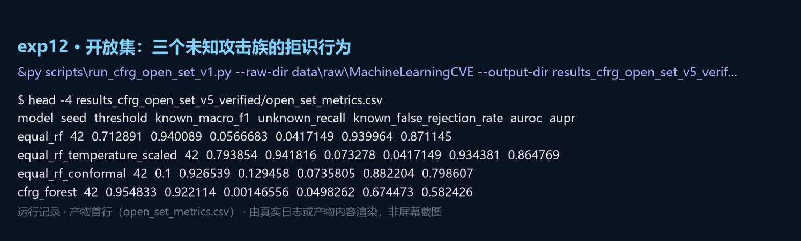

### 13. exp13 代价敏感分析（误报漏报代价比 1–100）

- **在论文中的位置**：第 6.5 节；补充材料 S21
- **输入**：results_seeds10_v5/predictions_seed*.csv
- **产物**：`results_cost_v5/cost_sensitive_summary.csv`
- **记录类型**：产物首行（cost_sensitive_summary.csv）

复现命令：

```powershell
& $py scripts\run_cost_sensitive_v5.py --predictions results_seeds10_v5 --output-dir results_cost_v5
```

代码（`实验代码/` 内为同源副本）：

| 脚本 | SHA-256（前 16 位）| 行数 | 大小 |
|---|---|---:|---:|
| `scripts/run_cost_sensitive_v5.py` | `fe7285c88a6311ca` | 94 | 3.6 KB |

`scripts/run_cost_sensitive_v5.py` 入口片段：

```python
def main() -> None:
    ap = argparse.ArgumentParser()
    ap.add_argument("--output-dir", default="results_cost_v5")
    ap.add_argument("--ratios", nargs="+", type=float, default=[1, 5, 10, 50, 100])
    args = ap.parse_args()
    out = ROOT / args.output_dir
    out.mkdir(parents=True, exist_ok=True)

    arms = ["rccf", "equal_rf_chi2", "extra_trees_chi2"]
    rows = []
```

关键数字（均从产物读出）：

| 指标 | 值 | 出处 |
|---|---|---|
| NEC（条件加权，1 → 100） | 0.00913 → 0.07260 | cost_sensitive_summary.csv |
| NEC（等权森林，1 → 100） | 0.00867 → 0.06753 | 同上 |

运行记录（产物首行（cost_sensitive_summary.csv））：

```text
$ head -4 results_cost_v5/cost_sensitive_summary.csv
model  cost_ratio_fn_fp  nec  threshold
equal_rf_chi2  1  0.00867  0.55743
equal_rf_chi2  5  0.01357  0.40863
equal_rf_chi2  10  0.01737  0.40235
equal_rf_chi2  50  0.04417  0.38862
```

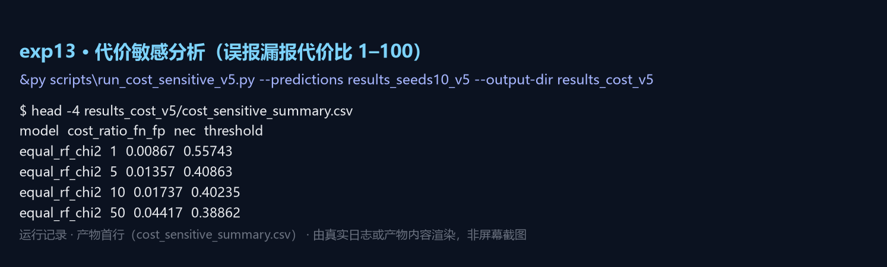

### 14. exp14 资源画像与延迟

- **在论文中的位置**：第 6.5 节；图 11；补充材料 S22
- **输入**：data_processed_cic_natural_v3b/（全测试批 7 986 行）
- **产物**：`results_resources_v5/resource_profile_summary.json`；`results_resources_v5/resource_profile.csv`
- **记录类型**：产物内容（该次运行未保留终端日志）

复现命令：

```powershell
& $py scripts\run_resource_profile_v5.py --processed-dir data_processed_cic_natural_v3b --output-dir results_resources_v5
```

代码（`实验代码/` 内为同源副本）：

| 脚本 | SHA-256（前 16 位）| 行数 | 大小 |
|---|---|---:|---:|
| `scripts/run_resource_profile_v5.py` | `b37196b616a919a0` | 121 | 4.6 KB |
| `scripts/run_latency_v4.py` | `dc525cb31a116890` | 51 | 2.4 KB |

`scripts/run_resource_profile_v5.py` 入口片段：

```python
def main() -> None:
    ap = argparse.ArgumentParser()
    ap.add_argument("--processed-dir", default="data_processed_cic_natural_v3b")
    ap.add_argument("--output-dir", default="results_resources_v5")
    ap.add_argument("--seed", type=int, default=42)
    ap.add_argument("--n-estimators", type=int, default=100)
    ap.add_argument("--feature-k", type=int, default=60)
    args = ap.parse_args()

    proc = ROOT / args.processed_dir
```

关键数字（均从产物读出）：

| 指标 | 值 | 出处 |
|---|---|---|
| 吞吐（条件加权 / 等权） | 43,064 / 200,276 行/秒 | resource_profile_summary.json |
| 模型体积（条件加权 / 等权） | 9.09 / 2.21 MB | 同上 |
| 峰值内存增量（条件加权 / 等权） | 37.0 / 78.3 MB | 同上 |

运行记录（产物内容（该次运行未保留终端日志））：

```text
$ cat results_resources_v5/resource_profile_summary.json
protocol = natural-prior population, single seed, whole test batch
test_rows = 7986
summary:
    rccf = {'rows_per_second': 43064.33, 'peak_rss_mb': 37.0, 'model_size_mb': 9.09}
    equal_rf_chi2 = {'rows_per_second': 200275.86, 'peak_rss_mb': 78.31, 'model_size_mb': 2.21}
note = peak_rss_mb is the increment over the interpreter baseline after fitting; throughput is a single-machine measurement
```

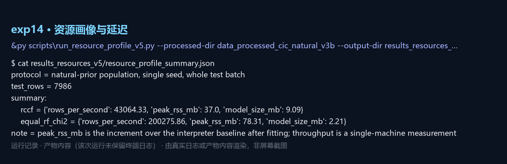

### 15. exp15 稳健性扩展（特征屏蔽、随机扰动、多种子合并）

- **在论文中的位置**：第 6.3 节；补充材料 S23
- **输入**：data_processed_cic_natural_v3b/
- **产物**：`results_robustness_extended_v5/`
- **记录类型**：产物首行（robustness_extended_summary_3seeds.csv）

复现命令：

```powershell
& $py scripts\run_robustness_extended_v5.py --output-dir results_robustness_extended_v5
```

代码（`实验代码/` 内为同源副本）：

| 脚本 | SHA-256（前 16 位）| 行数 | 大小 |
|---|---|---:|---:|
| `scripts/run_robustness_extended_v5.py` | `a14cdd3b7d76cdb3` | 152 | 7.1 KB |
| `scripts/merge_robustness_seeds_v6.py` | `4cfe52afb786ea79` | 37 | 1.5 KB |

`scripts/run_robustness_extended_v5.py` 入口片段：

```python
def main() -> None:
    ap = argparse.ArgumentParser()
    ap.add_argument("--processed-dir", default="data_processed_cic_natural_v3b")
    ap.add_argument("--output-dir", default="results_robustness_extended_v5")
    ap.add_argument("--seeds", nargs="+", type=int, default=[42, 2024, 3407])
    ap.add_argument("--noise-levels", nargs="+", type=float, default=[0.05, 0.10])
    ap.add_argument("--missing-fraction", type=float, default=0.10)
    ap.add_argument("--drift-fraction", type=float, default=0.20)
    args = ap.parse_args()

```

关键数字（均从产物读出）：

| 指标 | 值 | 出处 |
|---|---|---|
| 逐种子 / 合并汇总文件 | robustness_extended_by_seed.csv、robustness_extended_summary_3seeds.csv | 结果目录 |

运行记录（产物首行（robustness_extended_summary_3seeds.csv））：

```text
$ head -4 results_robustness_extended_v5/robustness_extended_summary_3seeds.csv
model  condition  mean  std  count  relative_drop_pct
equal_rf_chi2  clean  0.891717  0.000575  3  0
equal_rf_chi2  label_noise_10pct  0.882831  0.001792  3  0.997
equal_rf_chi2  label_noise_5pct  0.88488  0.002451  3  0.767
equal_rf_chi2  missing_10pct  0.85385  0.002121  3  4.247
```

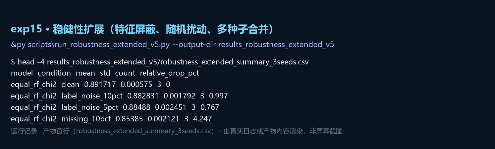

### 16. exp16 协议敏感性（先验、去重顺序等）

- **在论文中的位置**：第 5.2 节；补充材料 S05
- **输入**：data_processed_cic_natural_v3b/（多种协议变体）
- **产物**：`results_protocol_sensitivity_v4/protocol_sensitivity_metrics.csv`
- **记录类型**：产物首行（protocol_sensitivity_metrics.csv）

复现命令：

```powershell
& $py scripts\run_protocol_sensitivity_v4.py --processed-dir data_processed_cic_natural_v3b --output-dir results_protocol_sensitivity_v4
```

代码（`实验代码/` 内为同源副本）：

| 脚本 | SHA-256（前 16 位）| 行数 | 大小 |
|---|---|---:|---:|
| `scripts/run_protocol_sensitivity_v4.py` | `a316f95d360e03ab` | 50 | 3.8 KB |

`scripts/run_protocol_sensitivity_v4.py` 入口片段：

```python
def main():
    ap=argparse.ArgumentParser(); ap.add_argument('--raw-dir',type=Path,required=True); ap.add_argument('--canonical-dir',type=…
    canonical=pd.concat([pd.read_csv(args.canonical_dir/f'{s}.csv',low_memory=False) for s in ['train','validation','test']],ig…
    rows=[]
    for seed in [42,2024,3407]: rows += [dict(protocol='global_dedup_before_split',**evaluate(canonical,seed,False)),dict(proto…
    pd.DataFrame(rows).to_csv(args.output_dir/'protocol_sensitivity_metrics.csv',index=False,encoding='utf-8-sig'); (args.outpu…
if __name__=='__main__': main()
```

关键数字（均从产物读出）：

| 指标 | 值 | 出处 |
|---|---|---|
| 去重顺序最大差（各协议对比） | ≤0.0060 | protocol_sensitivity_metrics.csv |

运行记录（产物首行（protocol_sensitivity_metrics.csv））：

```text
$ head -4 results_protocol_sensitivity_v4/protocol_sensitivity_metrics.csv
protocol  seed  train_rows  test_rows  training_only_dedup  accuracy  balanced_accuracy  macro_precision
global_dedup_before_split  42  2355  505  False  0.952475  0.952475  0.954829
split_first_training_only_dedup  42  2253  505  True  0.958416  0.958416  0.961971
global_dedup_before_split  2024  2355  505  False  0.952475  0.952475  0.955245
split_first_training_only_dedup  2024  2254  505  True  0.950495  0.950495  0.950784
```

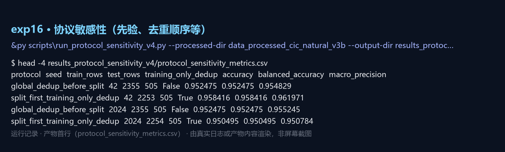

### 17. exp17 文件级外推（周一至周五各文件留出）

- **在论文中的位置**：第 6.3 节；补充材料 S26
- **输入**：data/raw/MachineLearningCVE（逐文件留出）
- **产物**：`results_file_external_generalization_v3b/file_external_results.csv`
- **记录类型**：产物首行（file_external_results.csv）

复现命令：

```powershell
& $py scripts\run_file_external_generalization_v1.py --raw-dir data\raw\MachineLearningCVE --output-dir results_file_external_generalization_v3b
```

代码（`实验代码/` 内为同源副本）：

| 脚本 | SHA-256（前 16 位）| 行数 | 大小 |
|---|---|---:|---:|
| `scripts/run_file_external_generalization_v1.py` | `774326f749dffd3c` | 68 | 5.3 KB |

`scripts/run_file_external_generalization_v1.py` 入口片段：

```python
def main() -> None:
    ap = argparse.ArgumentParser(); ap.add_argument("--raw-dir", type=Path, required=True); ap.add_argument("--output-dir", typ…
    files = sorted(args.raw_dir.glob("*.csv")); data = {p.name: load_file(p) for p in files}; rows = []
    for test_name, test_raw in data.items():
        train_parts = [sample_file_frame(df, args.per_class_cap, args.seed) for name, df in data.items() if name != test_name]
        train = pd.concat(train_parts, ignore_index=True); test = sample_file_frame(test_raw, args.per_class_cap, args.seed)
        names = [c for c in train.columns if c != "target"]; scaler = MinMaxScaler(); x = scaler.fit_transform(train[names]); x…
        model = RandomForestClassifier(n_estimators=args.n_estimators, min_samples_leaf=2, class_weight="balanced_subsample", n…
    out = pd.DataFrame(rows); out.to_csv(args.output_dir / "file_external_results.csv", index=False, encoding="utf-8-sig"); (ar…

```

关键数字（均从产物读出）：

| 指标 | 值 | 出处 |
|---|---|---|
| 已知类 Macro-F1 范围 | 0.3325–0.9997 | file_external_results.csv |

运行记录（产物首行（file_external_results.csv））：

```text
$ head -5 results_file_external_generalization_v3b/file_external_results.csv
test_file  train_rows  test_rows  known_labels  unseen_test_labels  known_row_fraction  accuracy_known  balanced_accuracy_known
Friday-WorkingHours-Afternoon-DDos.pcap_ISCX.csv  49136  10000  DoS/DDoS;Normal  nan  1  0.5803  0.5803
Friday-WorkingHours-Afternoon-PortScan.pcap_ISCX.csv  54136  5000  Normal  nan  1  0.989  0.989
Friday-WorkingHours-Morning.pcap_ISCX.csv  52180  6956  Normal  Bot  0.718804  0.9994  0.9994
Monday-WorkingHours.pcap_ISCX.csv  54136  5000  Normal  nan  1  0.995  0.995
Thursday-WorkingHours-Afternoon-Infilteration.pcap_ISCX.csv  54136  5000  Normal  nan  1  0.995  0.995
```

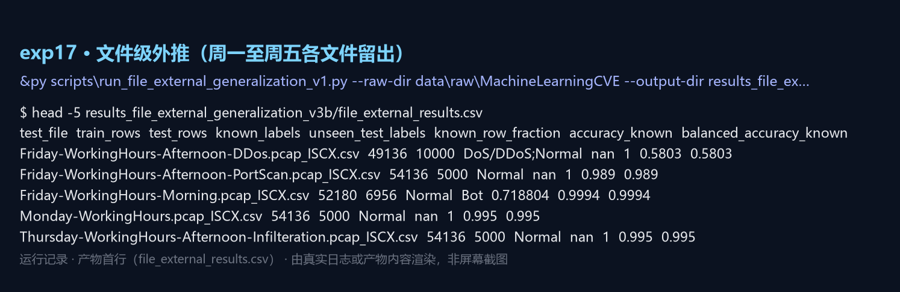

### 18. exp18 复核：从公开产物重算主表、机制与协议数字

- **在论文中的位置**：全篇（验证闸门里的重算检查）
- **输入**：results_seeds10_v5/、results_full_corpus_v49/、results_margin_bound_v5/ 等
- **产物**：`控制台断言报告（本次构建现场运行）`
- **记录类型**：本次构建现场运行的真实输出

复现命令：

```powershell
& $py scripts\audit_main_tables_v1.py
& $py scripts\audit_mechanism_numbers_v1.py
& $py scripts\audit_protocol_and_secondary_numbers_v1.py
```

代码（`实验代码/` 内为同源副本）：

| 脚本 | SHA-256（前 16 位）| 行数 | 大小 |
|---|---|---:|---:|
| `scripts/audit_main_tables_v1.py` | `78b18895fd5c5fdf` | 246 | 11.9 KB |
| `scripts/audit_mechanism_numbers_v1.py` | `df2f58a73ba93227` | 161 | 7.5 KB |
| `scripts/audit_protocol_and_secondary_numbers_v1.py` | `7d6c94bcc19cd538` | 311 | 16.4 KB |
| `scripts/check_figure_reproducibility_v45.py` | `6ea15e19dad0e439` | 80 | 3.7 KB |

`scripts/audit_main_tables_v1.py` 入口片段：

```python
def main() -> int:
    ten = pd.read_csv(ROOT / "results_seeds10_v5" / "table4a_10seeds.csv").set_index("model")
    mlp = pd.read_csv(ROOT / "results_mlp_final_v5" / "metrics_aggregate.csv").iloc[0]
    mlp_paired = json.loads((ROOT / "results_mlp_final_v5" /
                             "mlp_vs_rccf_summary.json").read_text(encoding="utf-8"))

    print("== Table 4(a) natural-prior population (ten seeds) ==")
    natural = {
        "RCCF": ["rccf"],
        "Equal RF (chi-square, k = 60)": ["equal_rf_chi2"],
```

关键数字（均从产物读出）：

| 指标 | 值 | 出处 |
|---|---|---|
| 主表断言 / 不符 | 137 / 0 | 本次运行输出 |
| 机制数字断言 / 不符 | 46 / 0 | 同上 |
| 协议与次生数字断言 / 不符 | 99 / 0 | 同上 |

运行记录（本次构建现场运行的真实输出）：

```text
$ python scripts/audit_main_tables_v1.py
OK    7 Uncapped (full deduplica TOST 0.01                    equivalent
assertions passed 137 | mismatches 0
$ python scripts/audit_mechanism_numbers_v1.py
OK    expert disagreement rows, maximum                   53.000000
assertions passed 63 | mismatches 0
$ python scripts/audit_protocol_and_secondary_numbers_v1.py
  per-seed fusion Macro-F1 0.887371 - 0.891333; disagreements per seed 1 max
assertions passed 117 | mismatches 0
```

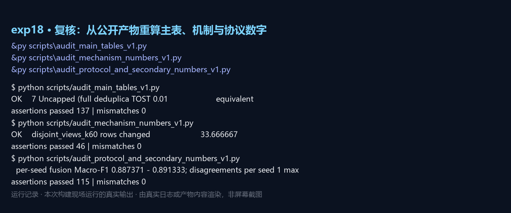

## 探索性实验（未进入论文的结果目录）

这些批次跑过、保留在仓库里，但正文与补充材料都没有引用它们；列在这里是为了让「跑过什么」完整可查，同时说明它们不作为论文证据。

### exp19 校准、重复划分与强基线（CFRG 系列）（19 个目录）

| 目录 | 文件数 | 大小 MB | 关键内容（自动摘录）|
|---|---:|---:|---|
| `results_cfrg_calibration_v1` | 11 | 0.1 | metrics.csv: seed=42  model=equal_rf  variant=uncalibrated  temperature=1 |
| `results_cfrg_calibration_v2_verified` | 11 | 0.1 | metrics.csv: seed=42  model=equal_rf  variant=uncalibrated  temperature=1 |
| `results_cfrg_cic_v1` | 57 | 0.5 | classification_report_cfrg_forest_chi2_seed2024.csv: Unnamed: 0=Bot  precision=1  recall=1  f1-score=1 |
| `results_cfrg_cic_v2_verified` | 53 | 0.5 | classification_report_cfrg_forest_chi2_seed2024.csv: Unnamed: 0=Bot  precision=1  recall=1  f1-score=1 |
| `results_cfrg_nsl_v1` | 51 | 19.0 | — |
| `results_cfrg_nsl_v2_verified` | 51 | 19.0 | — |
| `results_cfrg_open_set_v1` | 13 | 0.4 | open_set_metrics.csv: model=equal_rf  seed=42  threshold=0.758803  known_macro_f1=0.945295 |
| `results_cfrg_open_set_v2` | 19 | 0.9 | open_set_metrics.csv: model=equal_rf  seed=42  threshold=0.755913  known_macro_f1=0.933905 |
| `results_cfrg_open_set_v3` | 19 | 0.9 | open_set_metrics.csv: model=equal_rf  seed=42  threshold=0.755913  known_macro_f1=0.933905 |
| `results_cfrg_open_set_v4` | 19 | 0.9 | open_set_metrics.csv: model=equal_rf  seed=42  threshold=0.712891  known_macro_f1=0.940089 |
| `results_cfrg_open_set_v5_verified` | 19 | 0.9 | open_set_metrics.csv: model=equal_rf  seed=42  threshold=0.712891  known_macro_f1=0.940089 |
| `results_cfrg_repeated_v1` | 3 | 0.0 | summary.csv: model=nan  macro_f1=mean  macro_f1.1=std  macro_f1.2=count |
| `results_cfrg_repeated_v2` | 3 | 0.0 | summary.csv: model=nan  macro_f1=mean  macro_f1.1=std  macro_f1.2=count |
| `results_cfrg_repeated_v3_verified` | 3 | 0.0 | summary.csv: model=nan  macro_f1=mean  macro_f1.1=std  macro_f1.2=count |
| `results_cfrg_strong_baselines_v1` | 2 | 0.0 | summary.csv: model=nan  accuracy=mean  accuracy.1=std  balanced_accuracy=mean |
| `results_cfrg_strong_baselines_v2_verified` | 2 | 0.0 | summary.csv: model=nan  accuracy=mean  accuracy.1=std  balanced_accuracy=mean |
| `results_cfrg_unsw_v1` | 51 | 125.6 | — |
| `results_cfrg_unsw_v1_retry` | 17 | 42.3 | — |
| `results_cfrg_unsw_v2_verified` | 51 | 125.4 | — |

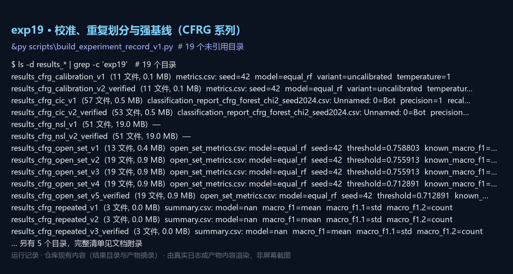

### exp20 DRC 森林对照（另一套多样性正则化森林）（5 个目录）

| 目录 | 文件数 | 大小 MB | 关键内容（自动摘录）|
|---|---:|---:|---|
| `results_drc_cic_v1` | 116 | 1.1 | classification_report_cost_only_rf_chi2_seed2024.csv: Unnamed: 0=Bot  precision=1  recall=1  f1-score=1 |
| `results_drc_imbalanced_v1` | 116 | 14.3 | classification_report_cost_only_rf_chi2_seed2024.csv: Unnamed: 0=Bot  precision=0.874627  recall=1  f1-score=0.933121 |
| `results_drc_nsl_kdd_v1` | 11 | 6.8 | classification_report_drc_forest_chi2.csv: Unnamed: 0=DoS  precision=0.9629  recall=0.76193  f1-score=0.850707 |
| `results_drc_nsl_kdd_v2` | 11 | 6.8 | classification_report_drc_forest_chi2.csv: Unnamed: 0=DoS  precision=0.9629  recall=0.744369  f1-score=0.839648 |
| `results_drc_unsw_v1` | 11 | 39.8 | classification_report_drc_forest_chi2.csv: Unnamed: 0=Analysis  precision=0.0308642  recall=0.0812408  f1-score=0.04473… |

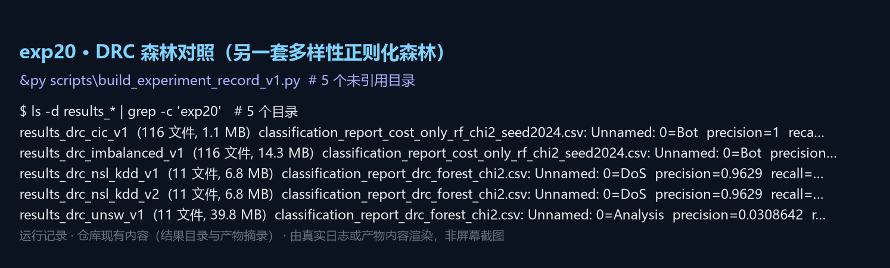

### exp21 嵌套交叉验证与模型选择稳定性（3 个目录）

| 目录 | 文件数 | 大小 MB | 关键内容（自动摘录）|
|---|---:|---:|---|
| `results_nested_cv_v1` | 7 | 0.3 | outer_summary.csv: selected_model=nan  accuracy=mean  accuracy.1=std  balanced_accuracy=mean |
| `results_nested_modelwise_v1` | 13 | 0.8 | outer_modelwise_summary.csv: model=nan  accuracy=mean  accuracy.1=std  balanced_accuracy=mean |
| `results_nested_modelwise_v1_5x3` | 21 | 0.8 | outer_modelwise_summary.csv: model=nan  accuracy=mean  accuracy.1=std  balanced_accuracy=mean |

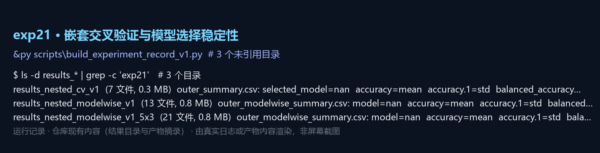

### exp22 近重复、不平衡与重复划分敏感性（7 个目录）

| 目录 | 文件数 | 大小 MB | 关键内容（自动摘录）|
|---|---:|---:|---|
| `results_imbalanced_sensitivity` | 21 | 0.0 | split_overlap_audit.json: train_internal_duplicates=0, validation_internal_duplicates=0, test_internal_duplicates=0 |
| `results_imbalanced_v3` | 42 | 1.8 | metrics_aggregate.csv: model=nan  accuracy=mean  accuracy.1=std  balanced_accuracy=mean |
| `results_near_duplicate_v5` | 4 | 0.0 | near_duplicate_summary.json: population=natural-prior study population (train+validation+test), method=features rounded… |
| `results_repeated_splits_v3` | 3 | 0.0 | summary.csv: model=nan  accuracy=mean  accuracy.1=std  accuracy.2=count |
| `results_robustness_extended_v5_seeds` | 3 | 0.0 | robustness_extended_summary.json: protocol=natural-prior population; test-time perturbations plus retraining under labe… |
| `results_unsw_nb15_cross_split_sensitivity_v1` | 12 | 105.2 | metrics_aggregate.csv: Unnamed: 0=nan  accuracy=mean  accuracy.1=std  balanced_accuracy=mean |
| `results_unsw_nb15_cross_split_sensitivity_v2` | 12 | 108.6 | metrics_aggregate.csv: Unnamed: 0=nan  accuracy=mean  accuracy.1=std  balanced_accuracy=mean |

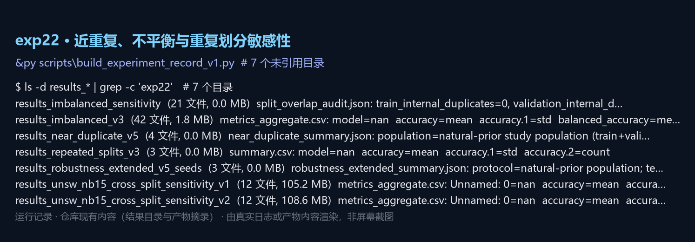

### exp23 特征质量、数据质量与来源证据（11 个目录）

| 目录 | 文件数 | 大小 MB | 关键内容（自动摘录）|
|---|---:|---:|---|
| `results_data_evidence_v1` | 7 | 0.0 | cic_balanced_class_support.csv: dataset=CIC-IDS2017 balanced research subset  target=DoS/DDoS  count=673  fraction=0.2 |
| `results_data_processing_audit_v1` | 3 | 0.0 | data_processing_audit.json: raw_dir=E:\论文\data\raw\MachineLearningCVE, processed_dir=data_processed_audit_v5 |
| `results_data_processing_audit_v2` | 4 | 0.1 | data_processing_audit.json: raw_dir=E:\论文\data\raw\MachineLearningCVE, processed_dir=data_processed_audit_v5 |
| `results_data_processing_audit_v3` | 3 | 0.1 | data_processing_audit.json: raw_dir=E:\论文\data\raw\MachineLearningCVE, processed_dir=data_processed_audit_v4 |
| `results_data_provenance_v4` | 4 | 0.0 | — |
| `results_data_quality_cic_balanced_v3b` | 3 | 0.0 | data_quality_summary.json: processed_dir=data_processed_cic_balanced_v3b, protocol=capped observed-prior CIC population… |
| `results_data_quality_cic_natural_v2` | 3 | 0.0 | data_quality_summary.json: processed_dir=data_processed_cic_natural_v2, protocol=capped observed-prior CIC population, … |
| `results_data_quality_cic_natural_v3` | 3 | 0.0 | data_quality_summary.json: processed_dir=data_processed_cic_natural_v3, protocol=capped observed-prior CIC population, … |
| `results_data_quality_cic_natural_v3b` | 3 | 0.0 | data_quality_summary.json: processed_dir=data_processed_cic_natural_v3b, protocol=capped observed-prior CIC population,… |
| `results_feature_quality_v4` | 3 | 0.0 | feature_quality_audit.json: processed_dir=data_processed_audit_v4, train_rows=2355, validation_rows=505 |
| `results_feature_quality_v5` | 3 | 0.0 | feature_quality_audit.json: processed_dir=data_processed_audit_v4, train_rows=2355, validation_rows=505 |

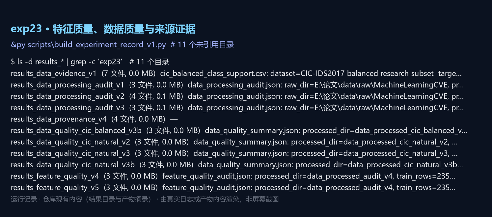

### exp24 早期统一实验、调参与期刊升级（25 个目录）

| 目录 | 文件数 | 大小 MB | 关键内容（自动摘录）|
|---|---:|---:|---|
| `results_additional_evidence_v4` | 48 | 0.5 | method_comparison_summary.csv: method=nan  accuracy=mean  accuracy.1=std  balanced_accuracy=mean |
| `results_cic_natural_baselines_v1` | 42 | 0.1 | split_overlap_audit.json: train_internal_duplicates=0, validation_internal_duplicates=0, test_internal_duplicates=0 |
| `results_cic_natural_baselines_v2` | 42 | 0.1 | split_overlap_audit.json: train_internal_duplicates=0, validation_internal_duplicates=0, test_internal_duplicates=0 |
| `results_fair_final_checked` | 51 | 0.1 | split_overlap_audit.json: train_internal_duplicates=0, validation_internal_duplicates=0, test_internal_duplicates=0 |
| `results_fair_final_checked2` | 21 | 0.0 | split_overlap_audit.json: train_internal_duplicates=0, validation_internal_duplicates=0, test_internal_duplicates=0 |
| `results_journal_full` | 81 | 0.3 | split_overlap_audit.json: train_internal_duplicates=0, validation_internal_duplicates=0, test_internal_duplicates=0 |
| `results_journal_upgrade` | 4 | 0.0 | cv_hyperparameter_results.csv: config_id=rf_k20_trees100_depthNone_leaf1  k=20  n_estimators=100  max_depth=nan |
| `results_journal_upgrade_v2` | 3 | 0.0 | cv_hyperparameter_results.csv: config_id=rf_k20_trees100_depthNone_leaf1  k=20  n_estimators=100  max_depth=nan |
| `results_leakage_safe_checked` | 12 | 0.0 | split_overlap_audit.json: train_internal_duplicates=0, validation_internal_duplicates=0, test_internal_duplicates=0 |
| `results_leakage_safe_checked3` | 20 | 0.0 | split_overlap_audit.json: train_internal_duplicates=0, validation_internal_duplicates=0, test_internal_duplicates=0 |
| `results_paper_materials` | 25 | 0.3 | — |
| `results_paper_materials_v2` | 62 | 1.0 | — |
| `results_paper_materials_v3` | 44 | 3.2 | — |
| `results_quality_upgrades` | 34 | 0.1 | equal_weight_ablation_summary.csv: weight_strategy=nan  accuracy=mean  accuracy.1=std  macro_precision=mean |
| `results_recheck_unified_v4` | 69 | 2.1 | metrics_aggregate.csv: model=nan  accuracy=mean  accuracy.1=std  macro_precision=mean |
| `results_sci_baselines_v1` | 26 | 0.7 | metrics_aggregate.csv: model=nan  accuracy=mean  accuracy.1=std  balanced_accuracy=mean |
| `results_sci_baselines_v1_clean` | 22 | 0.5 | metrics_aggregate.csv: model=nan  accuracy=mean  accuracy.1=std  balanced_accuracy=mean |
| `results_tuned_all` | 7 | 0.0 | cv_results.csv: model=decision_tree  feature_mode=all  k=78  max_depth=nan |
| `results_tuned_all_final` | 14 | 0.1 | predictions_tuned_decision_tree_seed2024.csv: y_true=Normal  y_pred=Normal |
| `results_tuned_gate_test_v5` | 2 | 0.0 | tuned_vs_default_summary.json: tuned_macro_f1_mean=0.8899550295993232, default_macro_f1_mean=0.8899550295993232, mean_d… |
| `results_tuned_v2` | 7 | 0.0 | cv_results.csv: model=decision_tree  feature_mode=all  k=78  max_depth=nan |
| `results_tuned_v2_final` | 38 | 0.1 | classification_report_tuned_decision_tree_seed2024.csv: Unnamed: 0=Bot  precision=0.990099  recall=0.990099  f1-score=0… |
| `results_tuning_v3` | 7 | 0.0 | cv_results.csv: model=decision_tree  feature_mode=all  k=78  max_depth=nan |
| `results_unified_final` | 60 | 2.1 | metrics_aggregate.csv: model=nan  accuracy=mean  accuracy.1=std  macro_precision=mean |
| `results_unified_imbalanced` | 36 | 1.8 | metrics_aggregate.csv: model=nan  accuracy=mean  accuracy.1=std  macro_precision=mean |

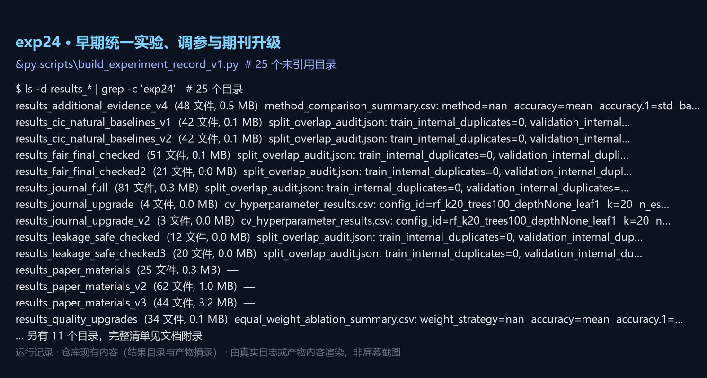

### exp25 其余探索性目录（124 个目录）

| 目录 | 文件数 | 大小 MB | 关键内容（自动摘录）|
|---|---:|---:|---|
| `results_cic_balanced_baselines_v3b` | 53 | 0.5 | classification_report_cfrg_forest_chi2_seed2024.csv: Unnamed: 0=Bot  precision=1  recall=1  f1-score=1 |
| `results_cost_v5` | 3 | 0.0 | cost_sensitive_summary.json: task=binary view: attack versus Normal, n_seeds=10, normalisation=NEC = cost / min(ratio *… |
| `results_data_audit_6tisch2026_uncapped_v1` | 1 | 0.0 | data_processing_audit.json: rows_scanned=1229568, split_rule=fingerprint % 100 < 30 -> test |
| `results_data_audit_6tisch2026_v1` | 1 | 0.0 | data_processing_audit.json: rows_scanned=1229568, split_rule=fingerprint % 100 < 30 -> test |
| `results_data_audit_aci_iot2023_v1` | 1 | 0.0 | — |
| `results_data_audit_cic_balanced_v3b` | 3 | 0.1 | data_processing_audit.json: raw_dir=data/raw/MachineLearningCVE, processed_dir=data_processed_cic_balanced_v3b |
| `results_data_audit_cic_ids2018_v1` | 1 | 0.0 | data_processing_audit.json: source_rows=16233002, mapped_rows=15976544, excluded_label_rows=160639 |
| `results_data_audit_cic_iot2023_cap200k` | 1 | 0.0 | — |
| `results_data_audit_cic_iot2023_cap20k` | 1 | 0.0 | — |
| `results_data_audit_cic_iot2023_cap500k` | 1 | 0.0 | — |
| `results_data_audit_cic_iot2023_v1` | 1 | 0.0 | — |
| `results_data_audit_cic_natural_v1` | 3 | 0.1 | data_processing_audit.json: raw_dir=E:\论文\data\raw\MachineLearningCVE, processed_dir=data_processed_cic_natural_v1 |
| `results_data_audit_cic_natural_v2` | 3 | 0.1 | data_processing_audit.json: raw_dir=E:\论文\data\raw\MachineLearningCVE, processed_dir=data_processed_cic_natural_v2 |
| `results_data_audit_cic_natural_v3` | 3 | 0.1 | data_processing_audit.json: raw_dir=E:\论文\data\raw\MachineLearningCVE, processed_dir=data_processed_cic_natural_v3 |
| `results_data_audit_cic_natural_v3b` | 4 | 0.1 | data_processing_audit.json: raw_dir=data/raw/MachineLearningCVE, processed_dir=data_processed_cic_natural_v3b |
| `results_data_audit_ctu_idseval6_uncapped_v1` | 1 | 0.0 | data_processing_audit.json: rows_scanned=286702, split_rule=fingerprint % 100 < 30 -> test |
| `results_data_audit_ctu_idseval6_v1` | 1 | 0.0 | data_processing_audit.json: rows_scanned=286702, split_rule=fingerprint % 100 < 30 -> test |
| `results_data_audit_genis2025_v1` | 1 | 0.0 | — |
| `results_data_audit_gotham2025_cap200k` | 1 | 0.0 | data_processing_audit.json: rows_scanned=35134281, split_rule=fingerprint % 100 < 30 -> test, archive_sha256=not hashed… |
| `results_data_audit_gotham2025_full` | 1 | 0.0 | data_processing_audit.json: rows_scanned=35134281, split_rule=fingerprint % 100 < 30 -> test, archive_sha256=not hashed… |
| `results_data_audit_gotham2025_v1` | 1 | 0.0 | data_processing_audit.json: rows_scanned=35134281, split_rule=fingerprint % 100 < 30 -> test, archive_sha256=not hashed… |
| `results_data_audit_ids2025_v1` | 1 | 0.0 | — |
| `results_data_audit_iot23_v1` | 1 | 0.0 | — |
| `results_data_audit_litnet2020_v1` | 1 | 0.0 | — |
| `results_data_audit_rt_iot2022_v1` | 1 | 0.0 | — |
| `results_data_audit_rtn2026_v1` | 1 | 0.0 | data_processing_audit.json: rows_scanned=221253, split_rule=fingerprint % 100 < 30 -> test |
| `results_data_audit_uavids2025_v1` | 1 | 0.0 | — |
| `results_day_holdout_v1` | 8 | 8.3 | day_class_support.csv: day=Friday  Bot=1948  Brute Force=0  DoS/DDoS=128005 |
| `results_deployment_metrics_v1` | 3 | 0.0 | deployment_metrics_by_seed.csv: source=results_full_corpus_v49  model=decision_tree_chi2  seed=101  rows=364426 |
| `results_deployment_robustness` | 6 | 10.1 | deployment_benchmark.csv: model=rf_all  batch_size=1  total_seconds=16.7498  latency_ms_per_sample=33.1679 |
| `results_deployment_robustness_final` | 6 | 10.1 | deployment_benchmark.csv: model=rf_all  batch_size=1  total_seconds=16.8856  latency_ms_per_sample=33.4368 |
| `results_diversity_v5` | 2 | 0.0 | diversity_gain_regression.json: slope=0.064608879852392, intercept=0.0005120884748743437, pearson_r=0.7488684021191764 |
| `results_equivalence_10seeds_v5` | 3 | 0.0 | equivalence_summary.json: comparison=rccf_minus_equal_rf_chi2, protocol=CIC-IDS2017 natural-prior population, deduplica… |
| `results_equivalence_v5` | 4 | 0.0 | equivalence_summary.json: comparison=rccf_minus_equal_rf_chi2, protocol=CIC-IDS2017 natural-prior population, deduplica… |
| `results_expert_disagreement_v1` | 2 | 0.0 | expert_disagreement_summary.json: population=data_processed_cic_natural_v3b, test_rows_per_seed=7986, pairwise_disagree… |
| `results_file_external_generalization_v1` | 2 | 0.0 | file_external_results.csv: test_file=Friday-WorkingHours-Afternoon-DDos.pcap_ISCX.csv  train_rows=49136  test_rows=1000… |
| `results_file_external_generalization_v3b` | 2 | 0.0 | file_external_results.csv: test_file=Friday-WorkingHours-Afternoon-DDos.pcap_ISCX.csv  train_rows=49136  test_rows=1000… |
| `results_file_label_coverage_v4` | 3 | 0.0 | file_label_coverage_summary.json: raw_dir=E:\论文\data\raw\MachineLearningCVE, file_count=8, files_with_all_five_main_c… |
| `results_file_label_coverage_v5` | 3 | 0.0 | file_label_coverage_summary.json: raw_dir=E:\论文\data\raw\MachineLearningCVE, file_count=8, files_with_all_five_main_c… |
| `results_gate_tuning_smoke` | 3 | 0.0 | gate_search_summary.csv: cv=5  risk_C=0.01  descriptor_set=all  mean=0.896198 |
| `results_k_sensitivity_k20` | 15 | 8.2 | metrics_aggregate.csv: Unnamed: 0=nan  macro_f1=mean  macro_f1.1=std  accuracy=mean |
| `results_margin_bound_cic-iot2023_v1` | 12 | 35.3 | margin_bound_summary.json: n_seeds=10, total_rows=375160, empirical_changed_rows=12 |
| `results_margin_bound_gotham2025_v1` | 12 | 30.9 | margin_bound_summary.json: n_seeds=10, total_rows=297180, empirical_changed_rows=0 |
| `results_margin_bound_v5` | 7 | 2.7 | margin_bound_summary.json: n_seeds=3, total_rows=23958, empirical_changed_rows=0 |
| `results_member_family_v1` | 18 | 22.6 | gate_results_by_config.csv: config=families  seed=42  members=4  member_names=rf_full|rf_chi2|xgb_chi2|et_chi2 |
| `results_mlp_final_v5` | 9 | 3.1 | mlp_vs_rccf_summary.json: mlp_macro_f1_mean=0.7976544293719458, rccf_macro_f1_mean=0.8899550295993232, mlp_balanced_acc… |
| `results_mlp_long_v5` | 5 | 1.0 | metrics_aggregate.csv: model=mlp  macro_f1_mean=0.799319  macro_f1_std=nan  accuracy_mean=0.977711 |
| `results_mlp_v5` | 7 | 3.1 | metrics_aggregate.csv: model=mlp  macro_f1_mean=0.780382  macro_f1_std=0.0142322  accuracy_mean=0.965314 |
| `results_modern_evidence_v1` | 2 | 0.0 | summary.json: corpora=14, max_labels_moved_mean=44.6, min_prediction_agreement=0.9984992260582812 |
| `results_modern_replication_v1` | 2 | 0.0 | summary.json: corpora_in_pool=12, corpora_reported_separately=1, seeds_per_corpus=10 |
| `results_nsl_kdd` | 7 | 0.6 | classification_report_extra_trees.csv: Unnamed: 0=DoS  precision=0.962508  recall=0.80893  f1-score=0.879062 |
| `results_nsl_kdd_fair_v2` | 23 | 1.1 | minority_analysis_summary.csv: class=R2L  model=rf_all  test_support_total=2754  precision=0.977358 |
| `results_nsl_kdd_full` | 11 | 1.4 | classification_report_decision_tree_chi2.csv: Unnamed: 0=DoS  precision=0.963815  recall=0.76428  f1-score=0.852528 |
| `results_nsl_kdd_full_v2` | 11 | 1.4 | classification_report_decision_tree_chi2.csv: Unnamed: 0=DoS  precision=0.963815  recall=0.76428  f1-score=0.852528 |
| `results_open_set_matrix_v2` | 2 | 0.0 | open_set_matrix_metrics.csv: unknown_combination=Heartbleed  known_validation_samples=935  unknown_samples=11  threshol… |
| `results_open_set_v1` | 4 | 0.1 | open_set_metrics.csv: known_train_samples=3738  known_validation_samples=935  unknown_samples=1047  threshold=0.716837 |
| `results_protocol_sensitivity_v4` | 2 | 0.0 | protocol_sensitivity_metrics.csv: protocol=global_dedup_before_split  seed=42  train_rows=2355  test_rows=505 |
| `results_publication_final` | 180 | 4.3 | metrics_aggregate.csv: model=nan  accuracy=mean  accuracy.1=std  macro_precision=mean |
| `results_publication_stage2` | 69 | 2.1 | metrics_aggregate.csv: model=nan  accuracy=mean  accuracy.1=std  macro_precision=mean |
| `results_rccf_6tisch2026_uncapped` | 43 | 1436.0 | benchmark_summary.json: population=data_processed_6tisch2026_uncapped_v1, test_rows=364816, rccf_mean_macro_f1=0.937018… |
| `results_rccf_6tisch2026_v1` | 43 | 76.0 | benchmark_summary.json: population=data_processed_6tisch2026_v1, test_rows=15957, rccf_mean_macro_f1=0.9946233071932251 |
| `results_rccf_aci_iot2023_v1` | 43 | 136.4 | benchmark_summary.json: population=data_processed_aci_iot2023_v1, test_rows=19404, rccf_mean_macro_f1=0.7781630297879424 |
| `results_rccf_cic_balanced_v10` | 53 | 0.8 | metrics_aggregate.csv: model=rccf  accuracy_mean=0.962574  balanced_accuracy_mean=0.962574  macro_precision_mean=0.9642… |
| `results_rccf_cic_balanced_v3b` | 18 | 0.3 | metrics_aggregate.csv: model=rccf  accuracy_mean=0.961716  balanced_accuracy_mean=0.961716  macro_precision_mean=0.9632… |
| `results_rccf_cic_ids2018_v1` | 43 | 36.6 | benchmark_summary.json: population=data_processed_cic_ids2018_v1, test_rows=12012, rccf_mean_macro_f1=0.9552305078666674 |
| `results_rccf_cic_iot2023_cap200k` | 43 | 1531.1 | benchmark_summary.json: population=data_processed_cic_iot2023_cap200k, test_rows=307516, rccf_mean_macro_f1=0.726504794… |
| `results_rccf_cic_iot2023_cap20k` | 43 | 198.8 | benchmark_summary.json: population=data_processed_cic_iot2023_cap20k, test_rows=37516, rccf_mean_macro_f1=0.75105074226… |
| `results_rccf_cic_iot2023_cap500k` | 43 | 2914.2 | benchmark_summary.json: population=data_processed_cic_iot2023_cap500k, test_rows=599792, rccf_mean_macro_f1=0.714826022… |
| `results_rccf_cic_iot2023_k16` | 43 | 200.0 | benchmark_summary.json: population=data_processed_cic_iot2023_v1, test_rows=37516, rccf_mean_macro_f1=0.7389005702814033 |
| `results_rccf_cic_iot2023_k32` | 43 | 197.9 | benchmark_summary.json: population=data_processed_cic_iot2023_v1, test_rows=37516, rccf_mean_macro_f1=0.7501823154944254 |
| `results_rccf_cic_iot2023_k60` | 43 | 198.8 | benchmark_summary.json: population=data_processed_cic_iot2023_v1, test_rows=37516, rccf_mean_macro_f1=0.7510507422675166 |
| `results_rccf_cic_iot2023_k8` | 43 | 219.4 | benchmark_summary.json: population=data_processed_cic_iot2023_v1, test_rows=37516, rccf_mean_macro_f1=0.7204587941041514 |
| `results_rccf_cic_iot2023_v1` | 44 | 206.0 | benchmark_summary.json: population=data_processed_cic_iot2023_v1, test_rows=37516, rccf_mean_macro_f1=0.7510507422675166 |
| `results_rccf_cic_natural_v1` | 18 | 4.0 | metrics_aggregate.csv: model=rccf  accuracy_mean=0.978421  balanced_accuracy_mean=0.950701  macro_precision_mean=0.8670… |
| `results_rccf_cic_natural_v2` | 18 | 4.0 | metrics_aggregate.csv: model=rccf  accuracy_mean=0.978421  balanced_accuracy_mean=0.950701  macro_precision_mean=0.8670… |
| `results_rccf_cic_natural_v3` | 18 | 3.9 | metrics_aggregate.csv: model=rccf  accuracy_mean=0.97792  balanced_accuracy_mean=0.949198  macro_precision_mean=0.86393 |
| `results_rccf_cic_natural_v3b` | 18 | 3.9 | metrics_aggregate.csv: model=rccf  accuracy_mean=0.97792  balanced_accuracy_mean=0.949198  macro_precision_mean=0.86393 |
| `results_rccf_cic_v1` | 18 | 0.3 | metrics_aggregate.csv: model=rccf  accuracy_mean=0.960396  balanced_accuracy_mean=0.960396  macro_precision_mean=0.9616… |
| `results_rccf_ctu_idseval6_uncapped` | 43 | 192.7 | benchmark_summary.json: population=data_processed_ctu_idseval6_uncapped_v1, test_rows=54983, rccf_mean_macro_f1=0.89295… |
| `results_rccf_ctu_idseval6_v1` | 43 | 14.3 | benchmark_summary.json: population=data_processed_ctu_idseval6_v1, test_rows=4599, rccf_mean_macro_f1=0.8932811616928976 |
| `results_rccf_evidence_v1` | 8 | 0.0 | file_label_coverage.csv: source_file=Friday-WorkingHours-Afternoon-DDos.pcap_ISCX.csv  raw_rows=225745  Normal=97718  D… |
| `results_rccf_evidence_v3b` | 8 | 0.0 | file_label_coverage.csv: source_file=Friday-WorkingHours-Afternoon-DDos.pcap_ISCX.csv  raw_rows=225745  Normal=97718  D… |
| `results_rccf_genis2025_v1` | 43 | 19.2 | benchmark_summary.json: population=data_processed_genis2025_v1, test_rows=8000, rccf_mean_macro_f1=0.9998749999921875 |
| `results_rccf_gotham2025_cap200k` | 43 | 4201.0 | benchmark_summary.json: population=data_processed_gotham2025_cap200k, test_rows=415223, rccf_mean_macro_f1=0.9838629465… |
| `results_rccf_gotham2025_full` | 43 | 62537.5 | benchmark_summary.json: population=data_processed_gotham2025_full, test_rows=7189693, rccf_mean_macro_f1=0.984474696358… |
| `results_rccf_gotham2025_v1` | 43 | 292.3 | benchmark_summary.json: population=data_processed_gotham2025_v1, test_rows=29718, rccf_mean_macro_f1=0.9929076997159033 |
| `results_rccf_gotham2025_v1_k8` | 43 | 303.6 | benchmark_summary.json: population=data_processed_gotham2025_v1, test_rows=29718, rccf_mean_macro_f1=0.9899177254636575 |
| `results_rccf_ids2025_v1` | 43 | 39.2 | benchmark_summary.json: population=data_processed_ids2025_v1, test_rows=9114, rccf_mean_macro_f1=0.9809970795790495 |
| `results_rccf_iot23_v1` | 43 | 9.9 | benchmark_summary.json: population=data_processed_iot23_v1, test_rows=4000, rccf_mean_macro_f1=0.9854484706452968 |
| `results_rccf_litnet2020_v1` | 43 | 55.7 | benchmark_summary.json: population=data_processed_litnet2020_v1, test_rows=9522, rccf_mean_macro_f1=0.9994142442498581 |
| `results_rccf_nbaiot_v10` | 33 | 28.2 | metrics_aggregate.csv: model=rccf  macro_f1_mean=0.999941  macro_f1_std=5.29556e-05  accuracy_mean=0.999941 |
| `results_rccf_nsl_v1` | 21 | 10.5 | metrics_aggregate.csv: dataset=nsl  model=rccf  accuracy_mean=0.74796  accuracy_std=0.000625742 |
| `results_rccf_nsl_v10` | 38 | 55.1 | metrics_aggregate.csv: model=rccf  macro_f1_mean=0.518756  macro_f1_std=0.00337399  accuracy_mean=0.748314 |
| `results_rccf_nsl_v2_final` | 21 | 10.5 | metrics_aggregate.csv: dataset=nsl  model=rccf  accuracy_mean=0.74796  accuracy_std=0.000625742 |
| `results_rccf_rt_iot2022_v1` | 43 | 30.2 | benchmark_summary.json: population=data_processed_rt_iot2022_v1, test_rows=5390, rccf_mean_macro_f1=0.9392315106445634 |
| `results_rccf_rtn2026_v1` | 43 | 5.6 | benchmark_summary.json: population=data_processed_rtn2026_v1, test_rows=2538, rccf_mean_macro_f1=1.0 |
| `results_rccf_uavids2025_v1` | 43 | 38.9 | benchmark_summary.json: population=data_processed_uavids2025_v1, test_rows=10000, rccf_mean_macro_f1=0.9450103462654116 |
| `results_rccf_unsw_v1` | 21 | 66.3 | metrics_aggregate.csv: dataset=unsw  model=rccf  accuracy_mean=0.715344  accuracy_std=0.000730408 |
| `results_rccf_unsw_v10` | 33 | 361.4 | metrics_aggregate.csv: model=rccf  macro_f1_mean=0.483371  macro_f1_std=0.00558245  accuracy_mean=0.711312 |
| `results_rccf_unsw_v2_final` | 19 | 66.3 | metrics_aggregate.csv: dataset=unsw  model=rccf  accuracy_mean=0.71534  accuracy_std=0.000382613 |
| `results_source_holdout_6tisch_v1` | 2 | 0.0 | holdout_summary.json: processed_dir=data_processed_6tisch2026_grouped_v1, groups_total=122, groups_evaluated=12 |
| `results_source_holdout_gotham_v1` | 2 | 0.0 | holdout_summary.json: processed_dir=data_processed_gotham2025_grouped_v1, groups_total=78, groups_evaluated=12 |
| `results_unsw_nb15_audit` | 3 | 0.0 | audit.json: source=UNSW Canberra Cyber official UNSW-NB15 project page, local_dir=data_external\UNSW-NB15 |
| `results_unsw_nb15_independent_seed2024` | 10 | 48.6 | classification_report_extra_trees_chi2.csv: Unnamed: 0=Analysis  precision=0.0189189  recall=0.0103397  f1-score=0.0133… |
| `results_unsw_nb15_independent_seed3407` | 10 | 47.8 | classification_report_extra_trees_chi2.csv: Unnamed: 0=Analysis  precision=0.0190736  recall=0.0103397  f1-score=0.01341 |
| `results_unsw_nb15_independent_v1` | 8 | 4.1 | classification_report_extra_trees_chi2.csv: Unnamed: 0=Analysis  precision=0.0232558  recall=0.014771  f1-score=0.01806… |
| `results_unsw_nb15_independent_v2` | 12 | 49.3 | metrics_aggregate.csv: model=nan  accuracy=mean  accuracy.1=std  balanced_accuracy=mean |
| `results_unsw_nb15_independent_v3` | 4 | 0.0 | metrics_aggregate.csv: model=nan  accuracy=mean  accuracy.1=std  balanced_accuracy=mean |
| `results_unsw_nb15_independent_v3_seed2024` | 18 | 48.6 | class_prediction_counts_extra_trees_chi2.csv: label=Analysis  true_count=677  pred_count=370 |
| `results_unsw_nb15_independent_v3_seed3407` | 18 | 47.8 | class_prediction_counts_extra_trees_chi2.csv: label=Analysis  true_count=677  pred_count=367 |
| `results_unsw_nb15_independent_v3_seed42` | 18 | 49.3 | class_prediction_counts_extra_trees_chi2.csv: label=Analysis  true_count=677  pred_count=430 |
| `results_unsw_nb15_independent_v4` | 2 | 0.0 | metrics_aggregate.csv: model=nan  accuracy=mean  accuracy.1=std  balanced_accuracy=mean |
| `results_unsw_nb15_independent_v4_seed2024` | 19 | 54.6 | bootstrap_confidence_intervals.csv: model=extra_trees_chi2  metric=accuracy  estimate=0.664128  ci95_low=0.660957 |
| `results_unsw_nb15_independent_v4_seed3407` | 19 | 56.2 | bootstrap_confidence_intervals.csv: model=extra_trees_chi2  metric=accuracy  estimate=0.665233  ci95_low=0.661735 |
| `results_unsw_nb15_independent_v4_seed42` | 19 | 56.1 | bootstrap_confidence_intervals.csv: model=extra_trees_chi2  metric=accuracy  estimate=0.662112  ci95_low=0.658698 |
| `results_unsw_nb15_k20` | 2 | 0.0 | metrics_aggregate.csv: model=nan  accuracy=mean  accuracy.1=std  balanced_accuracy=mean |
| `results_unsw_nb15_k20_seed2024` | 18 | 48.6 | class_prediction_counts_extra_trees_chi2.csv: label=Analysis  true_count=677  pred_count=290 |
| `results_unsw_nb15_k20_seed3407` | 18 | 47.4 | class_prediction_counts_extra_trees_chi2.csv: label=Analysis  true_count=677  pred_count=321 |
| `results_unsw_nb15_k20_seed42` | 18 | 47.2 | class_prediction_counts_extra_trees_chi2.csv: label=Analysis  true_count=677  pred_count=327 |
| `results_v2_extended` | 59 | 8.6 | metrics_aggregate.csv: model=nan  accuracy=mean  accuracy.1=std  macro_precision=mean |
| `results_weight_ablation` | 11 | 0.1 | weight_strategy_summary.csv: weight_metric=accuracy  accuracy=0.953135  macro_precision=0.95363  macro_recall=0.953135 |
| `results_weight_mechanism_cic-iot2023_v1` | 3 | 0.8 | weight_mechanism_summary.csv: tree_count=100  score_mean=0.666116  score_std=0.00540463  score_min=0.649144 |
| `results_weight_mechanism_gotham2025_v1` | 3 | 1.2 | weight_mechanism_summary.csv: tree_count=100  score_mean=0.961995  score_std=0.0157089  score_min=0.874572 |
| `results_weight_mechanism_v3` | 3 | 0.0 | weight_mechanism_summary.csv: tree_count=100  score_mean=0.905901  score_std=0.011432  score_min=0.879208 |

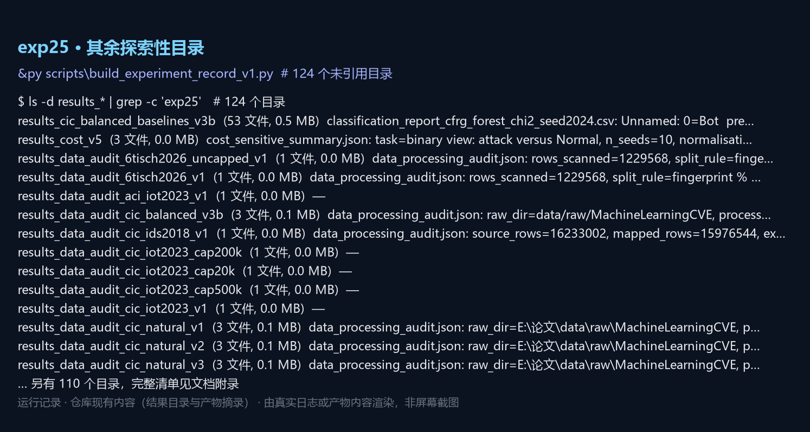

## 全部实验产物清单

仓库共 213 个 `results_*` 目录、4,632 个文件、78.12 GB。「论文引用」表示目录名是否出现在正文或补充材料里；「产出脚本」是从脚本源码里反查到的写入者（检索目录名 + 写文件调用），多个候选时取第一个。

| 目录 | 文件数 | 大小 MB | 主要文件 | 产出脚本 | 论文引用 |
|---|---:|---:|---|---|---|
| `results_additional_evidence_v4` | 48 | 0.5 | `method_comparison_summary.csv` | `build_statistical_effects_v4.py` | 否 |
| `results_cfrg_calibration_v1` | 11 | 0.1 | — | `—` | 否 |
| `results_cfrg_calibration_v2_verified` | 11 | 0.1 | — | `assemble_supplementary_v5.py` | 否 |
| `results_cfrg_cic_v1` | 57 | 0.5 | — | `—` | 否 |
| `results_cfrg_cic_v2_verified` | 53 | 0.5 | — | `build_cfrg_figures_v1.py` | 否 |
| `results_cfrg_nsl_v1` | 51 | 19.0 | — | `—` | 否 |
| `results_cfrg_nsl_v2_verified` | 51 | 19.0 | — | `—` | 否 |
| `results_cfrg_open_set_v1` | 13 | 0.4 | — | `—` | 否 |
| `results_cfrg_open_set_v2` | 19 | 0.9 | — | `—` | 否 |
| `results_cfrg_open_set_v3` | 19 | 0.9 | — | `—` | 否 |
| `results_cfrg_open_set_v4` | 19 | 0.9 | — | `—` | 否 |
| `results_cfrg_open_set_v5_verified` | 19 | 0.9 | — | `add_open_set_supplementary_v1.py` | 否 |
| `results_cfrg_repeated_v1` | 3 | 0.0 | `summary.csv` | `—` | 否 |
| `results_cfrg_repeated_v2` | 3 | 0.0 | `summary.csv` | `—` | 否 |
| `results_cfrg_repeated_v3_verified` | 3 | 0.0 | `summary.csv` | `—` | 否 |
| `results_cfrg_strong_baselines_v1` | 2 | 0.0 | `summary.csv` | `—` | 否 |
| `results_cfrg_strong_baselines_v2_verified` | 2 | 0.0 | `summary.csv` | `audit_number_traceability_v5.py` | 否 |
| `results_cfrg_unsw_v1` | 51 | 125.6 | — | `—` | 否 |
| `results_cfrg_unsw_v1_retry` | 17 | 42.3 | — | `—` | 否 |
| `results_cfrg_unsw_v2_verified` | 51 | 125.4 | — | `—` | 否 |
| `results_cic_balanced_baselines_v3b` | 53 | 0.5 | — | `audit_number_traceability_v5.py` | 否 |
| `results_cic_natural_baselines_v1` | 42 | 0.1 | `metrics_summary.csv`、`split_overlap_audit.json` | `—` | 否 |
| `results_cic_natural_baselines_v2` | 42 | 0.1 | `metrics_summary.csv`、`split_overlap_audit.json` | `—` | 否 |
| `results_cic_natural_baselines_v3` | 53 | 5.9 | — | `assemble_supplementary_v5.py` | 是 |
| `results_cic_natural_baselines_v3b` | 53 | 5.9 | — | `assemble_supplementary_v5.py` | 是 |
| `results_cost_v5` | 3 | 0.0 | `cost_sensitive_summary.json`、`cost_sensitive_summary.csv` | `assemble_supplementary_v5.py` | 否 |
| `results_data_audit_6tisch2026_uncapped_v1` | 1 | 0.0 | `data_processing_audit.json` | `run_modern_ladder_queue_v1.py` | 否 |
| `results_data_audit_6tisch2026_v1` | 1 | 0.0 | `data_processing_audit.json` | `prepare_2026_corpora_v1.py` | 否 |
| `results_data_audit_aci_iot2023_v1` | 1 | 0.0 | `data_processing_audit.json` | `—` | 否 |
| `results_data_audit_cic_balanced_v3b` | 3 | 0.1 | `processed_split_summary.csv`、`data_processing_audit.json` | `build_data_products_doc_v1.py` | 否 |
| `results_data_audit_cic_ids2018_v1` | 1 | 0.0 | `data_processing_audit.json` | `add_extension_section_v1.py` | 否 |
| `results_data_audit_cic_iot2023_cap200k` | 1 | 0.0 | `data_processing_audit.json` | `—` | 否 |
| `results_data_audit_cic_iot2023_cap20k` | 1 | 0.0 | `data_processing_audit.json` | `—` | 否 |
| `results_data_audit_cic_iot2023_cap500k` | 1 | 0.0 | `data_processing_audit.json` | `run_modern_ladder_queue_v1.py` | 否 |
| `results_data_audit_cic_iot2023_v1` | 1 | 0.0 | `data_processing_audit.json` | `prepare_cic_iot2023_v1.py` | 否 |
| `results_data_audit_cic_natural_v1` | 3 | 0.1 | `processed_split_summary.csv`、`data_processing_audit.json` | `—` | 否 |
| `results_data_audit_cic_natural_v2` | 3 | 0.1 | `processed_split_summary.csv`、`data_processing_audit.json` | `—` | 否 |
| `results_data_audit_cic_natural_v3` | 3 | 0.1 | `processed_split_summary.csv`、`data_processing_audit.json` | `append_review_round_v17.py` | 否 |
| `results_data_audit_cic_natural_v3b` | 4 | 0.1 | `processed_split_summary.csv`、`data_processing_audit.json` | `append_review_round_v17.py` | 否 |
| `results_data_audit_ctu_idseval6_uncapped_v1` | 1 | 0.0 | `data_processing_audit.json` | `run_modern_ladder_queue_v1.py` | 否 |
| `results_data_audit_ctu_idseval6_v1` | 1 | 0.0 | `data_processing_audit.json` | `prepare_2026_corpora_v1.py` | 否 |
| `results_data_audit_genis2025_v1` | 1 | 0.0 | `data_processing_audit.json` | `—` | 否 |
| `results_data_audit_gotham2025_cap200k` | 1 | 0.0 | `data_processing_audit.json` | `run_modern_ladder_queue_v1.py` | 否 |
| `results_data_audit_gotham2025_full` | 1 | 0.0 | `data_processing_audit.json` | `run_modern_ladder_queue_v1.py` | 否 |
| `results_data_audit_gotham2025_v1` | 1 | 0.0 | `data_processing_audit.json` | `prepare_gotham2025_v1.py` | 否 |
| `results_data_audit_ids2025_v1` | 1 | 0.0 | `data_processing_audit.json` | `—` | 否 |
| `results_data_audit_iot23_v1` | 1 | 0.0 | `data_processing_audit.json` | `—` | 否 |
| `results_data_audit_litnet2020_v1` | 1 | 0.0 | `data_processing_audit.json` | `—` | 否 |
| `results_data_audit_rt_iot2022_v1` | 1 | 0.0 | `data_processing_audit.json` | `—` | 否 |
| `results_data_audit_rtn2026_v1` | 1 | 0.0 | `data_processing_audit.json` | `prepare_2026_corpora_v1.py` | 否 |
| `results_data_audit_uavids2025_v1` | 1 | 0.0 | `data_processing_audit.json` | `—` | 否 |
| `results_data_evidence_v1` | 7 | 0.0 | `data_evidence_summary.json` | `build_data_evidence_pack_v1.py` | 否 |
| `results_data_processing_audit_v1` | 3 | 0.0 | `processed_split_summary.csv`、`data_processing_audit.json` | `—` | 否 |
| `results_data_processing_audit_v2` | 4 | 0.1 | `processed_split_summary.csv`、`data_processing_audit.json` | `build_data_processing_tables_v1.py` | 否 |
| `results_data_processing_audit_v3` | 3 | 0.1 | `processed_split_summary.csv`、`data_processing_audit.json` | `—` | 否 |
| `results_data_provenance_v4` | 4 | 0.0 | — | `generate_v2_paper_materials.py` | 否 |
| `results_data_quality_cic_balanced_v3b` | 3 | 0.0 | `data_quality_summary.json`、`data_quality_summary.csv` | `build_publication_manifest.py` | 否 |
| `results_data_quality_cic_natural_v2` | 3 | 0.0 | `data_quality_summary.json`、`data_quality_summary.csv` | `—` | 否 |
| `results_data_quality_cic_natural_v3` | 3 | 0.0 | `data_quality_summary.json`、`data_quality_summary.csv` | `build_publication_manifest.py` | 否 |
| `results_data_quality_cic_natural_v3b` | 3 | 0.0 | `data_quality_summary.json`、`data_quality_summary.csv` | `build_publication_manifest.py` | 否 |
| `results_day_holdout_v1` | 8 | 8.3 | `day_holdout_summary.json` | `add_extension_section_v1.py` | 否 |
| `results_deployment_metrics_v1` | 3 | 0.0 | `deployment_summary.json` | `add_extension_section_v1.py` | 否 |
| `results_deployment_robustness` | 6 | 10.1 | — | `—` | 否 |
| `results_deployment_robustness_final` | 6 | 10.1 | — | `—` | 否 |
| `results_diversity_cic_iot2023_v1` | 3 | 0.0 | `diversity_gain_regression.json`、`diversity_suite_results.csv` | `add_modern_ladder_to_paper_v1.py` | 是 |
| `results_diversity_v5` | 2 | 0.0 | `diversity_gain_regression.json`、`diversity_suite_results.csv` | `append_review_round_v17.py` | 否 |
| `results_drc_cic_v1` | 116 | 1.1 | — | `—` | 否 |
| `results_drc_imbalanced_v1` | 116 | 14.3 | — | `—` | 否 |
| `results_drc_nsl_kdd_v1` | 11 | 6.8 | — | `—` | 否 |
| `results_drc_nsl_kdd_v2` | 11 | 6.8 | — | `—` | 否 |
| `results_drc_unsw_v1` | 11 | 39.8 | — | `—` | 否 |
| `results_equal_fusion_control_v1` | 12 | 4.9 | `equal_fusion_summary.json` | `assemble_supplementary_v5.py` | 是 |
| `results_equivalence_10seeds_v5` | 3 | 0.0 | `equivalence_summary.json`、`tost_results.csv` | `assemble_supplementary_v5.py` | 否 |
| `results_equivalence_v5` | 4 | 0.0 | `equivalence_summary.json`、`tost_results.csv` | `audit_number_traceability_v5.py` | 否 |
| `results_expert_disagreement_v1` | 2 | 0.0 | `expert_disagreement_summary.json` | `assemble_supplementary_v5.py` | 否 |
| `results_fair_final_checked` | 51 | 0.1 | `metrics_summary.csv`、`split_overlap_audit.json` | `generate_paper_materials.py` | 否 |
| `results_fair_final_checked2` | 21 | 0.0 | `metrics_summary.csv`、`split_overlap_audit.json` | `—` | 否 |
| `results_feature_quality_v4` | 3 | 0.0 | `feature_quality_summary.csv`、`feature_quality_audit.json` | `generate_v2_paper_materials.py` | 否 |
| `results_feature_quality_v5` | 3 | 0.0 | `feature_quality_summary.csv`、`feature_quality_audit.json` | `build_data_evidence_pack_v1.py` | 否 |
| `results_file_external_generalization_v1` | 2 | 0.0 | `file_external_results.csv` | `build_data_processing_tables_v1.py` | 否 |
| `results_file_external_generalization_v3b` | 2 | 0.0 | `file_external_results.csv` | `assemble_supplementary_v5.py` | 否 |
| `results_file_label_coverage_v4` | 3 | 0.0 | `file_label_coverage_summary.json` | `generate_v2_paper_materials.py` | 否 |
| `results_file_label_coverage_v5` | 3 | 0.0 | `file_label_coverage_summary.json` | `build_data_evidence_pack_v1.py` | 否 |
| `results_full_corpus_v49` | 154 | 283.6 | `full_corpus_summary.json`、`metrics_aggregate.csv` | `add_extension_section_v1.py` | 是 |
| `results_gate_capacity_k20` | 2 | 0.0 | `gate_capacity_summary.json` | `assemble_supplementary_v5.py` | 是 |
| `results_gate_capacity_k40` | 2 | 0.0 | `gate_capacity_summary.json` | `assemble_supplementary_v5.py` | 是 |
| `results_gate_capacity_k80` | 2 | 0.0 | `gate_capacity_summary.json` | `assemble_supplementary_v5.py` | 是 |
| `results_gate_capacity_v1` | 2 | 0.0 | `gate_capacity_summary.json` | `assemble_supplementary_v5.py` | 是 |
| `results_gate_tuning_smoke` | 3 | 0.0 | `gate_search_summary.csv`、`gate_search_results.csv` | `—` | 否 |
| `results_gate_tuning_v5` | 3 | 0.0 | `gate_search_summary.csv`、`gate_search_results.csv` | `assemble_supplementary_v5.py` | 是 |
| `results_imbalanced_sensitivity` | 21 | 0.0 | `metrics_summary.csv`、`split_overlap_audit.json` | `—` | 否 |
| `results_imbalanced_v3` | 42 | 1.8 | `metrics_aggregate.csv` | `build_probability_and_feature_evidence_v4.py` | 否 |
| `results_journal_full` | 81 | 0.3 | `metrics_summary.csv`、`split_overlap_audit.json` | `run_paired_tests.py` | 否 |
| `results_journal_upgrade` | 4 | 0.0 | `cv_hyperparameter_results.csv` | `audit_publication_readiness.py` | 否 |
| `results_journal_upgrade_v2` | 3 | 0.0 | `cv_hyperparameter_results.csv` | `audit_publication_readiness.py` | 否 |
| `results_k_sensitivity_k20` | 15 | 8.2 | `metrics_aggregate.csv` | `—` | 否 |
| `results_leakage_safe_checked` | 12 | 0.0 | `k_selection_validation_summary.csv`、`k_selection_validation_results.csv` | `generate_paper_materials.py` | 否 |
| `results_leakage_safe_checked3` | 20 | 0.0 | `k_selection_validation_summary.csv`、`k_selection_validation_results.csv` | `generate_paper_materials.py` | 否 |
| `results_margin_bound_cic-iot2023_v1` | 12 | 35.3 | `margin_bound_summary.json`、`margin_bound_summary.csv` | `add_modern_ladder_to_paper_v1.py` | 否 |
| `results_margin_bound_gotham2025_v1` | 12 | 30.9 | `margin_bound_summary.json`、`margin_bound_summary.csv` | `add_ladder_to_briefings_v1.py` | 否 |
| `results_margin_bound_v5` | 7 | 2.7 | `margin_bound_summary.json`、`margin_bound_summary.csv` | `analyze_margin_bound_v5.py` | 否 |
| `results_member_family_v1` | 18 | 22.6 | `member_family_summary.json`、`gate_results_by_config.csv` | `add_extension_section_v1.py` | 否 |
| `results_mlp_final_v5` | 9 | 3.1 | `mlp_vs_rccf_summary.json`、`metrics_aggregate.csv` | `assemble_supplementary_v5.py` | 否 |
| `results_mlp_long_v5` | 5 | 1.0 | `metrics_aggregate.csv`、`mlp_tuning_results.csv` | `—` | 否 |
| `results_mlp_v5` | 7 | 3.1 | `metrics_aggregate.csv`、`mlp_tuning_results.csv` | `run_mlp_baseline_v5.py` | 否 |
| `results_modern_evidence_v1` | 2 | 0.0 | `summary.json` | `analyse_modern_evidence_v1.py` | 否 |
| `results_modern_replication_v1` | 2 | 0.0 | `summary.json` | `add_modern_replication_reports_v1.py` | 否 |
| `results_nbaiot_baselines_v48` | 50 | 5.8 | `scale_sensitivity_summary.json`、`metrics_aggregate.csv` | `assemble_supplementary_v5.py` | 是 |
| `results_near_duplicate_v5` | 4 | 0.0 | `near_duplicate_summary.json`、`near_duplicate_summary.csv` | `assemble_supplementary_v5.py` | 否 |
| `results_nested_cv_v1` | 7 | 0.3 | `outer_summary.csv`、`inner_tuning_results.csv` | `—` | 否 |
| `results_nested_modelwise_v1` | 13 | 0.8 | `outer_modelwise_summary.csv` | `assemble_supplementary_v5.py` | 否 |
| `results_nested_modelwise_v1_5x3` | 21 | 0.8 | `outer_modelwise_summary.csv` | `assemble_supplementary_v5.py` | 否 |
| `results_nsl_kdd` | 7 | 0.6 | — | `audit_publication_readiness.py` | 否 |
| `results_nsl_kdd_fair_v2` | 23 | 1.1 | `minority_analysis_summary.csv` | `audit_publication_readiness.py` | 否 |
| `results_nsl_kdd_full` | 11 | 1.4 | — | `—` | 否 |
| `results_nsl_kdd_full_v2` | 11 | 1.4 | — | `—` | 否 |
| `results_open_set_matrix_v2` | 2 | 0.0 | — | `add_open_set_supplementary_v1.py` | 否 |
| `results_open_set_v1` | 4 | 0.1 | — | `—` | 否 |
| `results_paper_materials` | 25 | 0.3 | — | `_generated_build_complete_paper_v7_impl.py` | 否 |
| `results_paper_materials_v2` | 62 | 1.0 | — | `audit_publication_readiness.py` | 否 |
| `results_paper_materials_v3` | 44 | 3.2 | — | `_generated_build_complete_paper_v7_impl.py` | 否 |
| `results_protocol_sensitivity_v4` | 2 | 0.0 | — | `append_review_round_v17.py` | 否 |
| `results_publication_final` | 180 | 4.3 | `weight_ablation_summary.csv`、`metrics_aggregate.csv` | `append_review_round_v11_note4.py` | 否 |
| `results_publication_stage2` | 69 | 2.1 | `weight_ablation_summary.csv`、`metrics_aggregate.csv` | `quarantine_superseded_v5.py` | 否 |
| `results_quality_upgrades` | 34 | 0.1 | `equal_weight_ablation_summary.csv`、`feature_stability_summary.csv` | `build_experiment_record_v1.py` | 否 |
| `results_rccf_6tisch2026_uncapped` | 43 | 1436.0 | `benchmark_summary.json`、`metrics_aggregate.csv` | `add_modern_ladder_to_paper_v1.py` | 否 |
| `results_rccf_6tisch2026_v1` | 43 | 76.0 | `benchmark_summary.json`、`metrics_aggregate.csv` | `add_2026_corpora_to_paper_v1.py` | 否 |
| `results_rccf_aci_iot2023_v1` | 43 | 136.4 | `benchmark_summary.json`、`metrics_aggregate.csv` | `add_recent_corpora_section_v1.py` | 否 |
| `results_rccf_cic_balanced_v10` | 53 | 0.8 | `metrics_aggregate.csv` | `—` | 否 |
| `results_rccf_cic_balanced_v3b` | 18 | 0.3 | `metrics_aggregate.csv` | `audit_number_traceability_v5.py` | 否 |
| `results_rccf_cic_ids2018_v1` | 43 | 36.6 | `benchmark_summary.json`、`metrics_aggregate.csv` | `add_extension_section_v1.py` | 否 |
| `results_rccf_cic_iot2023_cap200k` | 43 | 1531.1 | `benchmark_summary.json`、`metrics_aggregate.csv` | `add_modern_ladder_to_paper_v1.py` | 否 |
| `results_rccf_cic_iot2023_cap20k` | 43 | 198.8 | `benchmark_summary.json`、`metrics_aggregate.csv` | `add_modern_ladder_to_paper_v1.py` | 否 |
| `results_rccf_cic_iot2023_cap500k` | 43 | 2914.2 | `benchmark_summary.json`、`metrics_aggregate.csv` | `add_modern_ladder_to_paper_v1.py` | 否 |
| `results_rccf_cic_iot2023_k16` | 43 | 200.0 | `benchmark_summary.json`、`metrics_aggregate.csv` | `add_modern_ladder_to_paper_v1.py` | 否 |
| `results_rccf_cic_iot2023_k32` | 43 | 197.9 | `benchmark_summary.json`、`metrics_aggregate.csv` | `add_ladder_to_briefings_v1.py` | 否 |
| `results_rccf_cic_iot2023_k60` | 43 | 198.8 | `benchmark_summary.json`、`metrics_aggregate.csv` | `add_modern_ladder_to_paper_v1.py` | 否 |
| `results_rccf_cic_iot2023_k8` | 43 | 219.4 | `benchmark_summary.json`、`metrics_aggregate.csv` | `add_ladder_to_briefings_v1.py` | 否 |
| `results_rccf_cic_iot2023_v1` | 44 | 206.0 | `benchmark_summary.json`、`metrics_aggregate.csv` | `add_extension_section_v1.py` | 否 |
| `results_rccf_cic_natural_v1` | 18 | 4.0 | `metrics_aggregate.csv` | `—` | 否 |
| `results_rccf_cic_natural_v2` | 18 | 4.0 | `metrics_aggregate.csv` | `—` | 否 |
| `results_rccf_cic_natural_v3` | 18 | 3.9 | `metrics_aggregate.csv` | `assemble_supplementary_v5.py` | 否 |
| `results_rccf_cic_natural_v3b` | 18 | 3.9 | `metrics_aggregate.csv` | `assemble_supplementary_v5.py` | 否 |
| `results_rccf_cic_natural_v4_full` | 53 | 506.7 | `metrics_aggregate.csv` | `add_full_corpus_supplementary_v57.py` | 是 |
| `results_rccf_cic_natural_v4_scale200k` | 53 | 102.7 | `metrics_aggregate.csv` | `assemble_supplementary_v5.py` | 是 |
| `results_rccf_cic_v1` | 18 | 0.3 | `metrics_aggregate.csv` | `—` | 否 |
| `results_rccf_ctu_idseval6_uncapped` | 43 | 192.7 | `benchmark_summary.json`、`metrics_aggregate.csv` | `add_modern_ladder_to_paper_v1.py` | 否 |
| `results_rccf_ctu_idseval6_v1` | 43 | 14.3 | `benchmark_summary.json`、`metrics_aggregate.csv` | `add_2026_corpora_to_paper_v1.py` | 否 |
| `results_rccf_evidence_v1` | 8 | 0.0 | — | `—` | 否 |
| `results_rccf_evidence_v3b` | 8 | 0.0 | — | `analyze_rccf_evidence_v1.py` | 否 |
| `results_rccf_genis2025_v1` | 43 | 19.2 | `benchmark_summary.json`、`metrics_aggregate.csv` | `add_2025_corpora_section_v1.py` | 否 |
| `results_rccf_gotham2025_cap200k` | 43 | 4201.0 | `benchmark_summary.json`、`metrics_aggregate.csv` | `add_modern_ladder_to_paper_v1.py` | 否 |
| `results_rccf_gotham2025_full` | 43 | 62537.5 | `benchmark_summary.json`、`metrics_aggregate.csv` | `add_ladder_to_briefings_v1.py` | 否 |
| `results_rccf_gotham2025_v1` | 43 | 292.3 | `benchmark_summary.json`、`metrics_aggregate.csv` | `add_2026_corpora_to_paper_v1.py` | 否 |
| `results_rccf_gotham2025_v1_k8` | 43 | 303.6 | `benchmark_summary.json`、`metrics_aggregate.csv` | `add_2026_corpora_to_paper_v1.py` | 否 |
| `results_rccf_ids2025_v1` | 43 | 39.2 | `benchmark_summary.json`、`metrics_aggregate.csv` | `add_2025_corpora_section_v1.py` | 否 |
| `results_rccf_iot23_v1` | 43 | 9.9 | `benchmark_summary.json`、`metrics_aggregate.csv` | `add_recent_corpora_section_v1.py` | 否 |
| `results_rccf_litnet2020_v1` | 43 | 55.7 | `benchmark_summary.json`、`metrics_aggregate.csv` | `add_recent_corpora_section_v1.py` | 否 |
| `results_rccf_nbaiot_v10` | 33 | 28.2 | `metrics_aggregate.csv` | `add_extension_section_v1.py` | 否 |
| `results_rccf_nbaiot_v48` | 18 | 7.0 | `metrics_aggregate.csv` | `add_full_corpus_supplementary_v57.py` | 是 |
| `results_rccf_nsl_v1` | 21 | 10.5 | `metrics_aggregate.csv` | `add_extension_section_v1.py` | 否 |
| `results_rccf_nsl_v10` | 38 | 55.1 | `metrics_aggregate.csv` | `add_extension_section_v1.py` | 否 |
| `results_rccf_nsl_v2_final` | 21 | 10.5 | `metrics_aggregate.csv` | `assemble_supplementary_v5.py` | 否 |
| `results_rccf_rt_iot2022_v1` | 43 | 30.2 | `benchmark_summary.json`、`metrics_aggregate.csv` | `add_recent_corpora_section_v1.py` | 否 |
| `results_rccf_rtn2026_v1` | 43 | 5.6 | `benchmark_summary.json`、`metrics_aggregate.csv` | `add_2026_corpora_to_paper_v1.py` | 否 |
| `results_rccf_uavids2025_v1` | 43 | 38.9 | `benchmark_summary.json`、`metrics_aggregate.csv` | `add_2025_corpora_section_v1.py` | 否 |
| `results_rccf_unsw_v1` | 21 | 66.3 | `metrics_aggregate.csv` | `add_extension_section_v1.py` | 否 |
| `results_rccf_unsw_v10` | 33 | 361.4 | `metrics_aggregate.csv` | `add_extension_section_v1.py` | 否 |
| `results_rccf_unsw_v2_final` | 19 | 66.3 | `metrics_aggregate.csv` | `assemble_supplementary_v5.py` | 否 |
| `results_recheck_unified_v4` | 69 | 2.1 | `weight_ablation_summary.csv`、`metrics_aggregate.csv` | `quarantine_superseded_v5.py` | 否 |
| `results_repeated_splits_v3` | 3 | 0.0 | `summary.csv` | `assemble_supplementary_v5.py` | 否 |
| `results_resources_v5` | 4 | 11.9 | `resource_profile_summary.json` | `assemble_supplementary_v5.py` | 是 |
| `results_review_v5` | 7 | 0.0 | `selection_tiebreak_audit_v1.json` | `assemble_supplementary_v5.py` | 是 |
| `results_robustness_extended_v5` | 6 | 0.0 | `robustness_extended_summary.json`、`robustness_extended_summary_3seeds.json` | `assemble_supplementary_v5.py` | 是 |
| `results_robustness_extended_v5_seeds` | 3 | 0.0 | `robustness_extended_summary.json`、`robustness_extended_summary.csv` | `merge_robustness_seeds_v6.py` | 否 |
| `results_scale_sensitivity_v46` | 155 | 53.3 | `scale_sensitivity_summary.json`、`metrics_aggregate.csv` | `assemble_supplementary_v5.py` | 是 |
| `results_sci_baselines_v1` | 26 | 0.7 | `metrics_aggregate.csv` | `—` | 否 |
| `results_sci_baselines_v1_clean` | 22 | 0.5 | `metrics_aggregate.csv` | `—` | 否 |
| `results_seeds10_v5` | 51 | 25.3 | `metrics_aggregate.csv` | `add_content_selfcheck_v6.py` | 是 |
| `results_source_holdout_6tisch_v1` | 2 | 0.0 | `holdout_summary.json` | `add_ladder_to_briefings_v1.py` | 否 |
| `results_source_holdout_gotham_v1` | 2 | 0.0 | `holdout_summary.json` | `add_ladder_to_briefings_v1.py` | 否 |
| `results_tuned_all` | 7 | 0.0 | `cv_results.csv` | `evaluate_tuned_seeds.py` | 否 |
| `results_tuned_all_final` | 14 | 0.1 | — | `—` | 否 |
| `results_tuned_gate_test_v5` | 2 | 0.0 | `tuned_vs_default_summary.json` | `assemble_supplementary_v5.py` | 否 |
| `results_tuned_v2` | 7 | 0.0 | `cv_results.csv` | `—` | 否 |
| `results_tuned_v2_final` | 38 | 0.1 | — | `—` | 否 |
| `results_tuning_v3` | 7 | 0.0 | `cv_results.csv` | `generate_v2_paper_materials.py` | 否 |
| `results_unified_final` | 60 | 2.1 | `weight_ablation_summary.csv`、`metrics_aggregate.csv` | `quarantine_superseded_v5.py` | 否 |
| `results_unified_imbalanced` | 36 | 1.8 | `metrics_aggregate.csv` | `—` | 否 |
| `results_unsw_nb15_audit` | 3 | 0.0 | `audit.json`、`audit_v2.json` | `build_data_evidence_pack_v1.py` | 否 |
| `results_unsw_nb15_cross_split_sensitivity_v1` | 12 | 105.2 | `metrics_aggregate.csv` | `update_external_manifest_v1.py` | 否 |
| `results_unsw_nb15_cross_split_sensitivity_v2` | 12 | 108.6 | `metrics_aggregate.csv` | `build_data_processing_tables_v1.py` | 否 |
| `results_unsw_nb15_independent_seed2024` | 10 | 48.6 | — | `—` | 否 |
| `results_unsw_nb15_independent_seed3407` | 10 | 47.8 | — | `—` | 否 |
| `results_unsw_nb15_independent_v1` | 8 | 4.1 | — | `—` | 否 |
| `results_unsw_nb15_independent_v2` | 12 | 49.3 | `metrics_aggregate.csv` | `—` | 否 |
| `results_unsw_nb15_independent_v3` | 4 | 0.0 | `metrics_aggregate.csv` | `update_external_manifest_v1.py` | 否 |
| `results_unsw_nb15_independent_v3_seed2024` | 18 | 48.6 | — | `—` | 否 |
| `results_unsw_nb15_independent_v3_seed3407` | 18 | 47.8 | — | `—` | 否 |
| `results_unsw_nb15_independent_v3_seed42` | 18 | 49.3 | — | `—` | 否 |
| `results_unsw_nb15_independent_v4` | 2 | 0.0 | `metrics_aggregate.csv` | `build_english_sci_docx_v1.py` | 否 |
| `results_unsw_nb15_independent_v4_seed2024` | 19 | 54.6 | — | `build_unsw_chapter4_materials_v1.py` | 否 |
| `results_unsw_nb15_independent_v4_seed3407` | 19 | 56.2 | — | `—` | 否 |
| `results_unsw_nb15_independent_v4_seed42` | 19 | 56.1 | — | `—` | 否 |
| `results_unsw_nb15_k20` | 2 | 0.0 | `metrics_aggregate.csv` | `—` | 否 |
| `results_unsw_nb15_k20_seed2024` | 18 | 48.6 | — | `—` | 否 |
| `results_unsw_nb15_k20_seed3407` | 18 | 47.4 | — | `—` | 否 |
| `results_unsw_nb15_k20_seed42` | 18 | 47.2 | — | `—` | 否 |
| `results_v2_extended` | 59 | 8.6 | `weight_ablation_summary.csv`、`metrics_aggregate.csv` | `—` | 否 |
| `results_weight_ablation` | 11 | 0.1 | `weight_strategy_summary.csv` | `run_weight_ablation.py` | 否 |
| `results_weight_mechanism_cic-iot2023_v1` | 3 | 0.8 | `weight_mechanism_summary.csv` | `—` | 否 |
| `results_weight_mechanism_gotham2025_v1` | 3 | 1.2 | `weight_mechanism_summary.csv` | `add_modern_ladder_to_paper_v1.py` | 否 |
| `results_weight_mechanism_v3` | 3 | 0.0 | `weight_mechanism_summary.csv` | `append_review_round_v17.py` | 否 |

## 全部代码清单

`scripts/` 与 `src/` 共 441 个 Python 文件；副本见 `实验代码/scripts/` 与 `实验代码/src/`，哈希一一对应。

| 文件 | 类别 | SHA-256（前 16 位）| 行数 | 大小 |
|---|---|---|---:|---:|
| `scripts/__init__.py` |  | `3d15f94e12c9119b` | 3 | 0.1 KB |
| `scripts/_generated_build_complete_paper_v6_impl.py` |  | `578c791fe41fcfa9` | 145 | 8.6 KB |
| `scripts/_generated_build_complete_paper_v7_impl.py` |  | `4e05b215c4d3bbea` | 13 | 1.8 KB |
| `scripts/add_2025_corpora_section_v1.py` | add | `a7f4e23f26afb78b` | 186 | 11.8 KB |
| `scripts/add_2026_corpora_to_paper_v1.py` | add | `eaab6f7c28d0e386` | 258 | 16.2 KB |
| `scripts/add_commit_to_manuscript_v1.py` | add | `9163033e167b4887` | 14 | 0.5 KB |
| `scripts/add_content_selfcheck_v6.py` | add | `3150df1c52d566ba` | 49 | 3.6 KB |
| `scripts/add_dataset_scope_note_v5.py` | add | `bf34f97952413794` | 36 | 1.6 KB |
| `scripts/add_dilution_account_v1.py` | add | `1390065eea96b419` | 74 | 4.4 KB |
| `scripts/add_dilution_failure_condition_v1.py` | add | `06d16b720d918e84` | 114 | 7.9 KB |
| `scripts/add_dilution_to_conclusion_v1.py` | add | `06516ee734bfb89f` | 63 | 2.9 KB |
| `scripts/add_extension_section_v1.py` | add | `a5ad2c74180215d9` | 128 | 8.2 KB |
| `scripts/add_full_corpus_supplementary_v57.py` | add | `051520ab2886fa0b` | 81 | 5.0 KB |
| `scripts/add_gotham_to_briefings_v1.py` | add | `c744e398fed23d36` | 121 | 7.4 KB |
| `scripts/add_gotham_to_paper_v1.py` | add | `a7e972d7343d2ee5` | 295 | 20.3 KB |
| `scripts/add_ladder_to_briefings_v1.py` | add | `c877afaa9ec73e26` | 161 | 9.3 KB |
| `scripts/add_modern_ladder_to_paper_v1.py` | add | `d71fa9fea64bce81` | 418 | 26.7 KB |
| `scripts/add_modern_replication_reports_v1.py` | add | `6871db4860903705` | 106 | 6.4 KB |
| `scripts/add_modern_replication_section_v1.py` | add | `7d9dda38f304baec` | 127 | 6.7 KB |
| `scripts/add_nbaiot_references_v53.py` | add | `58800f103a8a8f68` | 70 | 2.6 KB |
| `scripts/add_open_set_supplementary_v1.py` | add | `21eb7d80f449273e` | 185 | 8.5 KB |
| `scripts/add_optimisation_experiments_v1.py` | add | `57c2459b6c033fee` | 129 | 7.5 KB |
| `scripts/add_recency_to_briefings_v1.py` | add | `f4213b7e3e42d95d` | 155 | 8.4 KB |
| `scripts/add_recent_corpora_section_v1.py` | add | `66a57d95439399fd` | 85 | 4.5 KB |
| `scripts/add_scale_ladder_table_v1.py` | add | `62a78cccc2fba1cf` | 93 | 4.8 KB |
| `scripts/align_aux_documents_v13.py` | align | `eaad76d7860c085c` | 48 | 2.1 KB |
| `scripts/align_contribution3_v29.py` | align | `feeba0ec3d652cac` | 38 | 2.0 KB |
| `scripts/align_cross_language_v10b.py` | align | `8bfa7142789745bf` | 60 | 2.4 KB |
| `scripts/align_headline_precision_v28.py` | align | `ef72c66e635535f9` | 45 | 2.1 KB |
| `scripts/align_reference_lists_v5.py` | align | `5f5e03dcc88192e3` | 46 | 1.5 KB |
| `scripts/align_zh_with_en_v10.py` | align | `839d069224009bfe` | 55 | 3.3 KB |
| `scripts/analyse_modern_evidence_v1.py` | analyse | `bbe0cd990b6fffac` | 131 | 6.0 KB |
| `scripts/analyse_modern_replication_v1.py` | analyse | `e0c7fe86e49f8402` | 134 | 6.1 KB |
| `scripts/analyze_margin_bound_v5.py` | analyze | `cd006f7d23369256` | 146 | 6.2 KB |
| `scripts/analyze_rccf_evidence_v1.py` | analyze | `27cf96cb20172a92` | 203 | 11.4 KB |
| `scripts/analyze_scale_sensitivity_v47.py` | analyze | `5e52eb456942ac00` | 140 | 5.7 KB |
| `scripts/analyze_weight_mechanism.py` | analyze | `84087159d7b5c7f4` | 59 | 3.4 KB |
| `scripts/append_ladder_section_v1.py` | append | `8aeafcba97c6d202` | 237 | 14.3 KB |
| `scripts/append_review_round_v10.py` | append | `127594b3a7ea36ac` | 57 | 2.9 KB |
| `scripts/append_review_round_v11.py` | append | `666f317e02976203` | 61 | 3.7 KB |
| `scripts/append_review_round_v11_note.py` | append | `ecb8e2ace906abbb` | 33 | 1.8 KB |
| `scripts/append_review_round_v11_note2.py` | append | `ed46cbfaa72c18c7` | 34 | 2.3 KB |
| `scripts/append_review_round_v11_note3.py` | append | `c4e36ecae4c03535` | 35 | 2.5 KB |
| `scripts/append_review_round_v11_note4.py` | append | `346937ed5fc18380` | 30 | 2.0 KB |
| `scripts/append_review_round_v12.py` | append | `e6641cca6117f6f3` | 52 | 3.3 KB |
| `scripts/append_review_round_v12_note.py` | append | `175d59dc68c8aaf9` | 40 | 2.2 KB |
| `scripts/append_review_round_v13.py` | append | `b838abc5330c2b02` | 55 | 3.8 KB |
| `scripts/append_review_round_v13_note.py` | append | `787c4cafe095efcc` | 44 | 3.0 KB |
| `scripts/append_review_round_v14.py` | append | `297592365430a886` | 62 | 4.1 KB |
| `scripts/append_review_round_v15.py` | append | `b5a373b18a140516` | 70 | 4.2 KB |
| `scripts/append_review_round_v16.py` | append | `fb0e1c1cc40587a1` | 76 | 4.2 KB |
| `scripts/append_review_round_v17.py` | append | `91176cc833632869` | 55 | 3.5 KB |
| `scripts/append_review_round_v18.py` | append | `61048aa2d70f3c0f` | 87 | 5.7 KB |
| `scripts/append_review_round_v19.py` | append | `458e13c9e57b8c73` | 168 | 9.9 KB |
| `scripts/append_review_round_v8.py` | append | `ad4079fa50bb1a42` | 61 | 2.7 KB |
| `scripts/append_review_round_v9.py` | append | `bf34def0a0133d84` | 64 | 3.3 KB |
| `scripts/append_review_rounds_v7.py` | append | `24f3027826761aca` | 66 | 4.1 KB |
| `scripts/apply_10seed_update_en2_v5.py` | apply | `c47fd10fb8db47e7` | 159 | 10.9 KB |
| `scripts/apply_10seed_update_en_v5.py` | apply | `22e9796320c9950c` | 95 | 5.6 KB |
| `scripts/apply_10seed_update_zh2_v5.py` | apply | `5371d2f621358c18` | 93 | 6.0 KB |
| `scripts/apply_10seed_update_zh3_v5.py` | apply | `b1c6a2e485de3979` | 58 | 3.2 KB |
| `scripts/apply_10seed_update_zh_v5.py` | apply | `08b1e5e6f6d6cff4` | 99 | 6.6 KB |
| `scripts/apply_content_fixes_v6.py` | apply | `4f29f22a193e42e2` | 135 | 8.4 KB |
| `scripts/apply_content_fixes_zh_v6.py` | apply | `30f0f482f7eaf470` | 52 | 3.4 KB |
| `scripts/apply_coverage_and_positioning_v6.py` | apply | `1c55d76e4e1deb4e` | 87 | 5.4 KB |
| `scripts/apply_f2_text_v5.py` | apply | `5075252f810dc718` | 47 | 2.3 KB |
| `scripts/apply_f2_text_zh_v5.py` | apply | `98ca0d212701a32d` | 33 | 1.3 KB |
| `scripts/apply_holm_v6.py` | apply | `db1de61c5098c9e2` | 72 | 4.8 KB |
| `scripts/apply_language_fixes_v6.py` | apply | `a0432e74835a0a80` | 50 | 2.2 KB |
| `scripts/apply_manuscript_edits_v5.py` | apply | `539fea57e2334557` | 78 | 4.7 KB |
| `scripts/apply_mlp_edit_v5.py` | apply | `04444a3040463ba0` | 44 | 2.2 KB |
| `scripts/apply_mlp_scope_note_v5.py` | apply | `0e4582055d104c5f` | 34 | 1.4 KB |
| `scripts/apply_new_results_en_v5.py` | apply | `dd77c20f01269025` | 70 | 4.1 KB |
| `scripts/apply_new_results_zh_v5.py` | apply | `37daeee98040b02e` | 58 | 3.4 KB |
| `scripts/apply_proposition3_text_v6.py` | apply | `82b6cf5805a28af4` | 57 | 3.7 KB |
| `scripts/apply_review_fixes_en_v5.py` | apply | `f62fdb89eadd4ec5` | 90 | 6.0 KB |
| `scripts/apply_review_fixes_zh_v5.py` | apply | `f83b031a1376ed18` | 115 | 5.8 KB |
| `scripts/apply_robustness_text_v6.py` | apply | `c42e8648a2dc6ecf` | 53 | 3.0 KB |
| `scripts/apply_scale_and_nbaiot_v49.py` | apply | `16683f55f33ad68d` | 99 | 14.0 KB |
| `scripts/apply_v7_fixes.py` | apply | `80c4c5929814f0de` | 63 | 2.4 KB |
| `scripts/artifact_counts_v1.py` | artifact | `05801c48fd49f4f3` | 65 | 2.5 KB |
| `scripts/assemble_supplementary_v5.py` | assemble | `6f960335eeb264ee` | 218 | 12.6 KB |
| `scripts/audit_abbreviations_v5.py` | audit | `06a364fc784530f8` | 39 | 1.4 KB |
| `scripts/audit_baseline_reproduction_v1.py` | audit | `0660bca690404d9b` | 110 | 5.2 KB |
| `scripts/audit_calibration_and_external_numbers_v1.py` | audit | `8860dada500de215` | 146 | 6.8 KB |
| `scripts/audit_cfrg_results_v1.py` | audit | `30fed5f219d300d7` | 94 | 4.8 KB |
| `scripts/audit_claims_and_citations_v5.py` | audit | `6fde26dc8bf11053` | 41 | 1.5 KB |
| `scripts/audit_crosslanguage_v5.py` | audit | `3f825161fccc4029` | 49 | 1.9 KB |
| `scripts/audit_data_authenticity_v1.py` | audit | `c392c45976391718` | 206 | 7.8 KB |
| `scripts/audit_data_processing_v1.py` | audit | `c98952971ea1b4c1` | 137 | 7.7 KB |
| `scripts/audit_discussion_numbers_v1.py` | audit | `7d517e5347ee8d99` | 407 | 21.2 KB |
| `scripts/audit_drc_results_v1.py` | audit | `01a85796f4b62a84` | 75 | 3.6 KB |
| `scripts/audit_feature_quality_v4.py` | audit | `38ca07adc0346f95` | 41 | 3.3 KB |
| `scripts/audit_file_label_coverage_v4.py` | audit | `4d134578daf68beb` | 58 | 2.8 KB |
| `scripts/audit_filewise_feasibility.py` | audit | `f375e236c32ccac1` | 26 | 1.3 KB |
| `scripts/audit_full_corpus_data_v1.py` | audit | `d38ce6467fd054b9` | 128 | 5.6 KB |
| `scripts/audit_jisa_submission_v1.py` | audit | `56c3dee9e81a4364` | 29 | 1.7 KB |
| `scripts/audit_main_tables_v1.py` | audit | `78b18895fd5c5fdf` | 246 | 11.9 KB |
| `scripts/audit_manuscript_claims_v1.py` | audit | `948b9851033ea243` | 59 | 2.9 KB |
| `scripts/audit_manuscripts_v5.py` | audit | `820731148b00c77c` | 74 | 2.9 KB |
| `scripts/audit_mechanism_numbers_v1.py` | audit | `df2f58a73ba93227` | 161 | 7.5 KB |
| `scripts/audit_number_coverage_v1.py` | audit | `1415840317264b11` | 73 | 2.6 KB |
| `scripts/audit_number_traceability_v5.py` | audit | `dbadb2a96c89c153` | 214 | 12.6 KB |
| `scripts/audit_per_class_metrics_v1.py` | audit | `b6af0ea4639708d0` | 141 | 6.8 KB |
| `scripts/audit_protocol_and_secondary_numbers_v1.py` | audit | `7d6c94bcc19cd538` | 311 | 16.4 KB |
| `scripts/audit_publication_readiness.py` | audit | `b42c0c1f52c1ba25` | 100 | 6.8 KB |
| `scripts/audit_redundancy_and_terms_v5.py` | audit | `7e05e77e65e4a3c8` | 50 | 1.9 KB |
| `scripts/audit_references_v5.py` | audit | `566fdda9b9553e84` | 43 | 1.4 KB |
| `scripts/audit_released_evidence_v1.py` | audit | `94889eda4480cb2d` | 123 | 5.2 KB |
| `scripts/audit_selection_tiebreak_v1.py` | audit | `042e5bf5b65ec41d` | 125 | 5.7 KB |
| `scripts/audit_selective_reporting_v5.py` | audit | `e1d06139d9347f51` | 93 | 3.4 KB |
| `scripts/audit_unsw_cross_split_v1.py` | audit | `dc1132e76c442fee` | 106 | 4.1 KB |
| `scripts/audit_unsw_nb15_v1.py` | audit | `4ddd9022bbbf87c4` | 38 | 1.9 KB |
| `scripts/benchmark_robustness.py` | benchmark | `a2547ce4a45d0acd` | 33 | 3.5 KB |
| `scripts/body_hygiene_check_v9.py` | body | `6c7623fb4fe31483` | 56 | 2.3 KB |
| `scripts/bootstrap_unsw_nb15_v1.py` | bootstrap | `1572a28a0f95cd08` | 95 | 4.5 KB |
| `scripts/build_cfrg_figures_v1.py` | build | `1acc7c8cd0a1cd23` | 46 | 2.7 KB |
| `scripts/build_cic_data_quality_pack_v1.py` | build | `437810a7c2ac0cc8` | 129 | 6.6 KB |
| `scripts/build_complete_paper_v3.py` | build | `23518463cd78c24e` | 190 | 9.4 KB |
| `scripts/build_complete_paper_v5.py` | build | `22b8fbeafb7de4bd` | 139 | 7.8 KB |
| `scripts/build_complete_paper_v6.py` | build | `44223587267094cd` | 13 | 1.8 KB |
| `scripts/build_complete_paper_v7.py` | build | `8857e16c07734eb4` | 8 | 0.8 KB |
| `scripts/build_data_evidence_pack_v1.py` | build | `d655212657c4eb85` | 153 | 8.6 KB |
| `scripts/build_data_processing_doc_v1.py` | build | `6d60070099407be9` | 237 | 12.8 KB |
| `scripts/build_data_processing_tables_v1.py` | build | `19baaba7cae11bbc` | 44 | 3.7 KB |
| `scripts/build_data_products_doc_v1.py` | build | `fd3725678459512d` | 272 | 13.0 KB |
| `scripts/build_data_provenance_v4.py` | build | `18b8997db08cf333` | 53 | 3.2 KB |
| `scripts/build_data_sources_doc_v1.py` | build | `657b51d533e42899` | 468 | 27.3 KB |
| `scripts/build_dataset_coverage_matrix_v6.py` | build | `4179baa387e886f8` | 42 | 1.8 KB |
| `scripts/build_english_sci_docx_v1.py` | build | `8466f382fc21426f` | 92 | 4.1 KB |
| `scripts/build_english_sci_docx_v3.py` | build | `fec8009904910e48` | 92 | 4.1 KB |
| `scripts/build_equation_sources_doc_v1.py` | build | `665dd7171fc92f37` | 170 | 9.7 KB |
| `scripts/build_experiment_record_v1.py` | build | `3af77d5840f21e98` | 961 | 52.5 KB |
| `scripts/build_extension_report_v1.py` | build | `e90de394e37f93c6` | 408 | 26.5 KB |
| `scripts/build_figures_en_v5.py` | build | `90d709f55ed629cf` | 479 | 26.8 KB |
| `scripts/build_final_manuscripts_v1.py` | build | `89299a4f68fb933e` | 247 | 12.8 KB |
| `scripts/build_graphical_abstract_v5.py` | build | `79a748e5be4a954f` | 121 | 5.8 KB |
| `scripts/build_jisa_graphical_abstract_v1.py` | build | `0449bf016c7133e2` | 54 | 2.9 KB |
| `scripts/build_ladder_figure_v1.py` | build | `9f2ca01285356d14` | 139 | 6.5 KB |
| `scripts/build_material_index_v1.py` | build | `f5a3b7fd613bf203` | 271 | 13.9 KB |
| `scripts/build_paper_docx.py` | build | `7b78efe54bdf4a16` | 107 | 4.2 KB |
| `scripts/build_paper_intro_v1.py` | build | `e6cd2f16ca757e5a` | 457 | 33.1 KB |
| `scripts/build_probability_and_feature_evidence_v4.py` | build | `807492413709dd35` | 42 | 4.2 KB |
| `scripts/build_project_flowchart_v1.py` | build | `395f6cf63f353483` | 241 | 11.5 KB |
| `scripts/build_publication_manifest.py` | build | `bc461fb772222fcb` | 185 | 10.3 KB |
| `scripts/build_rccf_figures_v1.py` | build | `6cf2ffccf07792aa` | 138 | 5.3 KB |
| `scripts/build_restructured_figures_v4.py` | build | `38b202fbad906681` | 536 | 28.3 KB |
| `scripts/build_restructured_manuscript_v4.py` | build | `f82c899d44e71e4b` | 344 | 13.5 KB |
| `scripts/build_statistical_effects_v4.py` | build | `f1fcc6a953297bf9` | 28 | 1.4 KB |
| `scripts/build_table4_10seeds_v5.py` | build | `6352903e9048dd35` | 94 | 3.8 KB |
| `scripts/build_talk_deck_v1.py` | build | `c5778cb6be5fd466` | 691 | 41.6 KB |
| `scripts/build_talk_script_v1.py` | build | `803dcfbfdfb7e824` | 593 | 47.1 KB |
| `scripts/build_unsw_chapter4_materials_v1.py` | build | `cd11e45fafbd3939` | 150 | 15.6 KB |
| `scripts/build_v2_docx.py` | build | `ba701e2806d5aa26` | 89 | 9.8 KB |
| `scripts/build_v5_figures.py` | build | `8d69ffa6a48948f7` | 135 | 5.6 KB |
| `scripts/build_work_log_v1.py` | build | `fd707b7d5997dfb0` | 192 | 9.8 KB |
| `scripts/bump_release_tag_v58.py` | bump | `aad5fd6dd927d55c` | 113 | 4.7 KB |
| `scripts/check_abstract_numbers_v1.py` | check | `95c3e27e5f06db58` | 55 | 1.9 KB |
| `scripts/check_audit_chain_numbers_v1.py` | check | `ca4d8e81ff7cf495` | 91 | 4.1 KB |
| `scripts/check_aux_documents_v13.py` | check | `883780bd947626be` | 110 | 5.9 KB |
| `scripts/check_citation_coverage_v5.py` | check | `e35ab8a51f553695` | 39 | 1.2 KB |
| `scripts/check_cited_paths_v1.py` | check | `f483fa8d4941b7bc` | 62 | 2.4 KB |
| `scripts/check_data_products_v1.py` | check | `812d9266a1948c1e` | 79 | 3.1 KB |
| `scripts/check_deck_fit_v1.py` | check | `b542b8d668354508` | 113 | 4.4 KB |
| `scripts/check_deliverable_counts_v1.py` | check | `8313d345357cf964` | 153 | 7.5 KB |
| `scripts/check_docx_freshness_v17.py` | check | `57c69eda9dec66b9` | 72 | 3.6 KB |
| `scripts/check_docx_numbering_v40.py` | check | `2e110c917ec7c52f` | 83 | 3.9 KB |
| `scripts/check_duplicate_sentences_v27.py` | check | `e6ef1cf9b0c891ba` | 79 | 3.7 KB |
| `scripts/check_experiment_record_v1.py` | check | `9a68a4a84feacf15` | 128 | 5.6 KB |
| `scripts/check_extension_report_v1.py` | check | `66d88f42192bbfdd` | 153 | 8.8 KB |
| `scripts/check_figure_annotations_v44.py` | check | `da6073372674a04e` | 73 | 3.0 KB |
| `scripts/check_figure_reproducibility_v45.py` | check | `6ea15e19dad0e439` | 80 | 3.7 KB |
| `scripts/check_full_corpus_status_v1.py` | check | `928fe5120a1065aa` | 108 | 4.6 KB |
| `scripts/check_jisa_format_v22.py` | check | `ef6fe47fd62fb21f` | 88 | 4.4 KB |
| `scripts/check_material_index_v1.py` | check | `1681e2382ca4bdcb` | 90 | 3.8 KB |
| `scripts/check_mcnemar_recomputation_v1.py` | check | `22a68b25c21bc12c` | 90 | 3.8 KB |
| `scripts/check_metrics_aggregation_v1.py` | check | `0165bec60d92a5c0` | 73 | 2.5 KB |
| `scripts/check_noDOI_notes_v5.py` | check | `bdd1591f98dcb430` | 29 | 1.3 KB |
| `scripts/check_project_flowchart_v1.py` | check | `fb6880ab37c2f89f` | 89 | 3.8 KB |
| `scripts/check_publication_manifest_v12.py` | check | `9c6e1175c9388768` | 70 | 3.0 KB |
| `scripts/check_reference_doi_v1.py` | check | `664e819a87371275` | 98 | 4.4 KB |
| `scripts/check_release_hygiene_v1.py` | check | `b28e7d449bf3659c` | 129 | 6.0 KB |
| `scripts/check_repeated_claims_v1.py` | check | `4e14afbe61fabadc` | 109 | 4.4 KB |
| `scripts/check_section_refs_v32.py` | check | `9de40f56486a8c42` | 71 | 3.1 KB |
| `scripts/check_seed_scope_v5.py` | check | `b812879d4b4aaa74` | 128 | 6.1 KB |
| `scripts/check_selection_reproducibility_v1.py` | check | `d9bf65ba1df0d205` | 110 | 5.0 KB |
| `scripts/check_selfcheck_claims_v1.py` | check | `23db32a3412d8a98` | 76 | 3.1 KB |
| `scripts/check_submission_bundle_v1.py` | check | `a72c35713024c3b9` | 157 | 7.1 KB |
| `scripts/check_submission_readiness_v1.py` | check | `3d97e495dbf3349e` | 118 | 5.1 KB |
| `scripts/check_supplementary_index_v1.py` | check | `92902b4595a84434` | 89 | 3.5 KB |
| `scripts/cite_scale_supplementary_v1.py` | cite | `a253a2b019dae187` | 54 | 2.0 KB |
| `scripts/cite_supplementary_inline_v26.py` | cite | `5d19c5e8d8b9a6a9` | 77 | 4.4 KB |
| `scripts/compare_mlp_vs_rccf_v5.py` | compare | `b2b10e7c5fabc5a4` | 74 | 2.9 KB |
| `scripts/consolidate_rccf_full_metrics_v1.py` | consolidate | `27ce2f8edbfcc1ef` | 89 | 3.4 KB |
| `scripts/content_audit_v6.py` | content | `891160e394ea248e` | 84 | 4.3 KB |
| `scripts/convert_equations_word_v41.py` | convert | `044147faa229d2e7` | 93 | 3.6 KB |
| `scripts/count_readings_v8.py` | count | `1a567262dec4c815` | 44 | 1.7 KB |
| `scripts/create_agent_key_points_docx.py` | create | `ec0e6f24b57a3d8c` | 144 | 8.1 KB |
| `scripts/create_agent_notes_docx.py` | create | `031a4094fb686a49` | 185 | 6.1 KB |
| `scripts/create_task_order.py` | create | `21b1073387f95d34` | 299 | 18.4 KB |
| `scripts/cross_language_number_diff_v10.py` | cross | `782ce5b69c55edf4` | 51 | 1.7 KB |
| `scripts/debug_ref_markers_v5.py` | debug | `03b4678adee96163` | 16 | 0.6 KB |
| `scripts/dedupe_zh_52_v27.py` | dedupe | `d261728d1d6a433b` | 24 | 1.2 KB |
| `scripts/enumeration_audit_v8.py` | enumeration | `16aaa2bc4479db72` | 57 | 2.7 KB |
| `scripts/evaluate_tuned_seeds.py` | evaluate | `98a6492d539f0975` | 30 | 3.2 KB |
| `scripts/evaluate_tuned_v2.py` | evaluate | `e9f7a74ec7d22779` | 90 | 4.3 KB |
| `scripts/export_manuscript_tables_v1.py` | export | `bda467550fe23d08` | 127 | 5.4 KB |
| `scripts/export_submission_text_v1.py` | export | `1fe10bb6160b29b9` | 55 | 2.2 KB |
| `scripts/extend_dilution_to_three_populations_v1.py` | extend | `9d0cd8b96c78ba6a` | 104 | 7.4 KB |
| `scripts/extend_discussion_full_corpus_v1.py` | extend | `71d6fb26365b37dc` | 96 | 5.7 KB |
| `scripts/fetch_2025_corpora_v1.py` | fetch | `d7345a0cf9eeaeea` | 69 | 2.6 KB |
| `scripts/fetch_2026_corpora_v1.py` | fetch | `4139e334dc2661f8` | 82 | 3.2 KB |
| `scripts/fetch_gotham2025_v1.py` | fetch | `3485bb2c94c0e1c2` | 181 | 7.4 KB |
| `scripts/fetch_new_corpora_v1.py` | fetch | `f99f3ee6f505f94d` | 101 | 3.9 KB |
| `scripts/fetch_recent_corpora_v1.py` | fetch | `3cb82ee0984de089` | 89 | 3.4 KB |
| `scripts/finalise_round20_docs_v1.py` | finalise | `ab6d8382b5ed9810` | 344 | 20.5 KB |
| `scripts/finalize_full_corpus_v56.py` | finalize | `debbef91537544dd` | 209 | 10.9 KB |
| `scripts/finalize_jisa_materials_v1.py` | finalize | `20dea03d5bf1cd22` | 60 | 4.4 KB |
| `scripts/finalize_references_v5.py` | finalize | `3541642dd0e60d22` | 76 | 3.0 KB |
| `scripts/finalize_references_v5b.py` | finalize | `0b1f5a1d70b04195` | 74 | 2.8 KB |
| `scripts/find_near_duplicates_v37.py` | find | `531dabcb27ebf96a` | 55 | 2.6 KB |
| `scripts/fix_abstract_length_v1.py` | fix | `44aab3898c3aa7ee` | 90 | 4.1 KB |
| `scripts/fix_abstract_seed_phrase_v5.py` | fix | `f151da6cbb95cc67` | 33 | 1.0 KB |
| `scripts/fix_body_annotation_leak_v9.py` | fix | `8e0dc15a81d76de1` | 42 | 1.4 KB |
| `scripts/fix_char_level_v34.py` | fix | `7fc010b1607d6b02` | 41 | 1.7 KB |
| `scripts/fix_conclusion_duplication_v1.py` | fix | `a8f13c97e6abb846` | 110 | 5.8 KB |
| `scripts/fix_cover_letter_title_v6.py` | fix | `0540bfdb09e7647b` | 34 | 1.5 KB |
| `scripts/fix_deliverable_counts_v1.py` | fix | `9720d66a28e2736a` | 128 | 6.4 KB |
| `scripts/fix_discussion_numbers_v1.py` | fix | `a36fd50304d00137` | 124 | 6.2 KB |
| `scripts/fix_doi_punctuation_v19.py` | fix | `86a927dee9d87dcd` | 37 | 1.5 KB |
| `scripts/fix_equal_fusion_wording_v1.py` | fix | `5f74c66222c4d607` | 134 | 7.2 KB |
| `scripts/fix_expert_disagreement_claim_v1.py` | fix | `9d51c426fa404dd8` | 162 | 9.1 KB |
| `scripts/fix_extension_counts_v1.py` | fix | `f31f0c3c28161ed8` | 67 | 3.3 KB |
| `scripts/fix_extension_metrics_v1.py` | fix | `dc9d37b247ddc295` | 83 | 3.7 KB |
| `scripts/fix_extension_report_order_v1.py` | fix | `e92169478edac65e` | 40 | 1.5 KB |
| `scripts/fix_figure_order_v5.py` | fix | `c70cd17870164f2e` | 41 | 1.8 KB |
| `scripts/fix_full_corpus_split_counts_v1.py` | fix | `01dd4ddc7429dd61` | 75 | 3.8 KB |
| `scripts/fix_full_corpus_wording_v1.py` | fix | `581c67528a094787` | 68 | 3.1 KB |
| `scripts/fix_gotham_packet_count_v1.py` | fix | `eaded66aaf7768a3` | 44 | 1.6 KB |
| `scripts/fix_gotham_zh_separators_v1.py` | fix | `a62e421d49c91744` | 61 | 3.7 KB |
| `scripts/fix_highlight_precision_v1.py` | fix | `65cf6a9c1b2fe958` | 45 | 1.4 KB |
| `scripts/fix_highlight_seed_wording_v1.py` | fix | `ab6b97681be2efd8` | 42 | 1.3 KB |
| `scripts/fix_logic_softspots_v1.py` | fix | `3b4c0a19fdf0bf72` | 205 | 12.4 KB |
| `scripts/fix_nsl_ece_v1.py` | fix | `0d99667fda576522` | 59 | 2.3 KB |
| `scripts/fix_open_set_endpoints_v1.py` | fix | `821f78e11054a86c` | 139 | 6.3 KB |
| `scripts/fix_overclaim_remnants_v9.py` | fix | `cd967bc3a034277f` | 36 | 1.5 KB |
| `scripts/fix_readiness_inventory_v1.py` | fix | `877bf1e495fa0b71` | 77 | 3.3 KB |
| `scripts/fix_readthrough_v9.py` | fix | `c856cada34359c0b` | 115 | 6.5 KB |
| `scripts/fix_readthrough_zh_v9.py` | fix | `9d9b108c778763ad` | 61 | 3.2 KB |
| `scripts/fix_reference_note_v1.py` | fix | `904c5c3205b3a129` | 46 | 2.1 KB |
| `scripts/fix_reference_notes_v5c.py` | fix | `023d3d08b06b705e` | 76 | 2.3 KB |
| `scripts/fix_release_docs_v1.py` | fix | `a9d2d22a9babb1ae` | 122 | 6.5 KB |
| `scripts/fix_round19_texts_v1.py` | fix | `c7e03c3377e5c3a8` | 82 | 3.3 KB |
| `scripts/fix_section51_wording_v1.py` | fix | `e45da3f90b95476a` | 71 | 4.0 KB |
| `scripts/fix_seed_scope_v5.py` | fix | `1c92ed17a67f3678` | 99 | 4.6 KB |
| `scripts/fix_selfcheck_counts_v2.py` | fix | `2c18285b74b0740a` | 75 | 3.4 KB |
| `scripts/fix_selfcheck_evidence_path_v1.py` | fix | `a508b81e8f44390d` | 57 | 2.4 KB |
| `scripts/fix_structure_roadmaps_v1.py` | fix | `655e9e84a9ded08c` | 141 | 8.2 KB |
| `scripts/fix_table4_balanced_train_times_v1.py` | fix | `e70953099a2d95b3` | 96 | 4.3 KB |
| `scripts/fix_table6_correlation_v1.py` | fix | `7b800abdf2e039db` | 80 | 3.3 KB |
| `scripts/fix_zh_scale_numbers_v52.py` | fix | `daf38327eb4b267b` | 26 | 1.0 KB |
| `scripts/flatten_inline_math_v42.py` | flatten | `c376cb86fddb0509` | 37 | 1.4 KB |
| `scripts/fresh_audit_v7.py` | fresh | `09894227918fd636` | 113 | 5.7 KB |
| `scripts/generate_paper_materials.py` | generate | `fc58d2fd17de9b7c` | 198 | 10.3 KB |
| `scripts/generate_v2_paper_materials.py` | generate | `d6723625c163c473` | 346 | 30.6 KB |
| `scripts/hash_external_data.py` | hash | `33fd889ddc12eb72` | 15 | 0.7 KB |
| `scripts/hash_nsl_kdd_v4.py` | hash | `073e08f99864be2f` | 15 | 0.8 KB |
| `scripts/holm_signflip_v6.py` | holm | `cbb9eed2e8762ef1` | 83 | 2.9 KB |
| `scripts/inject_repo_url_v1.py` | inject | `7038540e4be7b2a6` | 14 | 0.9 KB |
| `scripts/insert_citations_en_v5.py` | insert | `38897159f062d2df` | 93 | 5.3 KB |
| `scripts/insert_citations_zh_v5.py` | insert | `13542ce8e370c495` | 59 | 3.7 KB |
| `scripts/insert_scale_section_en_v51.py` | insert | `e6a2dd1f8121f1a3` | 34 | 3.2 KB |
| `scripts/insert_v5_figures_v5.py` | insert | `38d561647e89b3c9` | 33 | 1.2 KB |
| `scripts/integrate_full_corpus_claims_v1.py` | integrate | `6c9127a19162803b` | 142 | 8.9 KB |
| `scripts/keep_awake_v1.py` | keep | `2b53a6be7dca75d4` | 115 | 5.0 KB |
| `scripts/language_audit_v6.py` | language | `3fbe3b6ccd7bf869` | 61 | 2.2 KB |
| `scripts/launch_gotham_full_run_v1.py` | launch | `5607cfc74b6c2270` | 49 | 2.3 KB |
| `scripts/list_long_sentences_v6.py` | list | `d27bc692014aa60b` | 16 | 0.6 KB |
| `scripts/merge_duplicate_reading_v36.py` | merge | `038f308b920827c8` | 44 | 3.2 KB |
| `scripts/merge_robustness_seeds_v6.py` | merge | `4cfe52afb786ea79` | 37 | 1.5 KB |
| `scripts/near_duplicate_sensitivity_v5.py` | near | `4e32204ecf61bfb2` | 88 | 3.2 KB |
| `scripts/normalise_doi_terminator_v19b.py` | normalise | `684a0a83977ff631` | 36 | 1.4 KB |
| `scripts/normalize_jisa_manuscript.py` | normalize | `b64204adbe8d3fdc` | 40 | 3.1 KB |
| `scripts/number_equations_v21.py` | number | `ee3d4f36a73bfa05` | 66 | 3.0 KB |
| `scripts/package_full_research_archive_cn.py` | package | `5e82a53e77d338a2` | 208 | 10.3 KB |
| `scripts/package_full_research_archive_v2.py` | package | `6f6395a4ffd72026` | 156 | 5.7 KB |
| `scripts/package_submission_bundle_v18.py` | package | `2b1abaa2bc2dad3b` | 259 | 16.4 KB |
| `scripts/polish_limitations_v38.py` | polish | `ca0c4fa74e7ef71a` | 29 | 1.5 KB |
| `scripts/polish_prose_round20_v1.py` | polish | `e87e88013209f558` | 141 | 8.0 KB |
| `scripts/polish_prose_v39.py` | polish | `798b1c4ee1b6a92b` | 51 | 2.6 KB |
| `scripts/power_and_effect_size_v5.py` | power | `6f3f5f669faad6c4` | 145 | 5.8 KB |
| `scripts/prepare_2026_corpora_v1.py` | prepare | `8b3766f67dec22f3` | 266 | 12.8 KB |
| `scripts/prepare_cic_ids2018_v1.py` | prepare | `7fb971d27dea0ad9` | 254 | 11.8 KB |
| `scripts/prepare_cic_iot2023_v1.py` | prepare | `fe51b2ae800acd5e` | 145 | 6.8 KB |
| `scripts/prepare_gotham2025_v1.py` | prepare | `ebefcd8790df033a` | 224 | 10.2 KB |
| `scripts/prepare_grouped_corpus_v1.py` | prepare | `9d425d7835a86088` | 102 | 4.1 KB |
| `scripts/prepare_nbaiot_v48.py` | prepare | `37aa833e83be0376` | 110 | 4.9 KB |
| `scripts/prepare_nsl_kdd.py` | prepare | `238116acc243e838` | 44 | 3.5 KB |
| `scripts/prepare_sci_manuscript_v5.py` | prepare | `40320353cee200bb` | 59 | 5.7 KB |
| `scripts/prepare_tabular_corpus_v1.py` | prepare | `c3da94455a106adf` | 159 | 7.4 KB |
| `scripts/proofread_char_level_v33.py` | proofread | `595b592a5d533e47` | 127 | 5.8 KB |
| `scripts/proposition3_quantify_v6.py` | proposition3 | `156eb16cf7da3470` | 89 | 3.3 KB |
| `scripts/prose_diagnostics_v35.py` | prose | `ab9883a6d790140c` | 90 | 4.0 KB |
| `scripts/proxy_node_switch_v1.py` | proxy | `204825075a7e66bc` | 194 | 7.6 KB |
| `scripts/qualify_highlights_and_ga_v1.py` | qualify | `a96e17a576bb4ba4` | 67 | 2.8 KB |
| `scripts/quarantine_superseded_v5.py` | quarantine | `466925ae2cb92b93` | 58 | 1.9 KB |
| `scripts/quarantine_unrelated_material_v1.py` | quarantine | `93b52f32c8b3866e` | 189 | 8.9 KB |
| `scripts/quarantine_unrelated_material_v2.py` | quarantine | `68c7d57ea6c4a080` | 125 | 5.8 KB |
| `scripts/record_cic_csv_hashes_v1.py` | record | `755ef430fbc6cb65` | 48 | 1.6 KB |
| `scripts/refresh_selfcheck_facts_v11.py` | refresh | `399a2b8ccee41e84` | 122 | 5.7 KB |
| `scripts/rename_figures_v5.py` | rename | `b9c759dd5a5f3fbf` | 62 | 1.9 KB |
| `scripts/renumber_figures_v5.py` | renumber | `d84c8b932497af55` | 44 | 1.3 KB |
| `scripts/repair_jisa_manuscript_v2.py` | repair | `462e57e9c0267d35` | 54 | 4.9 KB |
| `scripts/repair_round19_duplication_v1.py` | repair | `caadfb71eddaa986` | 80 | 3.5 KB |
| `scripts/report_doi_pending_v5.py` | report | `73c60478dc550224` | 14 | 0.5 KB |
| `scripts/residual_gap_check_v5.py` | residual | `17286ff72fbb8db6` | 111 | 5.4 KB |
| `scripts/restore_keywords_v23.py` | restore | `9de291521864f65a` | 42 | 1.6 KB |
| `scripts/retire_data_sources_doc_v1.py` | retire | `83cd82d88cc2a939` | 47 | 1.8 KB |
| `scripts/rewrite_data_processing_section_v6.py` | rewrite | `7a93c0239161655d` | 51 | 6.3 KB |
| `scripts/rewrite_extension_seed_numbers_v1.py` | rewrite | `9182bf0574ba0607` | 174 | 10.2 KB |
| `scripts/rewrite_selfcheck_closing_v11.py` | rewrite | `c899f3025775284c` | 70 | 3.9 KB |
| `scripts/run_additional_evidence_v4.py` | run | `f05375a579f9f5c6` | 153 | 9.8 KB |
| `scripts/run_cfrg_calibration_v1.py` | run | `2d645df093d3dbd6` | 53 | 4.3 KB |
| `scripts/run_cfrg_cic_v1.py` | run | `430fb47cbaccd1b3` | 121 | 8.0 KB |
| `scripts/run_cfrg_external_v1.py` | run | `961d6b71028b9399` | 89 | 6.7 KB |
| `scripts/run_cfrg_nsl_v1.py` | run | `e971de96f5951ebe` | 77 | 6.0 KB |
| `scripts/run_cfrg_open_set_v1.py` | run | `8552425552287dd5` | 122 | 9.4 KB |
| `scripts/run_cfrg_repeated_splits_v1.py` | run | `8ec405b65268b183` | 44 | 3.7 KB |
| `scripts/run_cfrg_strong_baselines_v1.py` | run | `83582a522834ac2e` | 49 | 4.3 KB |
| `scripts/run_cost_sensitive_v5.py` | run | `fe7285c88a6311ca` | 94 | 3.6 KB |
| `scripts/run_day_holdout_v1.py` | run | `18d1f66c740dbe9c` | 194 | 8.9 KB |
| `scripts/run_deployment_metrics_v1.py` | run | `2f6e6229b6e028c6` | 153 | 6.7 KB |
| `scripts/run_diversity_suite_v5.py` | run | `22fd7788567d9315` | 295 | 13.3 KB |
| `scripts/run_drc_forest_cic_v1.py` | run | `00cbd39a81045523` | 225 | 12.7 KB |
| `scripts/run_drc_forest_external_v1.py` | run | `1889f27db8b3ea5d` | 149 | 8.7 KB |
| `scripts/run_equal_fusion_control_v1.py` | run | `0939e99eede0cbac` | 144 | 6.5 KB |
| `scripts/run_equivalence_tests_v5.py` | run | `d1104eafdf8afd74` | 164 | 6.6 KB |
| `scripts/run_expert_disagreement_v1.py` | run | `f5719ca5e944649d` | 108 | 4.8 KB |
| `scripts/run_external_seed_extension_v1.py` | run | `f7f8cb242b3faa95` | 145 | 7.0 KB |
| `scripts/run_feature_budget_sweep_v1.py` | run | `4ec30b27f59d76bc` | 44 | 1.7 KB |
| `scripts/run_file_external_generalization_v1.py` | run | `774326f749dffd3c` | 68 | 5.3 KB |
| `scripts/run_full_corpus_parallel_v1.py` | run | `8816b61226759680` | 187 | 7.1 KB |
| `scripts/run_gate_capacity_test_v1.py` | run | `4cf9935805965ce2` | 166 | 7.9 KB |
| `scripts/run_imbalanced_class_reports.py` | run | `2c50e90c31ba23a6` | 27 | 1.2 KB |
| `scripts/run_latency_v4.py` | run | `dc525cb31a116890` | 51 | 2.4 KB |
| `scripts/run_member_family_experiments_v1.py` | run | `17f531737d48e413` | 225 | 10.7 KB |
| `scripts/run_mlp_baseline_v5.py` | run | `a34b98f56bd5ae98` | 174 | 7.2 KB |
| `scripts/run_modern_ladder_phase2_v1.py` | run | `02e7ce2854f284a4` | 103 | 4.8 KB |
| `scripts/run_modern_ladder_queue_v1.py` | run | `807fe8dc7e6179dd` | 219 | 9.9 KB |
| `scripts/run_native_label_benchmark_v1.py` | run | `65404014e9fef823` | 316 | 15.7 KB |
| `scripts/run_near_duplicate_v5.py` | run | `09b8e6dd619e26d9` | 104 | 4.1 KB |
| `scripts/run_nested_cv_v1.py` | run | `168075e9140b85d8` | 126 | 7.8 KB |
| `scripts/run_nested_modelwise_v1.py` | run | `b10989f6c33c6176` | 68 | 5.3 KB |
| `scripts/run_nsl_kdd_external.py` | run | `b2c5a927fae04cac` | 13 | 1.7 KB |
| `scripts/run_nsl_kdd_full.py` | run | `deb06d4a5838b16d` | 44 | 5.9 KB |
| `scripts/run_open_set_matrix_v2.py` | run | `c2061d0af5f6c5e4` | 97 | 4.8 KB |
| `scripts/run_open_set_v1.py` | run | `24746fc10033159e` | 64 | 4.9 KB |
| `scripts/run_paired_tests.py` | run | `8fb55ab395eb3e7f` | 27 | 1.2 KB |
| `scripts/run_protocol_sensitivity_v4.py` | run | `a316f95d360e03ab` | 50 | 3.8 KB |
| `scripts/run_quality_upgrades.py` | run | `dcfe2e87392a8569` | 77 | 6.9 KB |
| `scripts/run_rccf_cic_v1.py` | run | `3635d04ea32b20ae` | 77 | 5.5 KB |
| `scripts/run_rccf_external_v1.py` | run | `2dbe6b1fc6008d79` | 63 | 7.2 KB |
| `scripts/run_repeated_splits_v3.py` | run | `0dfced1e3262d046` | 87 | 4.6 KB |
| `scripts/run_resource_profile_v5.py` | run | `b37196b616a919a0` | 121 | 4.6 KB |
| `scripts/run_robustness_extended_v5.py` | run | `a14cdd3b7d76cdb3` | 152 | 7.1 KB |
| `scripts/run_scale_sensitivity_v46.py` | run | `2d13a3892b124094` | 134 | 6.8 KB |
| `scripts/run_sci_baselines_v1.py` | run | `53b16bae3083c030` | 114 | 6.9 KB |
| `scripts/run_sci_statistics_v1.py` | run | `d7570d720edd10a3` | 42 | 2.0 KB |
| `scripts/run_seeds10_v5.py` | run | `0cbd3a80cbf12579` | 180 | 8.1 KB |
| `scripts/run_source_holdout_v1.py` | run | `3cdda1a9c14802a6` | 130 | 6.6 KB |
| `scripts/run_statistical_analysis.py` | run | `a36203385f6080ae` | 50 | 2.3 KB |
| `scripts/run_tuned_gate_test_v5.py` | run | `4ab571d86ccc6307` | 101 | 4.0 KB |
| `scripts/run_unified_final.py` | run | `62706acf7891d51b` | 169 | 11.8 KB |
| `scripts/run_unified_imbalanced.py` | run | `c754a221bd4faa50` | 24 | 4.8 KB |
| `scripts/run_unsw_cross_split_sensitivity_v1.py` | run | `1ca8e01c990c7a72` | 212 | 9.2 KB |
| `scripts/run_unsw_nb15_independent_v1.py` | run | `534ac2fd86305736` | 86 | 7.7 KB |
| `scripts/run_v2_extended.py` | run | `70a292b177935c0f` | 130 | 9.9 KB |
| `scripts/run_weight_ablation.py` | run | `55579f33fc20ac8a` | 34 | 2.2 KB |
| `scripts/selfcheck_extra_v5.py` | selfcheck | `f63872ec3be3dcc6` | 85 | 3.6 KB |
| `scripts/set_release_tag_v1.py` | set | `d6eab4452c43ceb6` | 22 | 0.9 KB |
| `scripts/shorten_abstracts_v20.py` | shorten | `56977c4b6044cfbe` | 69 | 5.0 KB |
| `scripts/split_single_table_v1.py` | split | `a0a59d8aa6cdd753` | 41 | 1.3 KB |
| `scripts/spotcheck_citations_v5.py` | spotcheck | `da3e51ac8a94cd13` | 39 | 1.3 KB |
| `scripts/stamp_aux_status_v14.py` | stamp | `cdfbd6115ef3d1fa` | 62 | 3.4 KB |
| `scripts/summarize_gate_tuning_v5.py` | summarize | `4c0275a0a7aa8f5e` | 40 | 1.5 KB |
| `scripts/summarize_nested_statistics_v1.py` | summarize | `8889f34ad041b54c` | 26 | 1.1 KB |
| `scripts/summarize_unsw_nb15_v1.py` | summarize | `8bbf408ad82ab3e2` | 27 | 1.2 KB |
| `scripts/supplementary_paths_v1.py` | supplementary | `906180d408e13db5` | 34 | 1.3 KB |
| `scripts/sync_desktop_delivery_v1.py` | sync | `189d8ea2b071b171` | 65 | 2.7 KB |
| `scripts/sync_supplementary_mirror_v16.py` | sync | `75e83984ef705708` | 75 | 3.2 KB |
| `scripts/tune_all_baselines.py` | tune | `a26ac39273fb8699` | 69 | 5.5 KB |
| `scripts/tune_gate_v5.py` | tune | `436ae6d4ceea914e` | 219 | 9.8 KB |
| `scripts/unify_aggregation_term_v30.py` | unify | `70b898c8f8166e06` | 29 | 1.4 KB |
| `scripts/update_abstracts_v50.py` | update | `23e22e23daa844cd` | 66 | 5.0 KB |
| `scripts/update_availability_statement_v5.py` | update | `738701e5a4e9fd05` | 28 | 0.9 KB |
| `scripts/update_counts_v54.py` | update | `ecc8fe8f6e73093f` | 44 | 2.0 KB |
| `scripts/update_dataset_scope_v1.py` | update | `0f52d3d925b91899` | 80 | 4.3 KB |
| `scripts/update_external_manifest_v1.py` | update | `6623c2d7b065e03c` | 60 | 2.7 KB |
| `scripts/update_provenance_cic_v1.py` | update | `61f00ef1f6cafbaf` | 48 | 2.1 KB |
| `scripts/update_public_metadata_v15.py` | update | `d41929a487dc59a2` | 49 | 2.5 KB |
| `scripts/update_review_counter_v1.py` | update | `61eca2f78e7b644a` | 76 | 3.5 KB |
| `scripts/update_robustness_3seeds_v6.py` | update | `5f165ccc5332bf8e` | 55 | 3.1 KB |
| `scripts/update_selfcheck_10seeds_v5.py` | update | `abf33c2026b19ada` | 72 | 3.7 KB |
| `scripts/update_selfcheck_f9_v43.py` | update | `41e92125b98eff69` | 24 | 1.5 KB |
| `scripts/update_selfcheck_format_notes_v25.py` | update | `df7f276cfb3bb71d` | 26 | 1.5 KB |
| `scripts/update_selfcheck_full_corpus_v59.py` | update | `6dfb609811dda3e7` | 134 | 5.7 KB |
| `scripts/update_selfcheck_jisa_v24.py` | update | `7d4a59a95a12647c` | 48 | 2.6 KB |
| `scripts/update_selfcheck_scale_v55.py` | update | `385c2ed9015e797c` | 50 | 2.9 KB |
| `scripts/update_selfcheck_v31.py` | update | `4621f6652901206c` | 41 | 2.3 KB |
| `scripts/update_selfcheck_v5b.py` | update | `0dfbcc974a57de6d` | 80 | 5.0 KB |
| `scripts/update_selfcheck_v6.py` | update | `e0970ee1cc76c71e` | 66 | 4.4 KB |
| `scripts/verify_all_v8.py` | verify | `10372a5ee995d831` | 272 | 16.7 KB |
| `scripts/verify_dois_v5.py` | verify | `40e971c4c94d3993` | 165 | 7.3 KB |
| `scripts/verify_paired_counts_v5.py` | verify | `108ee9d3f3b7621b` | 66 | 2.5 KB |
| `scripts/verify_selfcheck_counts_v7.py` | verify | `2ba3f50ccc7dcfff` | 113 | 4.6 KB |
| `src/__init__.py` | src | `c7b2d027d1f37cab` | 2 | 0.0 KB |
| `src/additional_metrics.py` | src | `90dbf6a99c8f981d` | 63 | 2.4 KB |
| `src/audit_utils.py` | src | `03554813465128ca` | 67 | 3.0 KB |
| `src/cfrg_forest.py` | src | `f260853b4602360b` | 221 | 10.4 KB |
| `src/conformal_rejection.py` | src | `2b3406ce17f89c35` | 59 | 2.5 KB |
| `src/data_pipeline.py` | src | `a158b6744d33d5f9` | 100 | 3.4 KB |
| `src/dataset_profile.py` | src | `08127ab94d3e136d` | 67 | 2.8 KB |
| `src/drc_forest.py` | src | `43a318dab8a600cc` | 143 | 5.6 KB |
| `src/experiment_components.py` | src | `dda1f3fb21dd60d8` | 125 | 5.5 KB |
| `src/fair_final_experiment.py` | src | `0aa50f428de5e6f6` | 100 | 7.9 KB |
| `src/feature_selection.py` | src | `dd48bd452ce18744` | 79 | 3.5 KB |
| `src/journal_upgrade_experiment.py` | src | `f74f02b50b75e4f9` | 107 | 5.4 KB |
| `src/nested_evaluation.py` | src | `d514cacfdb3b7ff3` | 67 | 4.0 KB |
| `src/nested_statistics.py` | src | `6c9c6fe82f78a2ba` | 27 | 1.2 KB |
| `src/open_set.py` | src | `b532134f8a5298f8` | 28 | 1.4 KB |
| `src/paired_tests.py` | src | `717635690abba39a` | 17 | 0.7 KB |
| `src/parameter_selection.py` | src | `644c8ac412eb05c0` | 121 | 7.9 KB |
| `src/prepare_dataset.py` | src | `ac5c2ea3c075d567` | 231 | 12.8 KB |
| `src/probability_calibration.py` | src | `945093646dfd4086` | 52 | 2.3 KB |
| `src/publication_additional.py` | src | `afa169c5a6797241` | 33 | 1.9 KB |
| `src/rccf_forest.py` | src | `65513d1232632ce2` | 231 | 10.5 KB |
| `src/rccf_metrics.py` | src | `b63ffbad853368e4` | 74 | 3.8 KB |
| `src/run_experiments.py` | src | `488a3b0b72923f26` | 120 | 8.0 KB |
| `src/sci_baselines.py` | src | `567e2b3083a4c29b` | 107 | 3.7 KB |
| `src/selective_prediction.py` | src | `bc514aac50d36078` | 76 | 3.2 KB |
| `src/statistical_analysis.py` | src | `d6fafc9441d50532` | 48 | 2.1 KB |

## 附录 A · 主线实验引用的脚本

共 34 个脚本，副本见 `实验代码/`，SHA-256 与仓库文件一致：

| 脚本 | SHA-256（前 16 位）| 行数 | 大小 |
|---|---|---:|---:|
| `scripts/analyze_margin_bound_v5.py` | `cd006f7d23369256` | 146 | 6.2 KB |
| `scripts/analyze_scale_sensitivity_v47.py` | `5e52eb456942ac00` | 140 | 5.7 KB |
| `scripts/analyze_weight_mechanism.py` | `84087159d7b5c7f4` | 59 | 3.4 KB |
| `scripts/audit_data_processing_v1.py` | `c98952971ea1b4c1` | 137 | 7.7 KB |
| `scripts/audit_main_tables_v1.py` | `78b18895fd5c5fdf` | 246 | 11.9 KB |
| `scripts/audit_mechanism_numbers_v1.py` | `df2f58a73ba93227` | 161 | 7.5 KB |
| `scripts/audit_protocol_and_secondary_numbers_v1.py` | `7d6c94bcc19cd538` | 311 | 16.4 KB |
| `scripts/check_figure_reproducibility_v45.py` | `6ea15e19dad0e439` | 80 | 3.7 KB |
| `scripts/fix_open_set_endpoints_v1.py` | `821f78e11054a86c` | 139 | 6.3 KB |
| `scripts/merge_robustness_seeds_v6.py` | `4cfe52afb786ea79` | 37 | 1.5 KB |
| `scripts/prepare_nbaiot_v48.py` | `37aa833e83be0376` | 110 | 4.9 KB |
| `scripts/run_cfrg_open_set_v1.py` | `8552425552287dd5` | 122 | 9.4 KB |
| `scripts/run_cost_sensitive_v5.py` | `fe7285c88a6311ca` | 94 | 3.6 KB |
| `scripts/run_diversity_suite_v5.py` | `22fd7788567d9315` | 295 | 13.3 KB |
| `scripts/run_equivalence_tests_v5.py` | `d1104eafdf8afd74` | 164 | 6.6 KB |
| `scripts/run_file_external_generalization_v1.py` | `774326f749dffd3c` | 68 | 5.3 KB |
| `scripts/run_full_corpus_parallel_v1.py` | `8816b61226759680` | 187 | 7.1 KB |
| `scripts/run_latency_v4.py` | `dc525cb31a116890` | 51 | 2.4 KB |
| `scripts/run_nsl_kdd_full.py` | `deb06d4a5838b16d` | 44 | 5.9 KB |
| `scripts/run_protocol_sensitivity_v4.py` | `a316f95d360e03ab` | 50 | 3.8 KB |
| `scripts/run_rccf_cic_v1.py` | `3635d04ea32b20ae` | 77 | 5.5 KB |
| `scripts/run_rccf_external_v1.py` | `2dbe6b1fc6008d79` | 63 | 7.2 KB |
| `scripts/run_resource_profile_v5.py` | `b37196b616a919a0` | 121 | 4.6 KB |
| `scripts/run_robustness_extended_v5.py` | `a14cdd3b7d76cdb3` | 152 | 7.1 KB |
| `scripts/run_scale_sensitivity_v46.py` | `2d13a3892b124094` | 134 | 6.8 KB |
| `scripts/run_seeds10_v5.py` | `0cbd3a80cbf12579` | 180 | 8.1 KB |
| `scripts/run_tuned_gate_test_v5.py` | `4ab571d86ccc6307` | 101 | 4.0 KB |
| `scripts/run_unsw_nb15_independent_v1.py` | `534ac2fd86305736` | 86 | 7.7 KB |
| `scripts/tune_gate_v5.py` | `436ae6d4ceea914e` | 219 | 9.8 KB |
| `src/cfrg_forest.py` | `f260853b4602360b` | 221 | 10.4 KB |
| `src/data_pipeline.py` | `a158b6744d33d5f9` | 100 | 3.4 KB |
| `src/feature_selection.py` | `dd48bd452ce18744` | 79 | 3.5 KB |
| `src/prepare_dataset.py` | `ac5c2ea3c075d567` | 231 | 12.8 KB |
| `src/rccf_forest.py` | `65513d1232632ce2` | 231 | 10.5 KB |

## 附录 B · 日志留档与重跑

原样留档的运行日志（`实验日志/`）：

- `logs/supervisor.log`（6 行，257 字节，SHA-256 `6c6fdde85bf4f1d5`）
- `logs/full_corpus_rccf_w0.log`（3 行，128 字节，SHA-256 `045c9314ff1dedaf`）
- `logs/full_corpus_rccf_w1.log`（3 行，128 字节，SHA-256 `cf5ea8420a669275`）
- `logs/full_corpus_rccf_w2.log`（4 行，192 字节，SHA-256 `28efc2e1e92eda4a`）

其余实验的终端输出没有留档：它们由当时的会话直接运行，输出未被重定向到文件。要得到同样的记录，按每节的复现命令重跑即可；本文档附录 C 给出脚本顺序。所有结果目录本身都保留了产物（逐样本预测、汇总表、审计 JSON），可用 `scripts/audit_released_evidence_v1.py` 从预测重算全部指标。

## 附录 C · 复跑顺序

```powershell
$py = 'E:\论文\.venv\Scripts\python.exe'
# exp01 数据处理与六阶段审计
& $py scripts\audit_data_processing_v1.py --raw-dir data\raw\MachineLearningCVE --processed-dir data_processed_cic_natural_v3b
# exp02 主实验：十种子、自然先验、五分类
& $py scripts\run_seeds10_v5.py --processed-dir data_processed_cic_natural_v3b --output-dir results_seeds10_v5
# exp03 等价性检验、功效与逐行 McNemar
& $py scripts\run_equivalence_tests_v5.py --predictions results_seeds10_v5 --output-dir results_equivalence_10seeds_v5
# exp04 规模阶梯：每类上限 20 万（413 209 条）
& $py scripts\run_scale_sensitivity_v46.py --processed-dir data_processed_cic_natural_v4_scale200k --output-dir results_scale_sensitivity_v46
# exp05 全语料十种子（2 429 503 条，三路并行、可续跑）
& $py scripts\run_full_corpus_parallel_v1.py --workers 3
# exp06 门控搜索与锁定（108 组配置）
& $py scripts\tune_gate_v5.py --processed-dir data_processed_cic_natural_v3b --output-dir results_gate_tuning_v5
# exp07 边距上界与命题 2/3 的量化
& $py scripts\analyze_margin_bound_v5.py --predictions results_seeds10_v5 --output-dir results_margin_bound_v5
# exp08 专家多样性套件（剂量—反应）
& $py scripts\run_diversity_suite_v5.py --processed-dir data_processed_cic_natural_v3b --output-dir results_diversity_v5
# exp09 权重弥散机制（熵与概率 L1）
& $py scripts\analyze_weight_mechanism.py --predictions results_seeds10_v5 --output-dir results_weight_mechanism_v3
# exp10 平衡控制总体（3 365 条，三类等量）
& $py scripts\run_rccf_cic_v1.py --processed-dir data_processed_cic_balanced_v3b --output-dir results_rccf_cic_balanced_v3b
# exp11 外部基准：NSL-KDD、UNSW-NB15、N-BaIoT
& $py scripts\run_rccf_external_v1.py --dataset nsl --data-dir data_external_nsl_kdd_processed_v2 --output-dir results_rccf_nsl_v2_final
# exp12 开放集：三个未知攻击族的拒识行为
& $py scripts\run_cfrg_open_set_v1.py --raw-dir data\raw\MachineLearningCVE --output-dir results_cfrg_open_set_v5_verified
# exp13 代价敏感分析（误报漏报代价比 1–100）
& $py scripts\run_cost_sensitive_v5.py --predictions results_seeds10_v5 --output-dir results_cost_v5
# exp14 资源画像与延迟
& $py scripts\run_resource_profile_v5.py --processed-dir data_processed_cic_natural_v3b --output-dir results_resources_v5
# exp15 稳健性扩展（特征屏蔽、随机扰动、多种子合并）
& $py scripts\run_robustness_extended_v5.py --output-dir results_robustness_extended_v5
# exp16 协议敏感性（先验、去重顺序等）
& $py scripts\run_protocol_sensitivity_v4.py --processed-dir data_processed_cic_natural_v3b --output-dir results_protocol_sensitivity_v4
# exp17 文件级外推（周一至周五各文件留出）
& $py scripts\run_file_external_generalization_v1.py --raw-dir data\raw\MachineLearningCVE --output-dir results_file_external_generalization_v3b
# exp18 复核：从公开产物重算主表、机制与协议数字
& $py scripts\audit_main_tables_v1.py
& $py scripts\audit_released_evidence_v1.py   # 从预测重算全部指标
& $py scripts\verify_all_v8.py                  # 闸门
```

