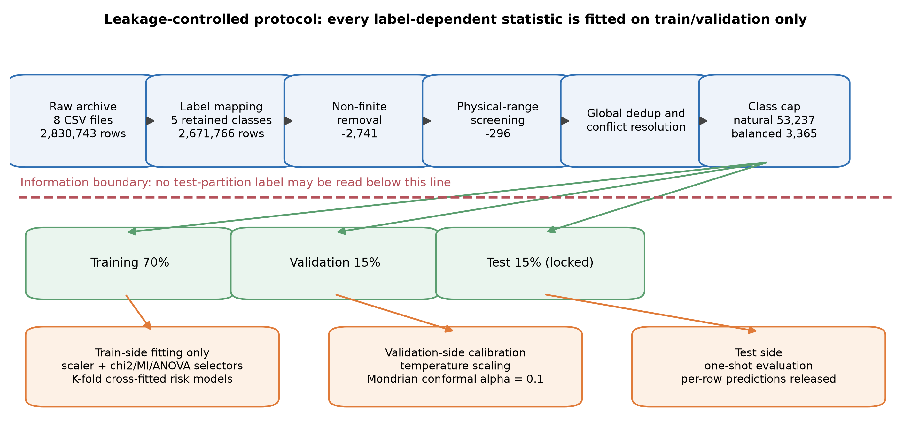
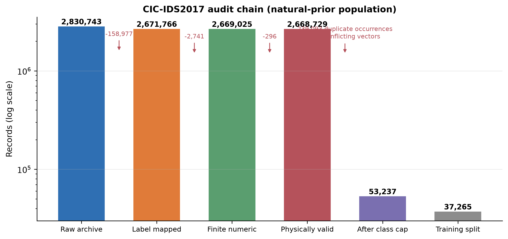
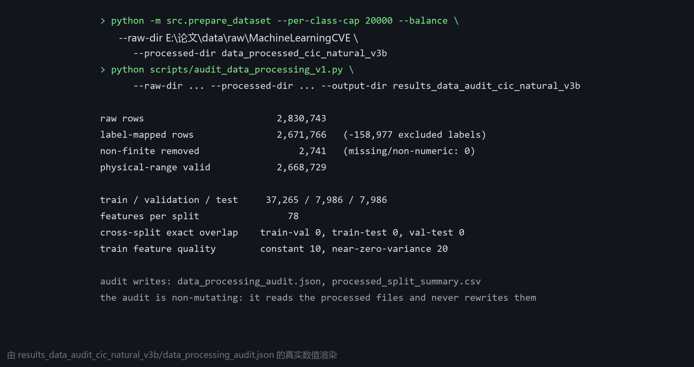

# 数据处理代码与流程

> CIC-IDS2017 的处理是**六阶段审计**：每一步都有实现代码、输入输出与发布证据，原始 2 830 743 行最终落到研究总体。本表同时给出流程截图、运行记录截图与关键代码摘录；所有计数取自 `results_data_audit_cic_natural_v3b/data_processing_audit.json`。

## 一、流程与运行记录（截图）







## 二、阶段 → 代码 → 证据

| 阶段 | 实现 | 输入 → 输出 | 发布证据 |
|---|---|---|---|
| S1 标签映射 | `src/data_pipeline.py` · `map_attack_label` | 2,830,743 → 2,671,766（排除 158,977 条非保留标签）| S02、表 3、`data_processing_audit.json` |
| S2 非有限值清理 | `src/prepare_dataset.py` · `collect_balanced_sample` | 移除 2,741 条（缺失 0 条）| 同上 |
| S3 物理范围筛查 | `src/data_pipeline.py` · `cic_physical_valid_mask` | 保留 2,668,729 条（时长/速率/长度/段大小不可为负）| 同上 |
| S4 全局去重 | `src/prepare_dataset.py`（前向/反向双哈希指纹）| 精确重复行在划分前全局剔除，审计见 `dedup_audit.json` | S21（近重复审计）|
| S5 分层划分 | `src/prepare_dataset.py` · `prepare_dataset` | 70/15/15 分层：37,265 / 7,986 / 7,986；跨划分精确特征重叠 0 | S03、S05、表 3 |
| S6 训练侧特征选择 | `src/feature_selection.py` | 仅在训练侧拟合卡方/互信息/ANOVA，取前 60 维；其余视图保留全特征 | S04、图 3 |
| 审计 | `scripts/audit_data_processing_v1.py` | 只读地重算每一阶段，写出审计 JSON 与划分汇总 | `results_data_audit_*`、S02/S03 |

## 三、代码清单（SHA-256 前 12 位，生成时计算）

| 文件 | 大小 | SHA-256 | 作用 |
|---|---:|---|---|
| `src/data_pipeline.py` | 3.4 KB | `a158b6744d33` | 标签映射与物理范围掩码 |
| `src/prepare_dataset.py` | 12.8 KB | `ac5c2ea3c075` | 分块读取、去重、按类上限、平衡与分层划分 |
| `src/feature_selection.py` | 3.5 KB | `dd48bd452ce1` | 训练侧特征选择（卡方 / 互信息 / ANOVA） |
| `scripts/audit_data_processing_v1.py` | 7.7 KB | `c98952971ea1` | 非改写式处理审计与阶段计数 |
| `scripts/hash_external_data.py` | 0.7 KB | `33fd889ddc12` | 外部数据集校验和记录 |
| `scripts/check_audit_chain_numbers_v1.py` | 4.1 KB | `ca4d8e81ff7c` | 阶段计数与正文数字的一致性检查 |

> 数据获取本身不是脚本：四个语料由人工从公开来源下载，URL、检索日期、快照与校验和记录在 S01 与《数据与资料来源总表》，再由上述代码处理。

## 四、关键代码摘录（摘自当前仓库）

**S1 · 标签映射**（`src/data_pipeline.py`）

```python
def map_attack_label(label: object, include_other: bool = False) -> Optional[str]:
    """Map a raw CIC-IDS2017 label to the paper's class scheme.

    The source CSVs contain leading spaces and, in some encodings, a replacement
    character in the en-dash used by Web Attack labels. Matching is therefore
    intentionally based on normalized lowercase substrings.
    """
    if label is None or (isinstance(label, float) and np.isnan(label)):
        return None
    raw = str(label).strip()
    key = raw.lower().replace("–", "-").replace("—", "-")

    if key == "benign":
        return "Normal"
    if key == "bot":
        return "Bot"
    if key == "ddos" or key.startswith("dos ") or key.startswith("dos-"):
        return "DoS/DDoS"
    if key in {"ftp-patator", "ssh-patator"}:
        return "Brute Force"
    if "web attack" in key and "brute" in key:
        return "Brute Force"
```

**S3 · 物理范围掩码**（`src/data_pipeline.py`）

```python
def cic_physical_valid_mask(frame: pd.DataFrame):
    """Return a conservative physical-range mask for CICFlowMeter fields.

    The CIC files contain a small number of malformed negative values.  The
    two TCP initial-window fields legitimately use ``-1`` as an unavailable
    value, so that sentinel is retained; other duration, rate, length and
    header fields must be non-negative.  Missing columns are ignored to keep
    the helper usable with reduced test fixtures.
    """
    rules = {
        "Flow Duration": 0.0,
        "Total Fwd Packets": 0.0,
        "Total Backward Packets": 0.0,
        "Total Length of Fwd Packets": 0.0,
        "Total Length of Bwd Packets": 0.0,
        "Flow Bytes/s": 0.0,
        "Flow Packets/s": 0.0,
        "Flow IAT Mean": 0.0,
```

**S4 · 去重指纹与按类上限**（`src/prepare_dataset.py`）

```python
            # removed before model CSVs are written and never enter features.
            numeric["_source_file"] = path.name
            numeric["_source_path"] = str(path.relative_to(raw_dir))
            numeric["_source_row_id"] = source_row_ids
            numeric["_source_label"] = source_labels
            kept_hashes = [row_hashes[i] for i, keep_row in enumerate(unique_mask) if keep_row]
            numeric["_dedup_hash_forward"] = [int(item[0]) for item in kept_hashes]
            numeric["_dedup_hash_reverse"] = [int(item[1]) for item in kept_hashes]
            for label in numeric["target"].unique():
                group = numeric.loc[numeric["target"] == label].copy()
                buckets.setdefault(label, []).append(group)
    audit["unique_rows_before_conflict"] = int(len(seen_hashes))
    audit["conflicting_feature_hash_count"] = int(len(conflict_hashes))
    audit["rows_in_conflicting_groups"] = int(sum(hash_row_counts[key] for key in conflict_hashes))
    audit["unique_rows_removed_for_conflicts"] = int(len(conflict_hashes))
    audit["cross_label_conflict_hashes"] = int(len(conflict_hashes))
```

**S5 · 分层划分与产物写出**（`src/prepare_dataset.py`）

```python
def prepare_dataset(raw_dir: Path, processed_dir: Path, config: dict):
    frame, features, audit = collect_balanced_sample(raw_dir, **config)
    provenance_cols = ["_source_file", "_source_path", "_source_row_id", "_source_label"]
    train, temp = train_test_split(frame, test_size=0.30, stratify=frame["target"], random_state=config["seed"])
    valid, test = train_test_split(temp, test_size=0.50, stratify=temp["target"], random_state=config["seed"])
    processed_dir.mkdir(parents=True, exist_ok=True)
    for split_name, split_frame in [("train", train), ("validation", valid), ("test", test)]:
        split_frame.reset_index(drop=True)[["target", *provenance_cols]].assign(processed_row_id=lambda d: np.arange(len(d))).to_csv(processed_dir / f"{split_name}_source_provenance.csv", index=False, encoding="utf-8-sig")
    train = train.drop(columns=provenance_cols)
    valid = valid.drop(columns=provenance_cols)
    test = test.drop(columns=provenance_cols)
    train.to_csv(processed_dir / "train.csv", index=False, encoding="utf-8-sig")
    valid.to_csv(processed_dir / "validation.csv", index=False, encoding="utf-8-sig")
    test.to_csv(processed_dir / "test.csv", index=False, encoding="utf-8-sig")
    mapping = {
        "Normal": ["BENIGN"],
        "DoS/DDoS": ["DDoS", "DoS ..."],
        "Brute Force": ["FTP-Patator", "SSH-Patator", "Web Attack ... Brute Force"],
        "Web Attack": ["Web Attack ... XSS", "Web Attack ... Sql Injection"],
        "Bot": ["Bot"],
        "excluded_main": ["PortScan", "Infiltration", "Heartbleed"],
    }
```

**审计入口**（`scripts/audit_data_processing_v1.py`）

```python
def main() -> None:
    ap = argparse.ArgumentParser()
    ap.add_argument("--raw-dir", type=Path, required=True)
    ap.add_argument("--processed-dir", type=Path, required=True)
    ap.add_argument("--output-dir", type=Path, required=True)
    args = ap.parse_args(); args.output_dir.mkdir(parents=True, exist_ok=True)
    files, totals = audit_raw(args.raw_dir)
    processed = audit_processed(args.processed_dir)
    result = {"raw_dir": str(args.raw_dir), "processed_dir": str(args.processed_dir), "raw_totals": totals, "raw_files": files, "processed": processed, "protocol_notes": ["Raw invalid rows are classified as excluded-label, infinite, or missing/non-numeric.", "Processed sidecar provenance is metadata only and is excluded from model features.", "Cross-split overlap is checked on exact processed feature vectors."]}
    (args.output_dir / "data_processing_audit.json").write_text(json.dumps(result, ensure_ascii=False, indent=2), encoding="utf-8")
    flat_files = []
    for row in files:
        flat = {k: v for k, v in row.items() if k not in {"class_counts", "raw_label_counts", "feature_columns", "file_hash"}}
        flat["class_counts"] = json.dumps(row["class_counts"], ensure_ascii=False)
        flat["raw_label_counts"] = json.dumps(row["raw_label_counts"], ensure_ascii=False)
        flat["feature_count"] = row["feature_count"]
```

## 五、同一份代码生成四个 CIC 总体

| 总体 | 关键参数 | 结果 | 配置记录 |
|---|---|---|---|
| 自然先验（主）| `--per-class-cap 20000`（平衡度按自然先验保留）| 53,237 条 | `data_processed_cic_natural_v3b/preprocess_config.json` |
| 平衡控制 | `--balance`（各类等量）| 3 365 条 | `data_processed_cic_balanced_v3b/preprocess_config.json` |
| 规模阶梯 | `--per-class-cap 200000` | 413 209 条 | `data_processed_cic_natural_v4_scale200k/preprocess_config.json` |
| 全去重语料 | 取消上限（`--per-class-cap` 极大）| 2 429 503 条 | `data_processed_cic_natural_v4_full/preprocess_config.json` |

## 六、复现命令

```powershell
$py = "E:\论文\.venv\Scripts\python.exe"
& $py -m src.prepare_dataset --raw-dir E:\论文\data\raw\MachineLearningCVE `
      --processed-dir data_processed_cic_natural_v3b --per-class-cap 20000
& $py scripts\audit_data_processing_v1.py `
      --raw-dir E:\论文\data\raw\MachineLearningCVE `
      --processed-dir data_processed_cic_natural_v3b `
      --output-dir results_data_audit_cic_natural_v3b
& $py scripts\check_audit_chain_numbers_v1.py   # 与正文表 3 逐项比对
```

## 七、核验

- 阶段计数链 2 830 743 → 2,671,766 → 2,669,025 → 2,668,729 → 划分/去重/截断，与正文表 3 及 S02 一致（`check_audit_chain_numbers_v1.py` 入闸门）；
- 跨划分精确特征重叠为 0；训练侧特征质量（常数列与近零方差列）记录在审计 JSON；
- 全语料与规模总体的划分计数由 `check_audit_chain_numbers_v1.py`、`audit_full_corpus_data_v1.py` 持续复核。

