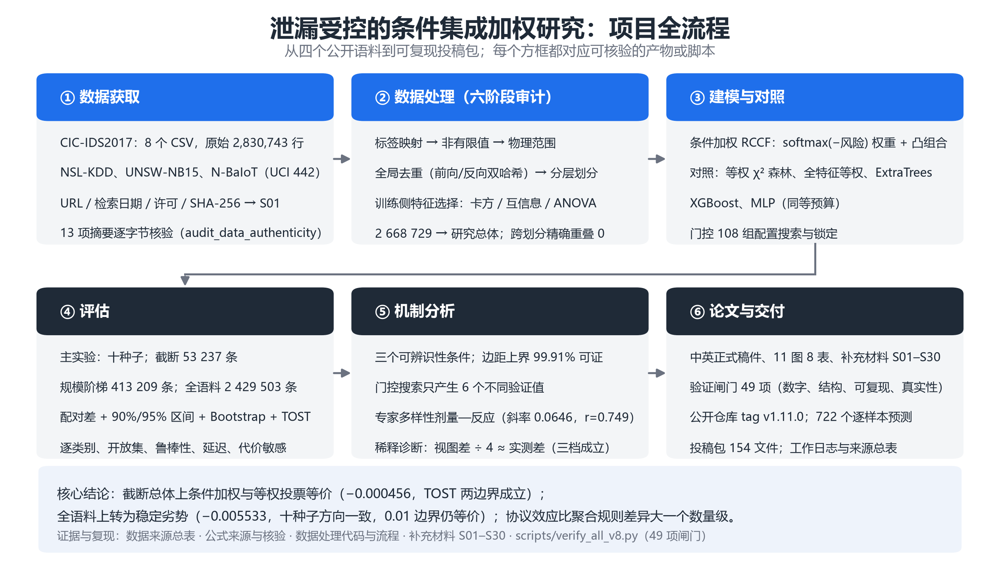

# 项目流程图

> 一张图概括从数据到投稿包的全过程；每个方框都对应可核验的脚本或产物。

## 各阶段的入口

| 阶段 | 入口 | 产物 |
|---|---|---|
| ① 数据获取 | S01、`docs/source_records/` | 四项语料的摘要与来源记录 |
| ② 数据处理 | `src/prepare_dataset.py`、`src/data_pipeline.py`、`scripts/audit_data_processing_v1.py` | `data_processed_*`、审计 JSON |
| ③ 建模与对照 | `src/rccf_forest.py`、`scripts/run_seeds10_v5.py`、`scripts/tune_gate_v5.py` | 逐种子预测、门控搜索记录 |
| ④ 评估 | `scripts/run_full_corpus_parallel_v1.py`、`scripts/audit_released_evidence_v1.py` | 汇总指标、TOST、开放集与代价结果 |
| ⑤ 机制分析 | `scripts/analyze_margin_bound_v5.py`、`scripts/run_diversity_suite_v5.py` | 边距上界、多样性回归、稀释诊断 |
| ⑥ 论文与交付 | `scripts/build_restructured_manuscript_v4.py`、`scripts/package_submission_bundle_v18.py` | 正式稿件、补充材料、投稿包 |

矢量版（印刷用）：`figures_project/flow_project.pdf`。
